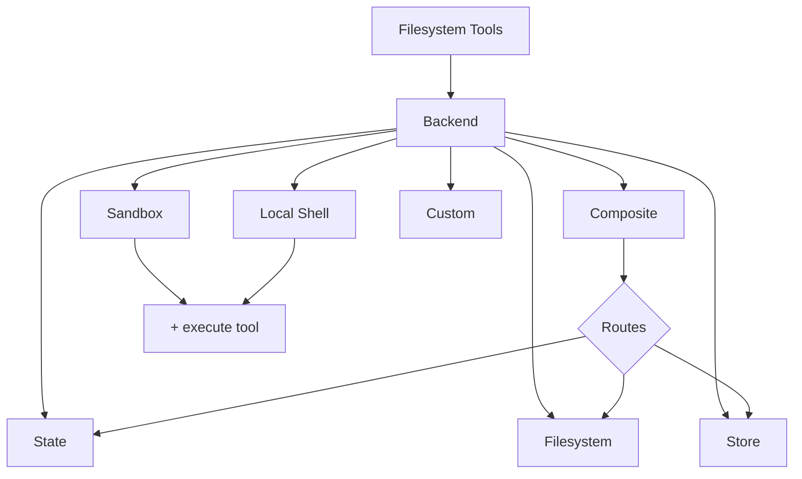

> ## Documentation Index
> Fetch the complete documentation index at: https://docs.langchain.com/llms.txt
> Use this file to discover all available pages before exploring further.

# Backends

> Choose and configure filesystem backends for deep agents. You can specify routes to different backends, implement virtual filesystems, and enforce policies.

Deep agents expose a filesystem surface to the agent via tools like `ls`, `read_file`, `write_file`, `edit_file`, `glob`, and `grep`. These tools operate through a pluggable backend. The `read_file` tool natively supports image files (`.png`, `.jpg`, `.jpeg`, `.gif`, `.webp`) across all backends, returning them as multimodal content blocks.

Sandboxes and the `LocalShellBackend` also provide and `execute` tool.



This page explains how to [choose a backend](#specify-a-backend), [route different paths to different backends](#route-to-different-backends), [implement your own virtual filesystem](#use-a-virtual-filesystem) (e.g., S3 or Postgres), [add policy hooks](#add-policy-hooks), and [comply with the backend protocol](#protocol-reference).

## Quickstart

Here are a few pre-built filesystem backends that you can quickly use with your deep agent:

| Built-in backend                                             | Description                                                  |
| ------------------------------------------------------------ | ------------------------------------------------------------ |
| [Default](#statebackend-ephemeral)                           | `agent = create_deep_agent()` <br /> Ephemeral in state. The default filesystem backend for an agent is stored in `langgraph` state. Note that this filesystem only persists *for a single thread*. |
| [Local filesystem persistence](#filesystembackend-local-disk) | `agent = create_deep_agent(backend=FilesystemBackend(root_dir="/Users/nh/Desktop/"))` <br />This gives the deep agent access to your local machine's filesystem. You can specify the root directory that the agent has access to. Note that any provided `root_dir` must be an absolute path. |
| [Durable store (LangGraph store)](#storebackend-langgraph-store) | `agent = create_deep_agent(backend=lambda rt: StoreBackend(rt))` <br />This gives the agent access to long-term storage that is *persisted across threads*. This is great for storing longer term memories or instructions that are applicable to the agent over multiple executions. |
| [Sandbox](/oss/javascript/deepagents/sandboxes)              | `agent = create_deep_agent(backend=sandbox)` <br />Execute code in isolated environments. Sandboxes provide filesystem tools plus the `execute` tool for running shell commands. Choose from Modal, Daytona, Deno, or local VFS. |
| [Local shell](#localshellbackend-local-shell)                | `agent = create_deep_agent(backend=LocalShellBackend(root_dir=".", env={"PATH": "/usr/bin:/bin"}))` <br />Filesystem and shell execution directly on the host. No isolation—use only in controlled development environments. See [security considerations](#local-shell) below. |
| [Composite](#compositebackend-router)                        | Ephemeral by default, `/memories/` persisted. The Composite backend is maximally flexible. You can specify different routes in the filesystem to point towards different backends. See Composite routing below for a ready-to-paste example. |

## Built-in backends

### StateBackend (ephemeral)

```python  theme={null}
# By default we provide a StateBackend
agent = create_deep_agent()

# Under the hood, it looks like
from deepagents.backends import StateBackend

agent = create_deep_agent(
    backend=(lambda rt: StateBackend(rt))   # Note that the tools access State through the runtime.state
)
```

**How it works:**

* Stores files in LangGraph agent state for the current thread.
* Persists across multiple agent turns on the same thread via checkpoints.

**Best for:**

* A scratch pad for the agent to write intermediate results.
* Automatic eviction of large tool outputs which the agent can then read back in piece by piece.

Note that this backend is shared between the supervisor agent and subagents, and any files a subagent writes will remain in the LangGraph agent state
even after that subagent's execution is complete. Those files will continue to be available to the supervisor agent and other subagents.

### FilesystemBackend (local disk)

<Warning>
  This backend grants agents direct filesystem read/write access.
  Use with caution and only in appropriate environments.

  **Appropriate use cases:**

  * Local development CLIs (coding assistants, development tools)
  * CI/CD pipelines (see security considerations below)

  **Inappropriate use cases:**

  * Web servers or HTTP APIs - use `StateBackend`, `StoreBackend`, or a [sandbox backend](/oss/javascript/deepagents/sandboxes) instead

  **Security risks:**

  * Agents can read any accessible file, including secrets (API keys, credentials, `.env` files)
  * Combined with network tools, secrets may be exfiltrated via SSRF attacks
  * File modifications are permanent and irreversible

  **Recommended safeguards:**

  1. Enable [Human-in-the-Loop (HITL) middleware](/oss/javascript/deepagents/human-in-the-loop) to review sensitive operations.
  2. Exclude secrets from accessible filesystem paths (especially in CI/CD).
  3. Use a [sandbox backend](/oss/javascript/deepagents/sandboxes) for production environments requiring filesystem interaction.
  4. **Always** use `virtual_mode=True` with `root_dir` to enable path-based access restrictions (blocks `..`, `~`, and absolute paths outside root).
     Note that the default (`virtual_mode=False`) provides no security even with `root_dir` set.
     </Warning>

```python  theme={null}
from deepagents.backends import FilesystemBackend

agent = create_deep_agent(
    backend=FilesystemBackend(root_dir=".", virtual_mode=True)
)
```

**How it works:**

* Reads/writes real files under a configurable `root_dir`.
* You can optionally set `virtual_mode=True` to sandbox and normalize paths under `root_dir`.
* Uses secure path resolution, prevents unsafe symlink traversal when possible, can use ripgrep for fast `grep`.

**Best for:**

* Local projects on your machine
* CI sandboxes
* Mounted persistent volumes

### LocalShellBackend (local shell)

<Warning>
  This backend grants agents direct filesystem read/write access **and** unrestricted shell execution on your host.
  Use with extreme caution and only in appropriate environments.

  **Appropriate use cases:**

  * Local development CLIs (coding assistants, development tools)
  * Personal development environments where you trust the agent's code
  * CI/CD pipelines with proper secret management

  **Inappropriate use cases:**

  * Production environments (such as web servers, APIs, multi-tenant systems)
  * Processing untrusted user input or executing untrusted code

  **Security risks:**

  * Agents can execute **arbitrary shell commands** with your user's permissions
  * Agents can read any accessible file, including secrets (API keys, credentials, `.env` files)
  * Secrets may be exposed
  * File modifications and command execution are **permanent and irreversible**
  * Commands run directly on your host system
  * Commands can consume unlimited CPU, memory, disk

  **Recommended safeguards:**

  1. Enable [Human-in-the-Loop (HITL) middleware](/oss/javascript/deepagents/human-in-the-loop) to review and approve operations before execution. This is **strongly recommended**.
  2. Run in dedicated development environments only. Never use on shared or production systems.
  3. Use a [sandbox backend](/oss/javascript/deepagents/sandboxes) for production environments requiring shell execution.

  **Note:** `virtual_mode=True` provides no security with shell access enabled, since commands can access any path on the system.
</Warning>

```python  theme={null}
from deepagents.backends import LocalShellBackend

agent = create_deep_agent(
    backend=LocalShellBackend(root_dir=".", env={"PATH": "/usr/bin:/bin"})
)
```

**How it works:**

* Extends `FilesystemBackend` with the `execute` tool for running shell commands on the host.
* Commands run directly on your machine using `subprocess.run(shell=True)` with no sandboxing.
* Supports `timeout` (default 120s), `max_output_bytes` (default 100,000), `env`, and `inherit_env` for environment variables.
* Shell commands use `root_dir` as the working directory but can access any path on the system.

**Best for:**

* Local coding assistants and development tools
* Quick iteration during development when you trust the agent

### StoreBackend (LangGraph store)

```python  theme={null}
from langgraph.store.memory import InMemoryStore
from deepagents.backends import StoreBackend

agent = create_deep_agent(
    backend=(lambda rt: StoreBackend(rt)),
    store=InMemoryStore()  # Good for local dev; omit for LangSmith Deployment
)
```

<Note>
  When deploying to [LangSmith Deployment](/langsmith/deployments), omit the `store` parameter. The platform automatically provisions a store for your agent.
</Note>

**How it works:**

* Stores files in a LangGraph [`BaseStore`](https://reference.langchain.com/javascript/classes/_langchain_langgraph-checkpoint.BaseStore.html) provided by the runtime, enabling cross‑thread durable storage.

**Best for:**

* When you already run with a configured LangGraph store (for example, Redis, Postgres, or cloud implementations behind [`BaseStore`](https://reference.langchain.com/javascript/classes/_langchain_langgraph-checkpoint.BaseStore.html)).
* When you're deploying your agent through LangSmith Deployment (a store is automatically provisioned for your agent).

### CompositeBackend (router)

```python  theme={null}
from deepagents import create_deep_agent
from deepagents.backends import CompositeBackend, StateBackend, StoreBackend
from langgraph.store.memory import InMemoryStore

composite_backend = lambda rt: CompositeBackend(
    default=StateBackend(rt),
    routes={
        "/memories/": StoreBackend(rt),
    }
)

agent = create_deep_agent(
    backend=composite_backend,
    store=InMemoryStore()  # Store passed to create_deep_agent, not backend
)
```

**How it works:**

* Routes file operations to different backends based on path prefix.
* Preserves the original path prefixes in listings and search results.

**Best for:**

* When you want to give your agent both ephemeral and cross-thread storage, a `CompositeBackend` allows you provide both a `StateBackend` and `StoreBackend`
* When you have multiple sources of information that you want to provide to your agent as part of a single filesystem.
  * e.g. You have long-term memories stored under `/memories/` in one Store and you also have a custom backend that has documentation accessible at /docs/.

## Specify a backend

* Pass a backend to `create_deep_agent(backend=...)`. The filesystem middleware uses it for all tooling.
* You can pass either:
  * An instance implementing `BackendProtocol` (for example, `FilesystemBackend(root_dir=".")`), or
  * A factory `BackendFactory = Callable[[ToolRuntime], BackendProtocol]` (for backends that need runtime like `StateBackend` or `StoreBackend`).
* If omitted, the default is `lambda rt: StateBackend(rt)`.

## Route to different backends

Route parts of the namespace to different backends. Commonly used to persist `/memories/*` and keep everything else ephemeral.

```typescript  theme={null}
import { createDeepAgent, CompositeBackend, FilesystemBackend, StateBackend } from "deepagents";

const compositeBackend = (rt) => new CompositeBackend(
  new StateBackend(rt),
  {
    "/memories/": new FilesystemBackend({ rootDir: "/deepagents/myagent", virtualMode: true }),
  },
);

const agent = createDeepAgent({ backend: compositeBackend });
```

Behavior:

* `/workspace/plan.md` → `StateBackend` (ephemeral)
* `/memories/agent.md` → `FilesystemBackend` under `/deepagents/myagent`
* `ls`, `glob`, `grep` aggregate results and show original path prefixes.

Notes:

* Longer prefixes win (for example, route `"/memories/projects/"` can override `"/memories/"`).
* For StoreBackend routing, ensure the agent runtime provides a store (`runtime.store`).

## Use a virtual filesystem

Build a custom backend to project a remote or database filesystem (e.g., S3 or Postgres) into the tools namespace.

Design guidelines:

* Paths are absolute (`/x/y.txt`). Decide how to map them to your storage keys/rows.
* Implement `ls_info` and `glob_info` efficiently (server-side listing where available, otherwise local filter).
* Return user-readable error strings for missing files or invalid regex patterns.
* For external persistence, set `files_update=None` in results; only in-state backends should return a `files_update` dict.

S3-style outline:

Postgres-style outline:

* Table `files(path text primary key, content text, created_at timestamptz, modified_at timestamptz)`
* Map tool operations onto SQL:
  * `ls_info` uses `WHERE path LIKE $1 || '%'`
  * `glob_info` filter in SQL or fetch then apply glob in Python
  * `grep_raw` can fetch candidate rows by extension or last modified time, then scan lines

## Add policy hooks

Enforce enterprise rules by subclassing or wrapping a backend.

Block writes/edits under selected prefixes (subclass):

Generic wrapper (works with any backend):

## Protocol reference

Backends must implement the `BackendProtocol`.

Required endpoints:

* `ls_info(path: str) -> list[FileInfo]`
  * Return entries with at least `path`. Include `is_dir`, `size`, `modified_at` when available. Sort by `path` for deterministic output.
* `read(file_path: str, offset: int = 0, limit: int = 2000) -> str`
  * Return numbered content. On missing file, return `"Error: File '/x' not found"`.
* `grep_raw(pattern: str, path: Optional[str] = None, glob: Optional[str] = None) -> list[GrepMatch] | str`
  * Return structured matches. For an invalid regex, return a string like `"Invalid regex pattern: ..."` (do not raise).
* `glob_info(pattern: str, path: str = "/") -> list[FileInfo]`
  * Return matched files as `FileInfo` entries (empty list if none).
* `write(file_path: str, content: str) -> WriteResult`
  * Create-only. On conflict, return `WriteResult(error=...)`. On success, set `path` and for state backends set `files_update={...}`; external backends should use `files_update=None`.
* `edit(file_path: str, old_string: str, new_string: str, replace_all: bool = False) -> EditResult`
  * Enforce uniqueness of `old_string` unless `replace_all=True`. If not found, return error. Include `occurrences` on success.

Supporting types:

* `WriteResult(error, path, files_update)`
* `EditResult(error, path, files_update, occurrences)`
* `FileInfo` with fields: `path` (required), optionally `is_dir`, `size`, `modified_at`.
* `GrepMatch` with fields: `path`, `line`, `text`.

***

<Callout icon="edit">
  [Edit this page on GitHub](https://github.com/langchain-ai/docs/edit/main/src/oss/deepagents/backends.mdx) or [file an issue](https://github.com/langchain-ai/docs/issues/new/choose).
</Callout>

<Callout icon="terminal-2">
  [Connect these docs](/use-these-docs) to Claude, VSCode, and more via MCP for real-time answers.
</Callout>