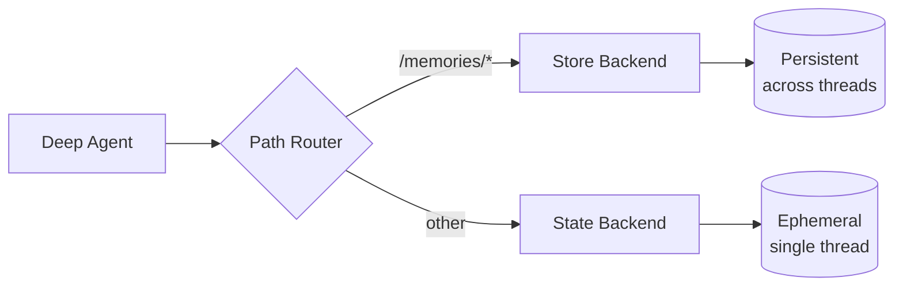

> ## Documentation Index
> Fetch the complete documentation index at: https://docs.langchain.com/llms.txt
> Use this file to discover all available pages before exploring further.

# Long-term memory

> Learn how to extend deep agents with persistent memory across threads

Deep agents come with a local filesystem to offload memory. By default, this filesystem is stored in agent state and is **transient to a single thread**—files are lost when the conversation ends.

You can extend deep agents with **long-term memory** by using a `CompositeBackend` that routes specific paths to persistent storage. This enables hybrid storage where some files persist across threads while others remain ephemeral.



## Setup

Configure long-term memory by using a `CompositeBackend` that routes the `/memories/` path to a `StoreBackend`:

```typescript  theme={null}
import { createDeepAgent } from "deepagents";
import { CompositeBackend, StateBackend, StoreBackend } from "deepagents";
import { InMemoryStore } from "@langchain/langgraph-checkpoint";

const agent = createDeepAgent({
  store: new InMemoryStore(),  // Good for local dev; omit for LangSmith Deployment
  backend: (config) => new CompositeBackend(
    new StateBackend(config),  // Ephemeral storage
    { "/memories/": new StoreBackend(config) }  // Persistent storage
  ),
});
```

## How it works

When using `CompositeBackend`, deep agents maintain **two separate filesystems**:

### 1. Short-term (transient) filesystem

* Stored in the agent's state (via `StateBackend`)
* Persists only within a single thread
* Files are lost when the thread ends
* Accessed through standard paths: `/notes.txt`, `/workspace/draft.md`

### 2. Long-term (persistent) filesystem

* Stored in a LangGraph Store (via `StoreBackend`)
* Persists across all threads and conversations
* Survives agent restarts
* Accessed through paths prefixed with `/memories/`: `/memories/preferences.txt`

### Path routing

The `CompositeBackend` routes file operations based on path prefixes:

* Files with paths starting with `/memories/` are stored in the Store (persistent)
* Files without this prefix remain in transient state
* All filesystem tools (`ls`, `read_file`, `write_file`, `edit_file`) work with both

<Note>
  `CompositeBackend` strips the route prefix before storing. For example, `/memories/preferences.txt` is stored as `/preferences.txt` in the `StoreBackend`. The agent always uses the full path. See [CompositeBackend](/oss/javascript/deepagents/backends#compositebackend-router) for details.
</Note>

```typescript  theme={null}
// Transient file (lost after thread ends)
await agent.invoke({
  messages: [{ role: "user", content: "Write draft to /draft.txt" }],
});

// Persistent file (survives across threads)
await agent.invoke({
  messages: [{ role: "user", content: "Save final report to /memories/report.txt" }],
});
```

## Cross-thread persistence

Files in `/memories/` can be accessed from any thread:

```typescript  theme={null}
import { v4 as uuidv4 } from "uuid";

// Thread 1: Write to long-term memory
const config1 = { configurable: { thread_id: uuidv4() } };
await agent.invoke({
  messages: [{ role: "user", content: "Save my preferences to /memories/preferences.txt" }],
}, config1);

// Thread 2: Read from long-term memory (different conversation!)
const config2 = { configurable: { thread_id: uuidv4() } };
await agent.invoke({
  messages: [{ role: "user", content: "What are my preferences?" }],
}, config2);
// Agent can read /memories/preferences.txt from the first thread
```

## Accessing memories from external code (LangSmith)

If deploying your agent on LangSmith, you can read or write memories from server-side code (outside the agent) using the [Store API](/langsmith/agent-server-api/store). The `StoreBackend` stores files using the namespace `(assistant_id, "filesystem")`.

```typescript  theme={null}
import { Client } from "@langchain/langgraph-sdk";

const client = new Client({ apiUrl: "<DEPLOYMENT_URL>" });

// Read a memory file (path without /memories/ prefix)
const item = await client.store.getItem(
  [assistantId, "filesystem"],
  "/preferences.txt"
);

// Write a memory file
await client.store.putItem(
  [assistantId, "filesystem"],
  "/preferences.txt",
  {
    content: ["line 1", "line 2"],
    created_at: "2024-01-15T10:30:00Z",
    modified_at: "2024-01-15T10:30:00Z"
  }
);

// Search for items
const items = await client.store.searchItems([assistantId, "filesystem"]);
```

<Note>
  The key does not include the `/memories/` prefix because `CompositeBackend` strips it before storing. See [Path routing](#path-routing) for details.
</Note>

For more information, see the [Store API reference](/langsmith/agent-server-api/store).

## Use cases

### User preferences

Store user preferences that persist across sessions:

```typescript  theme={null}
const agent = createDeepAgent({
  store: new InMemoryStore(),
  backend: (config) => new CompositeBackend(
    new StateBackend(config),
    { "/memories/": new StoreBackend(config) }
  ),
  systemPrompt: `When users tell you their preferences, save them to /memories/user_preferences.txt so you remember them in future conversations.`,
});
```

### Self-improving instructions

An agent can update its own instructions based on feedback:

```typescript  theme={null}
const agent = createDeepAgent({
  store: new InMemoryStore(),
  backend: (config) => new CompositeBackend(
    new StateBackend(config),
    { "/memories/": new StoreBackend(config) }
  ),
  systemPrompt: `You have a file at /memories/instructions.txt with additional instructions and preferences.

  Read this file at the start of conversations to understand user preferences.

  When users provide feedback like "please always do X" or "I prefer Y", update /memories/instructions.txt using the edit_file tool.`,
});
```

Over time, the instructions file accumulates user preferences, helping the agent improve.

### Knowledge base

Build up knowledge over multiple conversations:

```typescript  theme={null}
// Conversation 1: Learn about a project
await agent.invoke({
  messages: [{ role: "user", content: "We're building a web app with React. Save project notes." }],
});

// Conversation 2: Use that knowledge
await agent.invoke({
  messages: [{ role: "user", content: "What framework are we using?" }],
});
// Agent reads /memories/project_notes.txt from previous conversation
```

### Research projects

Maintain research state across sessions:

```typescript  theme={null}
const researchAgent = createDeepAgent({
  store: new InMemoryStore(),
  backend: (config) => new CompositeBackend(
    new StateBackend(config),
    { "/memories/": new StoreBackend(config) }
  ),
  systemPrompt: `You are a research assistant.

  Save your research progress to /memories/research/:
  - /memories/research/sources.txt - List of sources found
  - /memories/research/notes.txt - Key findings and notes
  - /memories/research/report.md - Final report draft

  This allows research to continue across multiple sessions.`,
});
```

## Store implementations

Any LangGraph `BaseStore` implementation works:

### InMemoryStore (development)

Good for testing and development, but data is lost on restart:

```typescript  theme={null}
import { InMemoryStore } from "@langchain/langgraph-checkpoint";
import { createDeepAgent, CompositeBackend, StateBackend, StoreBackend } from "deepagents";

const store = new InMemoryStore();
const agent = createDeepAgent({
  store,
  backend: (config) => new CompositeBackend(
    new StateBackend(config),
    { "/memories/": new StoreBackend(config) }
  ),
});
```

### PostgresStore (production)

For production, use a persistent store:

```typescript  theme={null}
import { PostgresStore } from "@langchain/langgraph-checkpoint-postgres";
import { createDeepAgent, CompositeBackend, StateBackend, StoreBackend } from "deepagents";

const store = new PostgresStore({
  connectionString: process.env.DATABASE_URL,
});
const agent = createDeepAgent({
  store,
  backend: (config) => new CompositeBackend(
    new StateBackend(config),
    { "/memories/": new StoreBackend(config) }
  ),
});
```

## FileData schema

Files stored via `StoreBackend` use the following schema:

```python  theme={null}
{
    "content": ["line 1", "line 2", "line 3"],  # List of strings (one per line)
    "created_at": "2024-01-15T10:30:00Z",       # ISO 8601 timestamp
    "modified_at": "2024-01-15T11:45:00Z"       # ISO 8601 timestamp
}
```

You can use the `create_file_data` helper to create properly formatted file data:

```typescript  theme={null}
import { createFileData } from "deepagents";

const fileData = createFileData("Hello\nWorld");
// { content: ['Hello', 'World'], created_at: '...', modified_at: '...' }
```

For more details on backend protocols, see [Backends](/oss/javascript/deepagents/backends#protocol-reference).

## Best practices

### Use descriptive paths

Organize persistent files with clear paths:

```
/memories/user_preferences.txt
/memories/research/topic_a/sources.txt
/memories/research/topic_a/notes.txt
/memories/project/requirements.md
```

### Document the memory structure

Tell the agent what's stored where in your system prompt:

```
Your persistent memory structure:
- /memories/preferences.txt: User preferences and settings
- /memories/context/: Long-term context about the user
- /memories/knowledge/: Facts and information learned over time
```

### Prune old data

Implement periodic cleanup of outdated persistent files to keep storage manageable.

### Choose the right storage

* **Development**: Use `InMemoryStore` for quick iteration
* **Production**: Use `PostgresStore` or other persistent stores
* **Multi-tenant**: Consider using `assistant_id`-based namespacing in your store

***

<Callout icon="edit">
  [Edit this page on GitHub](https://github.com/langchain-ai/docs/edit/main/src/oss/deepagents/long-term-memory.mdx) or [file an issue](https://github.com/langchain-ai/docs/issues/new/choose).
</Callout>

<Callout icon="terminal-2">
  [Connect these docs](/use-these-docs) to Claude, VSCode, and more via MCP for real-time answers.
</Callout>