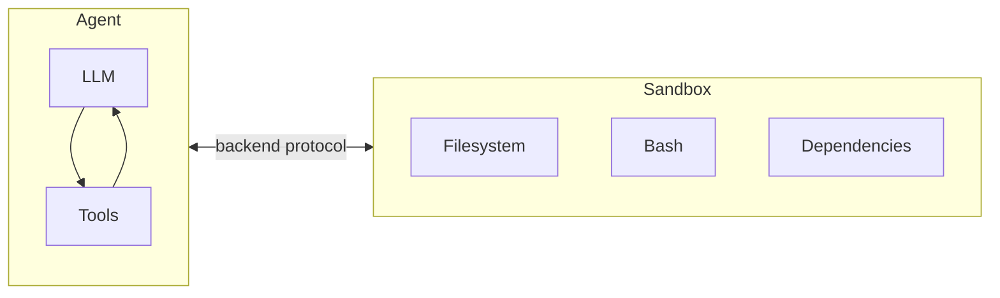
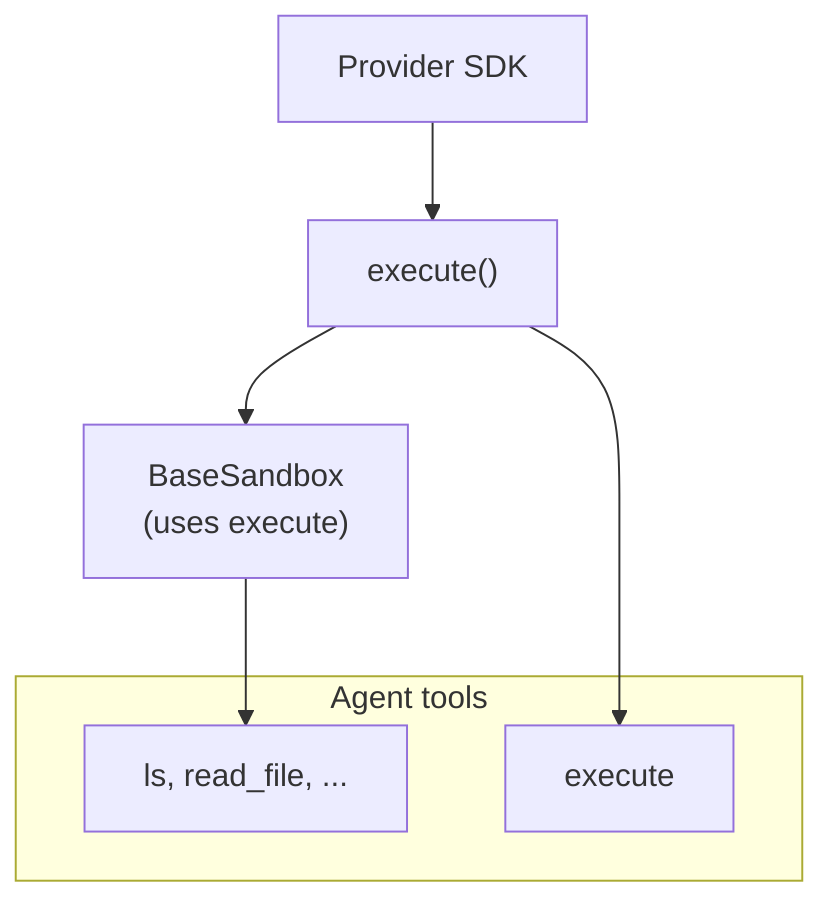
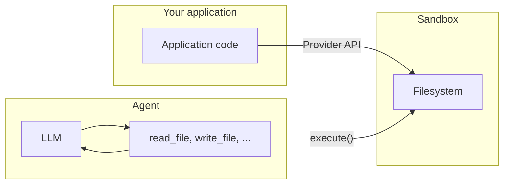

> ## Documentation Index
> Fetch the complete documentation index at: https://docs.langchain.com/llms.txt
> Use this file to discover all available pages before exploring further.

# Sandboxes

> Execute code in isolated environments with sandbox backends

Agents generate code, interact with filesystems, and run shell commands. Because we can't predict what an agent might do, it's important that its environment is isolated so it can't access credentials, files, or the network. Sandboxes provide this isolation by creating a boundary between the agent's execution environment and your host system.

In deep agents, **sandboxes are [backends](/oss/javascript/deepagents/backends)** that define the environment where the agent operates. Unlike other backends (State, Filesystem, Store) which only expose file operations, sandbox backends also give the agent an `execute` tool for running shell commands. When you configure a sandbox backend, the agent gets:

* All standard filesystem tools (`ls`, `read_file`, `write_file`, `edit_file`, `glob`, `grep`)
* The `execute` tool for running arbitrary shell commands in the sandbox
* A secure boundary that protects your host system



## Why use sandboxes?

Sandboxes are used for security.
They let agents execute arbitrary code, access files, and use the network without compromising your credentials, local files, or host system.
This isolation is essential when agents run autonomously.

Sandboxes are especially useful for:

* Coding agents: Agents that run autonomously can use shell, git, clone repositories (many providers offer native git APIs, e.g., [Daytona's git operations](https://www.daytona.io/docs/en/git-operations/)), and run Docker-in-Docker for build and test pipelines
* Data analysis agents — Load files, install data analysis libraries (pandas, numpy, etc.), run statistical calculations, and create outputs like PowerPoint presentations in a safe, isolated environment

## Integration patterns

There are two architecture patterns for integrating agents with sandboxes, based on where the agent runs.

### Agent in sandbox pattern

The agent runs inside the sandbox and you communicate with it over the network. You build a Docker or VM image with your agent framework pre-installed, run it inside the sandbox, and connect from outside to send messages.

Benefits:

* ✅ Mirrors local development closely.
* ✅ Tight coupling between agent and environment.

Trade-offs:

* 🔴 API keys must live inside the sandbox (security risk).
* 🔴 Updates require rebuilding images.
* 🔴 Requires infrastructure for communication (WebSocket or HTTP layer).

To run an agent in a sandbox, build an image and install deepagents on it.

```dockerfile  theme={null}
FROM python:3.11
RUN pip install deepagents-cli
```

Then run the agent inside the sandbox.
To use the agent inside the sandbox you have to add additional infrastructure to handle communication between your application and the agent inside the sandbox.

### Sandbox as tool pattern

The agent runs on your machine or server. When it needs to execute code, it calls sandbox tools (such as `execute`, `read_file`, or `write_file`) which invoke the provider's APIs to run operations in a remote sandbox.

Benefits:

* ✅ Update agent code instantly without rebuilding images.
* ✅ Cleaner separation between agent state and execution.
  * API keys stay outside the sandbox.
  * Sandbox failures don't lose agent state.
  * Option to run tasks in multiple sandboxes in parallel.
* ✅ Pay only for execution time.

Trade-offs:

* 🔴 Network latency on each execution call.

Example:

```typescript  theme={null}
import "dotenv/config";
import { DaytonaSandbox } from "@langchain/daytona";
import { createDeepAgent } from "deepagents";

// Can also do this with E2B, Runloop, Modal
const sandbox = await DaytonaSandbox.create();

const agent = createDeepAgent({
  backend: sandbox,
  systemPrompt:
    "You are a coding assistant with sandbox access. You can create and run code in the sandbox.",
});

try {
  const result = await agent.invoke({
    messages: [
      {
        role: "user",
        content: "Create a hello world Python script and run it",
      },
    ],
  });
  const lastMessage = result.messages[result.messages.length - 1];
  console.log(
    typeof lastMessage.content === "string"
      ? lastMessage.content
      : String(lastMessage.content),
  );
} finally {
  // Optional: delete the sandbox proactively when the agent finishes
  await sandbox.close();
  throw err;
}
```

The examples in this doc use the sandbox as a tool pattern.
Choose the agent in sandbox pattern when your provider's SDK handles the communication layer and you want production to mirror local development.
Choose the sandbox as tool pattern when you need to iterate quickly on agent logic, keep API keys outside the sandbox, or prefer cleaner separation of concerns.

## Available providers

For provider-specific setup, authentication, and lifecycle details, see the provider integration pages:

<CardGroup cols={2}>
  <Card title="Modal" icon="https://mintcdn.com/langchain-5e9cc07a/MSSEVW3iLbgtvNSU/images/providers/modal-icon.svg?fit=max&auto=format&n=MSSEVW3iLbgtvNSU&q=85&s=6a0f4e7623b58126477e1621422d9700" href="/oss/javascript/integrations/providers/modal" data-og-width="24" width="24" data-og-height="24" height="24" data-path="images/providers/modal-icon.svg" data-optimize="true" data-opv="3" srcset="https://mintcdn.com/langchain-5e9cc07a/MSSEVW3iLbgtvNSU/images/providers/modal-icon.svg?w=280&fit=max&auto=format&n=MSSEVW3iLbgtvNSU&q=85&s=cb608a0a97b066935a1cc7391191acd6 280w, https://mintcdn.com/langchain-5e9cc07a/MSSEVW3iLbgtvNSU/images/providers/modal-icon.svg?w=560&fit=max&auto=format&n=MSSEVW3iLbgtvNSU&q=85&s=5284d03a1e6090ae2d0ce2ef492af6e8 560w, https://mintcdn.com/langchain-5e9cc07a/MSSEVW3iLbgtvNSU/images/providers/modal-icon.svg?w=840&fit=max&auto=format&n=MSSEVW3iLbgtvNSU&q=85&s=ca63baa402a2172ed2cd06d202d8a5cb 840w, https://mintcdn.com/langchain-5e9cc07a/MSSEVW3iLbgtvNSU/images/providers/modal-icon.svg?w=1100&fit=max&auto=format&n=MSSEVW3iLbgtvNSU&q=85&s=15ae2b697af54a14d313758e8d0e93e1 1100w, https://mintcdn.com/langchain-5e9cc07a/MSSEVW3iLbgtvNSU/images/providers/modal-icon.svg?w=1650&fit=max&auto=format&n=MSSEVW3iLbgtvNSU&q=85&s=da2a8c1fbfd2043f9e6191084ec41c37 1650w, https://mintcdn.com/langchain-5e9cc07a/MSSEVW3iLbgtvNSU/images/providers/modal-icon.svg?w=2500&fit=max&auto=format&n=MSSEVW3iLbgtvNSU&q=85&s=b66ee2eb83643544d36abd04439d8d49 2500w">
    ML/AI workloads, GPU access, Python.
  </Card>

  <Card title="Daytona" icon="https://mintcdn.com/langchain-5e9cc07a/MSSEVW3iLbgtvNSU/images/providers/daytona-icon.svg?fit=max&auto=format&n=MSSEVW3iLbgtvNSU&q=85&s=9291e43366520dd8f4b2f1f72473cebb" href="/oss/javascript/integrations/providers/daytona" data-og-width="66" width="66" data-og-height="60" height="60" data-path="images/providers/daytona-icon.svg" data-optimize="true" data-opv="3" srcset="https://mintcdn.com/langchain-5e9cc07a/MSSEVW3iLbgtvNSU/images/providers/daytona-icon.svg?w=280&fit=max&auto=format&n=MSSEVW3iLbgtvNSU&q=85&s=2ff8fbb13bd6555f8adfb273cf98d89a 280w, https://mintcdn.com/langchain-5e9cc07a/MSSEVW3iLbgtvNSU/images/providers/daytona-icon.svg?w=560&fit=max&auto=format&n=MSSEVW3iLbgtvNSU&q=85&s=aa3da110a2212018d284e2fe2daaedf6 560w, https://mintcdn.com/langchain-5e9cc07a/MSSEVW3iLbgtvNSU/images/providers/daytona-icon.svg?w=840&fit=max&auto=format&n=MSSEVW3iLbgtvNSU&q=85&s=a10f77ceef88b39726fa40a4000947a0 840w, https://mintcdn.com/langchain-5e9cc07a/MSSEVW3iLbgtvNSU/images/providers/daytona-icon.svg?w=1100&fit=max&auto=format&n=MSSEVW3iLbgtvNSU&q=85&s=62981a74523449c6102228770d33a492 1100w, https://mintcdn.com/langchain-5e9cc07a/MSSEVW3iLbgtvNSU/images/providers/daytona-icon.svg?w=1650&fit=max&auto=format&n=MSSEVW3iLbgtvNSU&q=85&s=3444392f78f4e5fe537b2d3c3e72d0e8 1650w, https://mintcdn.com/langchain-5e9cc07a/MSSEVW3iLbgtvNSU/images/providers/daytona-icon.svg?w=2500&fit=max&auto=format&n=MSSEVW3iLbgtvNSU&q=85&s=cf01bb7ab795d0ba7ea3ee8cffdd38f9 2500w">
    TypeScript/Python development, fast cold starts.
  </Card>

  <Card title="Deno" icon="https://mintcdn.com/langchain-5e9cc07a/MSSEVW3iLbgtvNSU/images/providers/deno-icon.svg?fit=max&auto=format&n=MSSEVW3iLbgtvNSU&q=85&s=3e282755264734d1839c24935e58f412" href="/oss/javascript/integrations/providers/deno" data-og-width="24" width="24" data-og-height="24" height="24" data-path="images/providers/deno-icon.svg" data-optimize="true" data-opv="3" srcset="https://mintcdn.com/langchain-5e9cc07a/MSSEVW3iLbgtvNSU/images/providers/deno-icon.svg?w=280&fit=max&auto=format&n=MSSEVW3iLbgtvNSU&q=85&s=9c432f8a5c5f683cc0c116f288d3b513 280w, https://mintcdn.com/langchain-5e9cc07a/MSSEVW3iLbgtvNSU/images/providers/deno-icon.svg?w=560&fit=max&auto=format&n=MSSEVW3iLbgtvNSU&q=85&s=dc3caba678983bd812cab1e0a2a09619 560w, https://mintcdn.com/langchain-5e9cc07a/MSSEVW3iLbgtvNSU/images/providers/deno-icon.svg?w=840&fit=max&auto=format&n=MSSEVW3iLbgtvNSU&q=85&s=dbb0de78ad9a2e39ce4d6fbbb59feb8b 840w, https://mintcdn.com/langchain-5e9cc07a/MSSEVW3iLbgtvNSU/images/providers/deno-icon.svg?w=1100&fit=max&auto=format&n=MSSEVW3iLbgtvNSU&q=85&s=d3c1f62f5fba13dc062851708d88ae7e 1100w, https://mintcdn.com/langchain-5e9cc07a/MSSEVW3iLbgtvNSU/images/providers/deno-icon.svg?w=1650&fit=max&auto=format&n=MSSEVW3iLbgtvNSU&q=85&s=fd1100f2a5bab6fadd883ef45ed1e495 1650w, https://mintcdn.com/langchain-5e9cc07a/MSSEVW3iLbgtvNSU/images/providers/deno-icon.svg?w=2500&fit=max&auto=format&n=MSSEVW3iLbgtvNSU&q=85&s=a168ba45a1ac0141c770153b66e89fd5 2500w">
    Deno/JavaScript workloads, microVMs.
  </Card>

  <Card title="Node VFS" icon="https://mintcdn.com/langchain-5e9cc07a/MSSEVW3iLbgtvNSU/images/providers/nodejs-icon.svg?fit=max&auto=format&n=MSSEVW3iLbgtvNSU&q=85&s=25e3ffe0ff0f3fe413b2622e91e0d713" href="/oss/javascript/integrations/providers/node-vfs" data-og-width="24" width="24" data-og-height="24" height="24" data-path="images/providers/nodejs-icon.svg" data-optimize="true" data-opv="3" srcset="https://mintcdn.com/langchain-5e9cc07a/MSSEVW3iLbgtvNSU/images/providers/nodejs-icon.svg?w=280&fit=max&auto=format&n=MSSEVW3iLbgtvNSU&q=85&s=1506f5cdbc1e7e95be8f4bf2975ba403 280w, https://mintcdn.com/langchain-5e9cc07a/MSSEVW3iLbgtvNSU/images/providers/nodejs-icon.svg?w=560&fit=max&auto=format&n=MSSEVW3iLbgtvNSU&q=85&s=ea3734f37e49e3ab149c0e75887821dc 560w, https://mintcdn.com/langchain-5e9cc07a/MSSEVW3iLbgtvNSU/images/providers/nodejs-icon.svg?w=840&fit=max&auto=format&n=MSSEVW3iLbgtvNSU&q=85&s=9675dc4b4bd1d3bcdca88340d592db40 840w, https://mintcdn.com/langchain-5e9cc07a/MSSEVW3iLbgtvNSU/images/providers/nodejs-icon.svg?w=1100&fit=max&auto=format&n=MSSEVW3iLbgtvNSU&q=85&s=de0ed46efa5cf80b0af6e22766fe1629 1100w, https://mintcdn.com/langchain-5e9cc07a/MSSEVW3iLbgtvNSU/images/providers/nodejs-icon.svg?w=1650&fit=max&auto=format&n=MSSEVW3iLbgtvNSU&q=85&s=48e2e73d4a71812fd52299dfa42ddde7 1650w, https://mintcdn.com/langchain-5e9cc07a/MSSEVW3iLbgtvNSU/images/providers/nodejs-icon.svg?w=2500&fit=max&auto=format&n=MSSEVW3iLbgtvNSU&q=85&s=9af9ef43bc41df08ea357db4c5bbb31c 2500w">
    Local development, testing, no cloud required.
  </Card>
</CardGroup>

## Basic usage

```typescript  theme={null}
import { createDeepAgent } from "deepagents";
import { ChatAnthropic } from "@langchain/anthropic";
import { DenoSandbox } from "@langchain/deno";

// Create and initialize the sandbox
const sandbox = await DenoSandbox.create({
  memoryMb: 1024,
  lifetime: "10m",
});

try {
  const agent = createDeepAgent({
    model: new ChatAnthropic({ model: "claude-opus-4-6" }),
    systemPrompt: "You are a JavaScript coding assistant with sandbox access.",
    backend: sandbox,
  });

  const result = await agent.invoke({
    messages: [
      {
        role: "user",
        content:
          "Create a simple HTTP server using Deno.serve and test it with curl",
      },
    ],
  });
} finally {
  await sandbox.close();
}
```

## How sandboxes work

### Isolation boundaries

All sandbox providers protect your host system from the agent's filesystem and shell operations. The agent cannot read your local files, access environment variables on your machine, or interfere with other processes. However, sandboxes alone do **not** protect against:

* **Context injection** — An attacker who controls part of the agent's input can instruct it to run arbitrary commands inside the sandbox. The sandbox is isolated, but the agent has full control within it.
* **Network exfiltration** — Unless network access is blocked, a context-injected agent can send data out of the sandbox over HTTP or DNS. Some providers support blocking network access (e.g., `blockNetwork: true` on Modal).

See [security considerations](#security-considerations) for how to handle secrets and mitigate these risks.

### The `execute` method

Sandbox backends have a simple architecture: the only method a provider must implement is `execute()`, which runs a shell command and returns its output. Every other filesystem operation — `read`, `write`, `edit`, `ls`, `glob`, `grep` — is built on top of `execute()` by the `BaseSandbox` base class, which constructs scripts and runs them inside the sandbox via `execute()`.



This design means:

* **Adding a new provider is straightforward.** Implement `execute()` — the base class handles everything else.
* **The `execute` tool is conditionally available.** On every model call, the harness checks whether the backend implements `SandboxBackendProtocol`. If not, the tool is filtered out and the agent never sees it.

When the agent calls the `execute` tool, it provides a `command` string and gets back the combined stdout/stderr, exit code, and a truncation notice if the output was too large.

You can also call the backend `execute()` method directly in your application code.

For example:

```
4
[Command succeeded with exit code 0]
```

```
bash: foobar: command not found
[Command failed with exit code 127]
```

If a command produces very large output, the result is automatically saved to a file and the agent is instructed to use `read_file` to access it incrementally. This prevents context window overflow.

### Two planes of file access

There are two distinct ways files move in and out of a sandbox, and it's important to understand when to use each:

**Agent filesystem tools** — `read_file`, `write_file`, `edit_file`, `ls`, `glob`, `grep`, and `execute` are the tools the LLM calls during its execution. These go through `execute()` inside the sandbox. The agent uses them to read code, write files, and run commands as part of its task.

**File transfer APIs** — the `uploadFiles()` and `downloadFiles()` methods that your application code calls. These use the provider's native file transfer APIs (not shell commands) and are designed for moving files between your host environment and the sandbox. Use these to:

* **Seed the sandbox** with source code, configuration, or data before the agent runs
* **Retrieve artifacts** (generated code, build outputs, reports) after the agent finishes
* **Pre-populate dependencies** that the agent will need



## Working with files

### Seeding the sandbox

Use `uploadFiles()` to populate the sandbox before the agent runs. File contents are provided as `Uint8Array`:

```typescript  theme={null}
const encoder = new TextEncoder();
const responses = await sandbox.uploadFiles([
  ["src/index.js", encoder.encode("console.log('Hello')")],
  ["package.json", encoder.encode('{"name": "my-app"}')],
]);

// Each response indicates success or failure
for (const res of responses) {
  if (res.error) {
    console.error(`Failed to upload ${res.path}: ${res.error}`);
  }
}
```

### Retrieving artifacts

Use `downloadFiles()` to retrieve files from the sandbox after the agent finishes:

```typescript  theme={null}
const results = await sandbox.downloadFiles(["src/index.js", "output.txt"]);

const decoder = new TextDecoder();
for (const result of results) {
  if (result.content) {
    console.log(`${result.path}: ${decoder.decode(result.content)}`);
  } else {
    console.error(`Failed to download ${result.path}: ${result.error}`);
  }
}
```

<Note>
  Inside the sandbox, the agent uses its own filesystem tools (`read_file`, `write_file`) — not `uploadFiles` or `downloadFiles`. Those methods are for your application code to move files across the boundary between your host and the sandbox.
</Note>

## Lifecycle and cleanup

Sandboxes consume resources and cost money until they're shut down.
To avoid paying for resources that are no longer needed, remember to shut down sandboxes as soon as your application no longer needs them.

<Tip>
  **TTL for chat applications.** When users can re-engage after idle time, you often don't know if or when they'll return. Configure a time-to-live (TTL) on the sandbox—for example, TTL to archive or TTL to delete—so the provider automatically cleans up idle sandboxes. Many sandbox providers support this.
</Tip>

### Basic lifecycle

```typescript  theme={null}
// Create and initialize
const sandbox = await ModalSandbox.create(options);

// Use the sandbox (directly or via an agent)
const result = await sandbox.execute("echo hello");

// Clean up when done
await sandbox.close();
```

### Per-conversation lifecycle

In chat applications, a conversation is typically represented by a `thread_id`.
Generally, each `thread_id` should use its own unique sandbox.

Store the mapping between sandbox ID and `thread_id` in your application or with the sandbox if the sandbox provider allows attaching metadata to the sandbox.

```typescript  theme={null}
import "dotenv/config";
import { randomUUID } from "node:crypto";
import { Daytona } from "@daytonaio/sdk";
import type { CreateSandboxFromSnapshotParams } from "@daytonaio/sdk";
import { DaytonaSandbox } from "@langchain/daytona";
import { createDeepAgent } from "deepagents";

const client = new Daytona();
const threadId = randomUUID();

// Get or create sandbox by thread_id
let sandbox;
try {
    sandbox = await client.findOne({ labels: { thread_id: threadId } });
} catch {
    const params: CreateSandboxFromSnapshotParams = {
        labels: { thread_id: threadId },
        // Add TTL so the sandbox is cleaned up when idle (minutes)
        autoDeleteInterval: 3600,
    };
sandbox = await client.create(params);
}

const backend = await DaytonaSandbox.fromId(sandbox.id);
const agent = createDeepAgent({
    backend,
    systemPrompt:
        "You are a coding assistant with sandbox access. You can create and run code in the sandbox.",
});

try {
    const result = await agent.invoke(
        {
            messages: [
                {
                role: "user",
                content: "Create a hello world Python script and run it",
                },
            ],
        },
        {
            configurable: {
                thread_id: threadId,
            },
        },
    );
    const lastMessage = result.messages[result.messages.length - 1];
    console.log(
        typeof lastMessage.content === "string"
        ? lastMessage.content
        : String(lastMessage.content),
    );
} catch (err) {
    // Optional: delete the sandbox proactively on an exception
    await client.delete(sandbox);
    throw err;
}
```

## Security considerations

Sandboxes isolate code execution from your host system, but they don't protect against **context injection**. An attacker who controls part of the agent's input can instruct it to read files, run commands, or exfiltrate data from within the sandbox. This makes credentials inside the sandbox especially dangerous.

<Warning>
  **Never put secrets inside a sandbox.** API keys, tokens, database credentials, and other secrets injected into a sandbox (via environment variables, mounted files, or the `secrets` option) can be read and exfiltrated by a context-injected agent. This applies even to short-lived or scoped credentials — if an agent can access them, so can an attacker.
</Warning>

### Handling secrets safely

If your agent needs to call authenticated APIs or access protected resources, you have two options:

1. **Keep secrets in tools outside the sandbox.** Define tools that run in your host environment (not inside the sandbox) and handle authentication there. The agent calls these tools by name, but never sees the credentials. This is the recommended approach.

2. **Use a network proxy that injects credentials.** Some sandbox providers support proxies that intercept outgoing HTTP requests from the sandbox and attach credentials (e.g., `Authorization` headers) before forwarding them. The agent never sees the secret — it just makes plain requests to a URL. This approach is not yet widely available across providers.

<Warning>
  If you must inject secrets into a sandbox (not recommended), take these precautions:

  * Enable [human-in-the-loop](/oss/javascript/deepagents/human-in-the-loop) approval for **all** tool calls, not just sensitive ones
  * Block or restrict network access from the sandbox to limit exfiltration paths
  * Use the narrowest possible credential scope and shortest possible lifetime
  * Monitor sandbox network traffic for unexpected outbound requests

  Even with these safeguards, this remains an unsafe workaround. A sufficiently creative enough context injection attack can bypass output filtering and HITL review.
</Warning>

### General best practices

* Review sandbox outputs before acting on them in your application
* Block sandbox network access when not needed
* Use [middleware](/oss/javascript/langchain/middleware) to filter or redact sensitive patterns in tool outputs
* Treat everything produced inside the sandbox as untrusted input

***

<Callout icon="edit">
  [Edit this page on GitHub](https://github.com/langchain-ai/docs/edit/main/src/oss/deepagents/sandboxes.mdx) or [file an issue](https://github.com/langchain-ai/docs/issues/new/choose).
</Callout>

<Callout icon="terminal-2">
  [Connect these docs](/use-these-docs) to Claude, VSCode, and more via MCP for real-time answers.
</Callout>