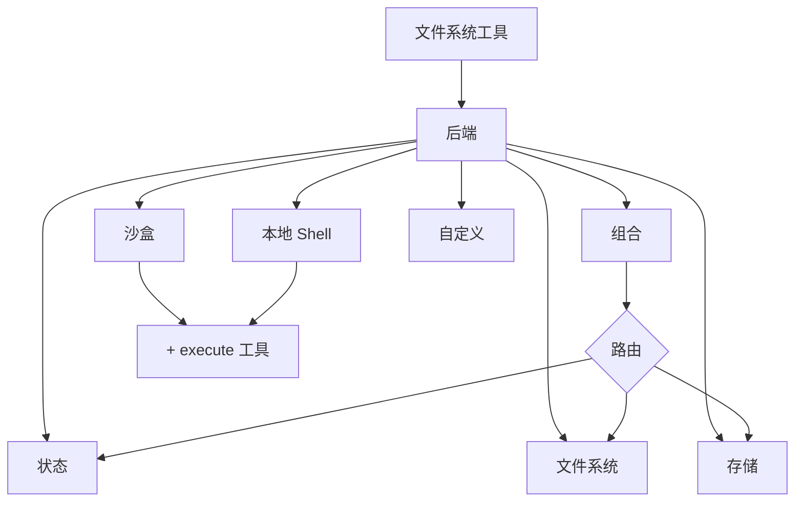

> ## 文档索引
> 在此获取完整文档索引：https://docs.langchain.com/llms.txt
> 在继续探索之前，使用此文件来发现所有可用页面。

# 后端

> 为 deep agents 选择并配置文件系统后端。你可以将不同路径路由到不同后端，实现虚拟文件系统，并强制执行策略。

Deep agents 通过 `ls`、`read_file`、`write_file`、`edit_file`、`glob` 与 `grep` 等工具向智能体暴露文件系统能力。这些工具通过一个可插拔后端运行。`read_file` 工具在所有后端上都原生支持图片文件（`.png`、`.jpg`、`.jpeg`、`.gif`、`.webp`），并将其作为多模态内容块返回。

沙盒与 `LocalShellBackend` 也提供 `execute` 工具。



本页解释如何[选择后端](#specify-a-backend)、[将不同路径路由到不同后端](#route-to-different-backends)、[实现你自己的虚拟文件系统](#use-a-virtual-filesystem)（例如 S3 或 Postgres）、[添加策略钩子](#add-policy-hooks)，以及[遵循后端协议](#protocol-reference)。

## 快速开始

下面是一些预构建的文件系统后端，你可以快速将其用于深度智能体：

| 内置后端                                               | 描述                                                         |
| ------------------------------------------------------ | ------------------------------------------------------------ |
| [默认](#statebackend-ephemeral)                        | `agent = create_deep_agent()` <br />临时存于状态中。智能体的默认文件系统后端存储在 `langgraph` 状态里。注意：该文件系统仅会在*单个线程*内持久化。 |
| [本地文件系统持久化](#filesystembackend-local-disk)     | `agent = create_deep_agent(backend=FilesystemBackend(root_dir="/Users/nh/Desktop/"))` <br />使深度智能体可以访问你本机的文件系统。你可以指定智能体可访问的根目录。注意：提供的 `root_dir` 必须是绝对路径。 |
| [耐久存储（LangGraph store）](#storebackend-langgraph-store) | `agent = create_deep_agent(backend=lambda rt: StoreBackend(rt))` <br />使智能体可以访问*跨线程持久化*的长期存储。这非常适合存储更长期的记忆或在多次执行之间对智能体依然适用的指令。 |
| [沙盒](/oss/javascript/deepagents/sandboxes)           | `agent = create_deep_agent(backend=sandbox)` <br />在隔离环境中执行代码。沙盒提供文件系统工具以及用于运行 Shell 命令的 `execute` 工具。可选 Modal、Daytona、Deno 或本地 VFS。 |
| [本地 Shell](#localshellbackend-local-shell)           | `agent = create_deep_agent(backend=LocalShellBackend(root_dir=".", env={"PATH": "/usr/bin:/bin"}))` <br />直接在宿主机上执行文件系统操作与 Shell。没有隔离——仅在受控的开发环境中使用。请参阅下方[安全注意事项](#local-shell)。 |
| [组合](#compositebackend-router)                       | 默认临时存储，`/memories/` 持久化。Composite 后端具备最大灵活性。你可以为文件系统中的不同路由指定不同后端。参阅下方 Composite 路由的可直接复制示例。 |

## 内置后端

### <a id="statebackend-ephemeral"></a> StateBackend（临时）

```python  theme={null}
# 默认情况下，我们提供 StateBackend
agent = create_deep_agent()

# 在底层，它看起来像这样
from deepagents.backends import StateBackend

agent = create_deep_agent(
    backend=(lambda rt: StateBackend(rt))   # 注意：这些工具会通过 runtime.state 访问 State
)
```

**它如何工作：**

* 将文件存储在当前线程的 LangGraph 智能体状态中。
* 通过 checkpoint 在同一线程的多轮智能体交互之间持久化。

**最适合：**

* 作为智能体写入中间结果的草稿板。
* 自动驱逐较大的工具输出，随后智能体可分段读回。

注意：该后端在主管智能体（supervisor agent）与子智能体之间共享，子智能体写入的任何文件都会保留在 LangGraph 智能体状态中，
即使该子智能体的执行已完成。这些文件仍然可供主管智能体与其他子智能体使用。

### <a id="filesystembackend-local-disk"></a> FilesystemBackend（本地磁盘）

<Warning>
  该后端会赋予智能体对文件系统的直接读写权限。
  请谨慎使用，并仅在合适的环境中启用。

  **适用场景：**

  * 本地开发 CLI（编码助手、开发工具）
  * CI/CD 流水线（参阅下方安全注意事项）

  **不适用场景：**

  * Web 服务器或 HTTP API —— 请改用 `StateBackend`、`StoreBackend` 或[沙盒后端](/oss/javascript/deepagents/sandboxes)

  **安全风险：**

  * 智能体可以读取任何可访问文件，包括密钥（API Key、凭据、`.env` 文件）
  * 与网络工具结合时，密钥可能通过 SSRF 攻击被外泄
  * 文件修改是永久且不可逆的

  **建议的防护措施：**

  1. 启用[人类介入（HITL）中间件](/oss/javascript/deepagents/human-in-the-loop)以审核敏感操作。
  2. 将密钥排除在可访问的文件系统路径之外（尤其在 CI/CD 中）。
  3. 对于生产环境中需要文件系统交互的场景，使用[沙盒后端](/oss/javascript/deepagents/sandboxes)。
  4. **始终**在设置 `root_dir` 的同时使用 `virtual_mode=True`，以启用基于路径的访问限制（阻止 `..`、`~` 与 root 之外的绝对路径）。
     注意：默认值（`virtual_mode=False`）即使设置了 `root_dir` 也不提供任何安全性。
     </Warning>

```python  theme={null}
from deepagents.backends import FilesystemBackend

agent = create_deep_agent(
    backend=FilesystemBackend(root_dir=".", virtual_mode=True)
)
```

**它如何工作：**

* 在可配置的 `root_dir` 下读取/写入真实文件。
* 你可以选择设置 `virtual_mode=True`，以在 `root_dir` 下对路径进行沙盒化与规范化处理。
* 使用安全的路径解析，尽可能防止不安全的 symlink 穿越，并可使用 ripgrep 进行快速 `grep`。

**最适合：**

* 你机器上的本地项目
* CI 沙盒
* 挂载的持久化卷

### <a id="localshellbackend-local-shell"></a><a id="local-shell"></a> LocalShellBackend（本地 Shell）

<Warning>
  该后端会赋予智能体对文件系统的直接读写权限，**并且**允许其在宿主机上不受限制地执行 Shell。
  请极其谨慎使用，并仅在合适的环境中启用。

  **适用场景：**

  * 本地开发 CLI（编码助手、开发工具）
  * 你信任智能体代码的个人开发环境
  * 具备正确密钥管理的 CI/CD 流水线

  **不适用场景：**

  * 生产环境（例如 Web 服务器、API、多租户系统）
  * 处理不受信任的用户输入或执行不受信任的代码

  **安全风险：**

  * 智能体可以以你的用户权限执行**任意 Shell 命令**
  * 智能体可以读取任何可访问文件，包括密钥（API Key、凭据、`.env` 文件）
  * 密钥可能被暴露
  * 文件修改与命令执行是**永久且不可逆的**
  * 命令直接在宿主系统上运行
  * 命令可能消耗无限 CPU、内存与磁盘

  **建议的防护措施：**

  1. 启用[人类介入（HITL）中间件](/oss/javascript/deepagents/human-in-the-loop)以在执行前审核并批准操作。**强烈建议**启用。
  2. 仅在专用开发环境中运行。切勿用于共享或生产系统。
  3. 对于生产环境中需要 Shell 执行的场景，使用[沙盒后端](/oss/javascript/deepagents/sandboxes)。

  **注意：**启用 Shell 访问后，`virtual_mode=True` 不提供任何安全性，因为命令可以访问系统中的任意路径。
</Warning>

```python  theme={null}
from deepagents.backends import LocalShellBackend

agent = create_deep_agent(
    backend=LocalShellBackend(root_dir=".", env={"PATH": "/usr/bin:/bin"})
)
```

**它如何工作：**

* 在 `FilesystemBackend` 的基础上增加 `execute` 工具，用于在宿主机上运行 Shell 命令。
* 命令使用 `subprocess.run(shell=True)` 直接在你的机器上运行，且不进行沙盒化。
* 支持 `timeout`（默认 120s）、`max_output_bytes`（默认 100,000）、`env` 与 `inherit_env` 等环境变量相关参数。
* Shell 命令以 `root_dir` 作为工作目录运行，但可以访问系统中的任意路径。

**最适合：**

* 本地编码助手与开发工具
* 在你信任智能体的前提下，用于开发过程中的快速迭代

### <a id="storebackend-langgraph-store"></a> StoreBackend（LangGraph store）

```python  theme={null}
from langgraph.store.memory import InMemoryStore
from deepagents.backends import StoreBackend

agent = create_deep_agent(
    backend=(lambda rt: StoreBackend(rt)),
    store=InMemoryStore()  # 适用于本地开发；LangSmith Deployment 时省略
)
```

<Note>
  部署到 [LangSmith Deployment](/langsmith/deployments) 时，请省略 `store` 参数。平台会自动为你的智能体配置 store。
</Note>

**它如何工作：**

* 将文件存储在运行时提供的 LangGraph [`BaseStore`](https://reference.langchain.com/javascript/classes/_langchain_langgraph-checkpoint.BaseStore.html) 中，从而实现跨线程的耐久存储。

**最适合：**

* 你已在运行时配置了 LangGraph store（例如 Redis、Postgres，或实现了 [`BaseStore`](https://reference.langchain.com/javascript/classes/_langchain_langgraph-checkpoint.BaseStore.html) 的云实现）。
* 你通过 LangSmith Deployment 部署智能体（平台会自动为智能体配置 store）。

### <a id="compositebackend-router"></a> CompositeBackend（路由器）

```python  theme={null}
from deepagents import create_deep_agent
from deepagents.backends import CompositeBackend, StateBackend, StoreBackend
from langgraph.store.memory import InMemoryStore

composite_backend = lambda rt: CompositeBackend(
    default=StateBackend(rt),
    routes={
        "/memories/": StoreBackend(rt),
    }
)

agent = create_deep_agent(
    backend=composite_backend,
    store=InMemoryStore()  # store 传给 create_deep_agent，而不是 backend
)
```

**它如何工作：**

* 根据路径前缀，将文件操作路由到不同后端。
* 在列表与搜索结果中保留原始路径前缀。

**最适合：**

* 你希望同时为智能体提供临时存储与跨线程存储时；`CompositeBackend` 允许你同时提供 `StateBackend` 与 `StoreBackend`
* 你有多个信息源，希望在单一文件系统中统一提供给智能体时
  * 例如：将长期记忆存储在某个 store 的 `/memories/` 下，同时还有一个自定义后端将文档暴露在 `/docs/` 下。

## <a id="specify-a-backend"></a> 指定一个后端

* 将后端传入 `create_deep_agent(backend=...)`。文件系统中间件会将其用于所有工具。
* 你可以传入以下任一形式：
  * 实现 `BackendProtocol` 的实例（例如 `FilesystemBackend(root_dir=".")`），或
  * 工厂函数 `BackendFactory = Callable[[ToolRuntime], BackendProtocol]`（适用于需要运行时信息的后端，如 `StateBackend` 或 `StoreBackend`）。
* 若省略，默认值为 `lambda rt: StateBackend(rt)`。

## <a id="route-to-different-backends"></a> 路由到不同后端

将命名空间的不同部分路由到不同后端。常见用法是将 `/memories/*` 持久化，并让其他内容保持临时态。

```typescript  theme={null}
import { createDeepAgent, CompositeBackend, FilesystemBackend, StateBackend } from "deepagents";

const compositeBackend = (rt) => new CompositeBackend(
  new StateBackend(rt),
  {
    "/memories/": new FilesystemBackend({ rootDir: "/deepagents/myagent", virtualMode: true }),
  },
);

const agent = createDeepAgent({ backend: compositeBackend });
```

行为：

* `/workspace/plan.md` → `StateBackend`（临时）
* `/memories/agent.md` → `FilesystemBackend`（位于 `/deepagents/myagent` 下）
* `ls`、`glob`、`grep` 会聚合结果并显示原始路径前缀。

说明：

* 更长的前缀优先（例如，路由 `"/memories/projects/"` 可以覆盖 `"/memories/"`）。
* 对 StoreBackend 路由时，确保智能体运行时提供了 store（`runtime.store`）。

## <a id="use-a-virtual-filesystem"></a> 使用虚拟文件系统

构建一个自定义后端，将远程或数据库文件系统（例如 S3 或 Postgres）投影到工具命名空间中。

设计指南：

* 路径为绝对路径（`/x/y.txt`）。决定如何将其映射到你的存储 key/行。
* 高效实现 `ls_info` 与 `glob_info`（如有可能使用服务端列表能力，否则在本地过滤）。
* 对缺失文件或无效正则模式，返回用户可读的错误字符串。
* 对外部持久化，将结果中的 `files_update=None`；只有存于状态的后端才应返回 `files_update` 字典。

S3 风格大纲：

Postgres 风格大纲：

* 表 `files(path text primary key, content text, created_at timestamptz, modified_at timestamptz)`
* 将工具操作映射到 SQL：
  * `ls_info` 使用 `WHERE path LIKE $1 || '%'`
  * `glob_info` 在 SQL 中过滤，或先拉取再在 Python 中应用 glob
  * `grep_raw` 可按扩展名或修改时间获取候选行，然后逐行扫描

## <a id="add-policy-hooks"></a> 添加策略钩子

通过继承或包装后端来强制执行企业规则。

在选定前缀下阻止写入/编辑（子类化）：

通用包装器（适用于任何后端）：

## <a id="protocol-reference"></a> 协议参考

后端必须实现 `BackendProtocol`。

必需端点：

* `ls_info(path: str) -> list[FileInfo]`
  * 返回至少包含 `path` 的条目。尽可能包含 `is_dir`、`size`、`modified_at`。为保证确定性输出，按 `path` 排序。
* `read(file_path: str, offset: int = 0, limit: int = 2000) -> str`
  * 返回带行号的内容。文件不存在时，返回 `"Error: File '/x' not found"`。
* `grep_raw(pattern: str, path: Optional[str] = None, glob: Optional[str] = None) -> list[GrepMatch] | str`
  * 返回结构化匹配结果。正则无效时，返回形如 `"Invalid regex pattern: ..."` 的字符串（不要抛异常）。
* `glob_info(pattern: str, path: str = "/") -> list[FileInfo]`
  * 以 `FileInfo` 条目返回匹配文件（若无匹配则返回空列表）。
* `write(file_path: str, content: str) -> WriteResult`
  * 仅创建。冲突时返回 `WriteResult(error=...)`。成功时设置 `path`；对状态后端设置 `files_update={...}`；外部后端应使用 `files_update=None`。
* `edit(file_path: str, old_string: str, new_string: str, replace_all: bool = False) -> EditResult`
  * 除非 `replace_all=True`，否则强制 `old_string` 唯一。未找到则返回错误。成功时包含 `occurrences`。

支持类型：

* `WriteResult(error, path, files_update)`
* `EditResult(error, path, files_update, occurrences)`
* `FileInfo` 字段：`path`（必需），以及可选的 `is_dir`、`size`、`modified_at`。
* `GrepMatch` 字段：`path`、`line`、`text`。

***

<Callout icon="edit">
  在 GitHub 上[编辑此页面](https://github.com/langchain-ai/docs/edit/main/src/oss/deepagents/backends.mdx)或[提交 issue](https://github.com/langchain-ai/docs/issues/new/choose)。
</Callout>

<Callout icon="terminal-2">
  通过 MCP 将[连接这些文档](/use-these-docs)到 Claude、VSCode 等，以获得实时答案。
</Callout>
