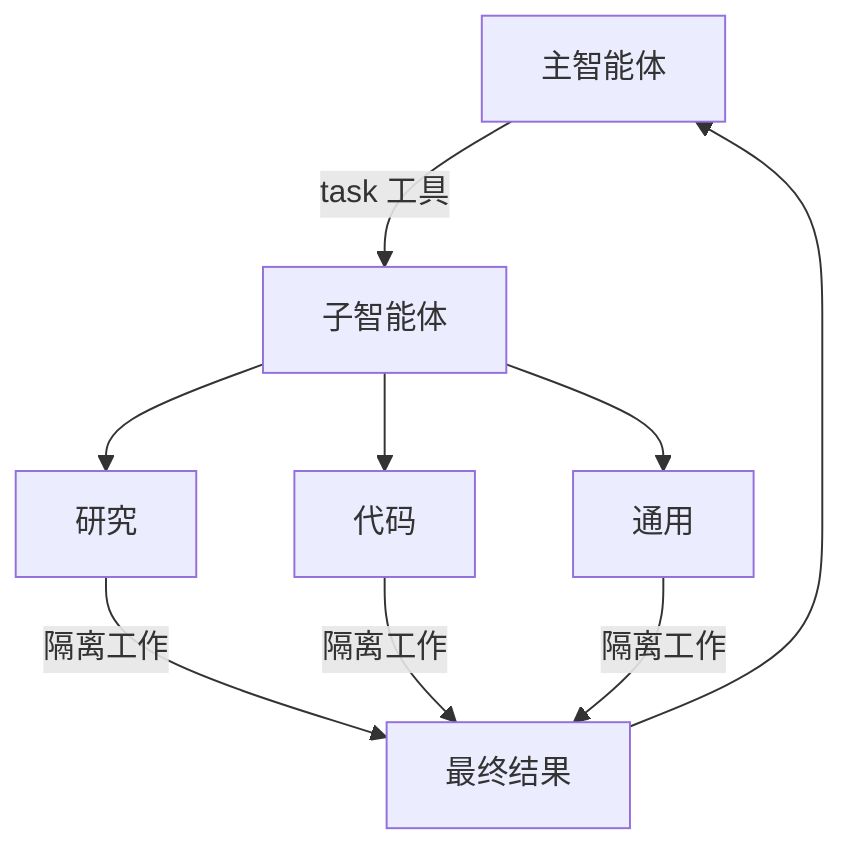

> ## 文档索引
> 在此获取完整文档索引：https://docs.langchain.com/llms.txt
> 在继续探索之前，使用此文件来发现所有可用页面。

# 子智能体

> 了解如何使用子智能体来委派工作并保持上下文干净

Deep agents 可以创建子智能体来委派工作。你可以在 `subagents` 参数中指定自定义子智能体。子智能体适用于[上下文隔离](https://www.dbreunig.com/2025/06/26/how-to-fix-your-context.html#context-quarantine)（保持主智能体的上下文干净），也可用于提供专门化指令。



## 为什么要使用子智能体？

子智能体解决了 **上下文膨胀问题**。当智能体使用输出很大的工具（Web 搜索、文件读取、数据库查询）时，上下文窗口会很快被中间结果填满。子智能体会隔离这些细节工作——主智能体只接收最终结果，而不是产生它的数十次工具调用。

**何时使用子智能体：**

* ✅ 会弄乱主智能体上下文的多步骤任务
* ✅ 需要自定义指令或工具的专业领域
* ✅ 需要不同模型能力的任务
* ✅ 希望让主智能体聚焦于高层协调时

**何时不使用子智能体：**

* ❌ 简单的单步任务
* ❌ 需要保留中间上下文时
* ❌ 开销大于收益时

## 配置

`subagents` 应为字典列表或 `CompiledSubAgent` 对象列表。共有两种类型：

### SubAgent（基于字典）

在大多数使用场景中，将子智能体定义为包含以下字段的字典：

| 字段 | 类型 | 描述 |
| --- | --- | --- |
| `name` | `str` | 必填。子智能体的唯一标识符。主智能体在调用 `task()` 工具时会使用该名称。子智能体名称会成为 `AIMessage` 的元数据以及流式传输中的元数据，有助于区分不同智能体。 |
| `description` | `str` | 必填。对子智能体功能的描述。请具体且以行动为导向。主智能体据此决定何时委派。 |
| `system_prompt` | `str` | 必填。对子智能体的指令。自定义子智能体必须自行定义。应包含工具使用指导与输出格式要求。<br />不从主智能体继承。 |
| `tools` | `list[Callable]` | 必填。子智能体可使用的工具。自定义子智能体自行指定。请保持最小化，仅包含必要工具。<br />不从主智能体继承。 |
| `model` | `str` \| `BaseChatModel` | 可选。覆盖主智能体的模型。不提供则使用主智能体的模型。<br />默认从主智能体继承。你可以传入形如 `'openai:gpt-5'` 的模型标识字符串（使用 `'provider:model'` 格式），或传入 LangChain 聊天模型对象（`await initChatModel("gpt-5")` 或 `new ChatOpenAI({ model: "gpt-5" })`）。 |
| `middleware` | `list[Middleware]` | 可选。用于自定义行为、日志记录或限流的额外中间件。<br />不从主智能体继承。 |
| `interrupt_on` | `dict[str, bool]` | 可选。为特定工具配置[人类介入](/oss/javascript/deepagents/human-in-the-loop)。子智能体的值会覆盖主智能体。需要 checkpointer。<br />默认从主智能体继承。子智能体的值会覆盖默认值。 |
| `skills` | `list[str]` | 可选。[技能](/oss/javascript/deepagents/skills)源路径。指定后，子智能体将从这些目录加载技能（例如 `["/skills/research/", "/skills/web-search/"]`）。这使得子智能体可以拥有与主智能体不同的技能集合。<br />不从主智能体继承。只有通用子智能体会继承主智能体的技能。当子智能体配置了 skills 时，它会运行自己独立的 `SkillsMiddleware` 实例。技能状态完全隔离——子智能体加载的技能对父智能体不可见，反之亦然。 |

### CompiledSubAgent

对于复杂工作流，可使用预构建的 LangGraph 图：

| 字段 | 类型 | 描述 |
| --- | --- | --- |
| `name` | `str` | 必填。子智能体的唯一标识符。子智能体名称会成为 `AIMessage` 的元数据以及流式传输中的元数据，有助于区分不同智能体。 |
| `description` | `str` | 必填。该子智能体的功能描述。 |
| `runnable` | `Runnable` | 必填。已编译的 LangGraph 图（必须先调用 `.compile()`）。 |

## 使用 SubAgent

```python  theme={null}
import os
from typing import Literal
from tavily import TavilyClient
from deepagents import create_deep_agent

tavily_client = TavilyClient(api_key=os.environ["TAVILY_API_KEY"])

def internet_search(
    query: str,
    max_results: int = 5,
    topic: Literal["general", "news", "finance"] = "general",
    include_raw_content: bool = False,
):
    """运行一次 Web 搜索"""
    return tavily_client.search(
        query,
        max_results=max_results,
        include_raw_content=include_raw_content,
        topic=topic,
    )

research_subagent = {
    "name": "research-agent",
    "description": "用于更深入地研究问题",
    "system_prompt": "你是一位出色的研究员",
    "tools": [internet_search],
    "model": "openai:gpt-4.1",  # 可选覆盖，默认使用主智能体模型
}
subagents = [research_subagent]

agent = create_deep_agent(
    model="claude-sonnet-4-5-20250929",
    subagents=subagents
)
```

## 使用 CompiledSubAgent

对于更复杂的使用场景，你可以提供自定义子智能体。
你可以使用 LangChain 的 `create_agent` 创建自定义子智能体，或使用 [graph API](https://github.com/langchain-ai/docs/pull/) 构建自定义 LangGraph 图。

如果你在创建自定义 LangGraph 图，请确保该图具有一个[名为 `"messages"` 的 state key](/oss/javascript/langgraph/quickstart#2-define-state)：

```typescript  theme={null}
import { createDeepAgent, CompiledSubAgent } from "deepagents";
import { createAgent } from "langchain";

// 创建一个自定义智能体图
const customGraph = createAgent({
  model: yourModel,
  tools: specializedTools,
  prompt: "你是一个专门用于数据分析的智能体……",
});

// 将其作为自定义子智能体使用
const customSubagent: CompiledSubAgent = {
  name: "data-analyzer",
  description: "用于复杂数据分析任务的专门化智能体",
  runnable: customGraph,
};

const subagents = [customSubagent];

const agent = createDeepAgent({
  model: "claude-sonnet-4-5-20250929",
  tools: [internetSearch],
  systemPrompt: researchInstructions,
  subagents: subagents,
});
```

## 流式传输

在流式追踪信息时，智能体名称会以 `lc_agent_name` 的形式出现在元数据中。
在查看追踪信息时，你可以使用该元数据来区分数据来自哪个智能体。

以下示例创建了一个名为 `main-agent` 的深度智能体，以及一个名为 `research-agent` 的子智能体：

```python  theme={null}
import os
from typing import Literal
from tavily import TavilyClient
from deepagents import create_deep_agent

tavily_client = TavilyClient(api_key=os.environ["TAVILY_API_KEY"])

def internet_search(
    query: str,
    max_results: int = 5,
    topic: Literal["general", "news", "finance"] = "general",
    include_raw_content: bool = False,
):
    """运行一次 Web 搜索"""
    return tavily_client.search(
        query,
        max_results=max_results,
        include_raw_content=include_raw_content,
        topic=topic,
    )

research_subagent = {
    "name": "research-agent",
    "description": "用于更深入地研究问题",
    "system_prompt": "你是一位出色的研究员",
    "tools": [internet_search],
    "model": "claude-sonnet-4-5-20250929",  # 可选覆盖，默认使用主智能体模型
}
subagents = [research_subagent]

agent = create_deep_agent(
    model="claude-sonnet-4-5-20250929",
    subagents=subagents,
    name="main-agent"
)
```

在你向 deepagents 发出提示时，所有由子智能体或深度智能体执行的 agent run，都会在其元数据中包含智能体名称。
在本例中，名为 `"research-agent"` 的子智能体，在任何关联的 agent run 元数据中都会包含 `{'lc_agent_name': 'research-agent'}`：


## 结构化输出

所有子智能体都支持[结构化输出](/oss/javascript/langchain/structured-output)，你可以使用它来验证子智能体的输出。

你可以通过在调用 `createAgent()` 时传入 `responseFormat` 参数来设置期望的结构化输出 schema。
当模型生成结构化数据时，它会被捕获并校验。结构化对象本身不会返回给父智能体。
当对子智能体使用结构化输出时，请在 `ToolMessage` 中包含结构化数据。

更多信息请参阅[响应格式](/oss/javascript/langchain/structured-output#response-format)。

## 通用子智能体

除任何用户自定义的子智能体之外，Deep agents 始终可以访问一个名为 `general-purpose` 的子智能体。该子智能体：

* 与主智能体具有相同的系统提示词
* 可访问完全相同的工具
* 使用相同的模型（除非被覆盖）
* 继承主智能体的技能（当配置了技能时）

### 何时使用

通用子智能体非常适合在不引入专门化行为的情况下进行上下文隔离。主智能体可以将一个复杂的多步骤任务委派给该子智能体，并获得一个简洁的结果，而不会因中间工具调用而产生膨胀。

<Card title="示例">
  主智能体不必进行 10 次 Web 搜索并用结果填满其上下文，而是将其委派给通用子智能体：`task(name="general-purpose", task="Research quantum computing trends")`。子智能体在内部执行所有搜索，仅返回一个摘要。
</Card>

### 技能继承

当使用 `create_deep_agent` 配置[技能](/oss/javascript/deepagents/skills)时：

* **通用子智能体**：自动继承主智能体的技能
* **自定义子智能体**：默认不会继承技能——使用 `skills` 参数为它们配置自己的技能

<Note>
  只有配置了 skills 的子智能体才会获得一个 `SkillsMiddleware` 实例——没有 `skills` 参数的自定义子智能体不会获得该实例。若存在该实例，技能状态会在两个方向上完全隔离：父智能体的技能对子智能体不可见，子智能体的技能也不会回传给父智能体。
</Note>

```typescript  theme={null}
import { createDeepAgent, SubAgent } from "deepagents";

// 具有自身技能的研究子智能体
const researchSubagent: SubAgent = {
  name: "researcher",
  description: "具备专门化技能的研究助手",
  systemPrompt: "你是一名研究员。",
  tools: [webSearch],
  skills: ["/skills/research/", "/skills/web-search/"],  // 子智能体专属技能
};

const agent = createDeepAgent({
  model: "claude-sonnet-4-5-20250929",
  skills: ["/skills/main/"],  // 主智能体与通用子智能体会获得这些技能
  subagents: [researchSubagent],  // 仅获得 /skills/research/ 与 /skills/web-search/
});
```

## 最佳实践

### 编写清晰的描述

主智能体会使用描述来决定调用哪个子智能体。请尽量具体：

✅ **好：**`"分析财务数据，并生成带置信度分数的投资洞察"`

❌ **差：**`"做点财务相关的事"`

### 保持系统提示词足够详细

请包含如何使用工具以及如何格式化输出的具体指导：

```typescript  theme={null}
const researchSubagent = {
  name: "research-agent",
  description: "使用 Web 搜索开展深入研究并综合结论",
  systemPrompt: `你是一位严谨的研究员。你的工作是：

  1. 将研究问题拆解为可搜索的查询
  2. 使用 internet_search 查找相关信息
  3. 将发现综合为全面但简洁的摘要
  4. 在提出主张时引用来源

  输出格式：
  - 摘要（2-3 段）
  - 关键发现（要点列表）
  - 来源（包含 URL）

  为保持上下文干净，请将响应控制在 500 词以内。`,
  tools: [internetSearch],
};
```

### 最小化工具集合

只给子智能体提供其所需的工具。这能提升专注度与安全性：

```typescript  theme={null}
// ✅ 好：聚焦的工具集合
const emailAgent = {
  name: "email-sender",
  tools: [sendEmail, validateEmail],  // 仅与邮件相关
};

// ❌ 差：工具过多
const emailAgentBad = {
  name: "email-sender",
  tools: [sendEmail, webSearch, databaseQuery, fileUpload],  // 不聚焦
};
```

### 按任务选择模型

不同模型在不同任务上更擅长：

```typescript  theme={null}
const subagents = [
  {
    name: "contract-reviewer",
    description: "审阅法律文件与合同",
    systemPrompt: "你是一位资深法律审阅专家……",
    tools: [readDocument, analyzeContract],
    model: "claude-sonnet-4-5-20250929",  // 更大的上下文，适合长文档
  },
  {
    name: "financial-analyst",
    description: "分析财务数据与市场趋势",
    systemPrompt: "你是一位资深金融分析师……",
    tools: [getStockPrice, analyzeFundamentals],
    model: "gpt-5",  // 更擅长数值分析
  },
];
```

### 返回简洁结果

指示子智能体返回摘要，而不是原始数据：

```typescript  theme={null}
const dataAnalyst = {
  systemPrompt: `分析数据并返回：
  1. 关键洞察（3-5 条要点）
  2. 总体置信度分数
  3. 推荐的下一步行动

  不要包含：
  - 原始数据
  - 中间计算过程
  - 详细的工具输出

  请将响应控制在 300 词以内。`,
};
```

## 常见模式

### 多个专门化子智能体

为不同领域创建专门化子智能体：

```typescript  theme={null}
import { createDeepAgent } from "deepagents";

const subagents = [
  {
    name: "data-collector",
    description: "从各种来源收集原始数据",
    systemPrompt: "收集关于该主题的全面数据",
    tools: [webSearch, apiCall, databaseQuery],
  },
  {
    name: "data-analyzer",
    description: "分析收集到的数据以提取洞察",
    systemPrompt: "分析数据并提取关键洞察",
    tools: [statisticalAnalysis],
  },
  {
    name: "report-writer",
    description: "基于分析结果撰写打磨后的报告",
    systemPrompt: "将洞察整理为专业报告",
    tools: [formatDocument],
  },
];

const agent = createDeepAgent({
  model: "claude-sonnet-4-5-20250929",
  systemPrompt: "你负责协调数据分析与报告撰写。对专门化任务使用子智能体。",
  subagents: subagents,
});
```

**工作流：**

1. 主智能体制定高层计划
2. 将数据收集委派给 data-collector
3. 将结果交给 data-analyzer
4. 将洞察交给 report-writer
5. 汇总最终输出

每个子智能体都在干净的上下文中工作，只聚焦于其任务。

## 故障排查

### 子智能体未被调用

**问题**：主智能体倾向于自己完成工作，而不是委派。

**解决方案**：

1. **让描述更具体：**

   ```typescript  theme={null}
   // ✅ 好
   { name: "research-specialist", description: "使用 Web 搜索对特定主题开展深入研究。当你需要通过多次搜索获取细节信息时使用。" }

   // ❌ 差
   { name: "helper", description: "帮忙做点事" }
   ```

2. **指示主智能体进行委派：**

   ```typescript  theme={null}
   const agent = createDeepAgent({
     systemPrompt: `...你的指令...
   
     IMPORTANT: 对于复杂任务，请使用 task() 工具委派给你的子智能体。
     这能保持上下文干净并提升结果质量。`,
     subagents: [...]
   });
   ```

### 上下文仍然膨胀

**问题**：即便使用了子智能体，上下文仍被填满。

**解决方案**：

1. **指示子智能体返回简洁结果：**

   ```typescript  theme={null}
   systemPrompt: `...

   IMPORTANT: 仅返回必要的摘要。
   不要包含原始数据、中间搜索结果或详细的工具输出。
   请将响应控制在 500 词以内。`
   ```

2. **对大数据使用文件系统：**

   ```typescript  theme={null}
   systemPrompt: `当你收集了大量数据时：
   1. 将原始数据保存到 /data/raw_results.txt
   2. 处理并分析数据
   3. 仅返回分析摘要
   
   这能保持上下文干净。`
   ```

### 选择了错误的子智能体

**问题**：主智能体为任务调用了不合适的子智能体。

**解决方案**：在描述中清晰地区分子智能体：

```typescript  theme={null}
const subagents = [
  {
    name: "quick-researcher",
    description: "用于简单、快速的研究问题，仅需 1-2 次搜索。当你需要基本事实或定义时使用。",
  },
  {
    name: "deep-researcher",
    description: "用于复杂、深入的研究，需多次搜索、综合与分析。用于生成全面报告。",
  }
];
```

***

<Callout icon="edit">
  [在 GitHub 上编辑此页面](https://github.com/langchain-ai/docs/edit/main/src/oss/deepagents/subagents.mdx)或[提交 issue](https://github.com/langchain-ai/docs/issues/new/choose)。
</Callout>

<Callout icon="terminal-2">
  通过 MCP 将[这些文档](/use-these-docs)连接到 Claude、VSCode 等，以获得实时答案。
</Callout>
