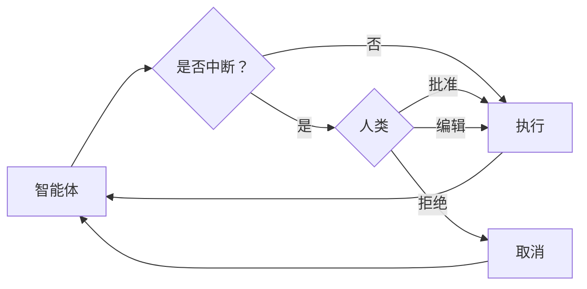

> ## 文档索引
> 在此获取完整文档索引：https://docs.langchain.com/llms.txt
> 在继续探索之前，使用此文件来发现所有可用页面。

# 人类介入

> 了解如何为敏感工具操作配置人工审批

某些工具操作可能较为敏感，需要在执行前获得人工批准。Deep agents 通过 LangGraph 的中断（interrupt）能力支持人类介入工作流。你可以使用 `interrupt_on` 参数配置哪些工具需要审批。



## 基础配置

`interrupt_on` 参数接受一个字典，将工具名映射到中断配置。每个工具可配置为：

* **`True`**：使用默认行为启用中断（允许批准、编辑、拒绝）
* **`False`**：为该工具禁用中断
* **`{"allowed_decisions": [...]}`**：使用指定允许决策的自定义配置

```python  theme={null}
from langchain.tools import tool
from deepagents import create_deep_agent
from langgraph.checkpoint.memory import MemorySaver

@tool
def delete_file(path: str) -> str:
    """从文件系统删除文件。"""
    return f"已删除 {path}"

@tool
def read_file(path: str) -> str:
    """从文件系统读取文件。"""
    return f"{path} 的内容"

@tool
def send_email(to: str, subject: str, body: str) -> str:
    """发送邮件。"""
    return f"已发送邮件至 {to}"

# 人类介入需要 Checkpointer（必需）
checkpointer = MemorySaver()

agent = create_deep_agent(
    model="claude-sonnet-4-5-20250929",
    tools=[delete_file, read_file, send_email],
    interrupt_on={
        "delete_file": True,  # 默认：批准、编辑、拒绝
        "read_file": False,   # 不需要中断
        "send_email": {"allowed_decisions": ["approve", "reject"]},  # 不允许编辑
    },
    checkpointer=checkpointer  # 必需！
)
```

## 决策类型

`allowed_decisions` 列表控制人在审核工具调用时可以采取的动作：

* **`"approve"`**：使用智能体提出的原始参数执行工具
* **`"edit"`**：在执行前修改工具参数
* **`"reject"`**：完全跳过本次工具调用的执行

你可以为每个工具自定义可用的决策：

```typescript  theme={null}
const interruptOn = {
  // 敏感操作：允许全部选项
  delete_file: { allowedDecisions: ["approve", "edit", "reject"] },

  // 中等风险：仅允许批准或拒绝
  write_file: { allowedDecisions: ["approve", "reject"] },

  // 必须批准（不允许拒绝）
  critical_operation: { allowedDecisions: ["approve"] },
};
```

## 处理中断

当触发中断时，智能体会暂停执行并返回控制权。请在结果中检查中断并进行相应处理。

```typescript  theme={null}
import { v4 as uuidv4 } from "uuid";
import { Command } from "@langchain/langgraph";

// 使用 thread_id 创建配置，用于状态持久化
const config = { configurable: { thread_id: uuidv4() } };

// 调用智能体
let result = await agent.invoke(
  {
    messages: [{ role: "user", content: "删除文件 temp.txt" }],
  },
  config,
);

// 检查执行是否被中断
if (result.__interrupt__) {
  // 提取中断信息
  const interrupts = result.__interrupt__[0].value;
  const actionRequests = interrupts.actionRequests;
  const reviewConfigs = interrupts.reviewConfigs;

  // 创建从工具名到审核配置的映射
  const configMap = Object.fromEntries(
    reviewConfigs.map((cfg) => [cfg.actionName, cfg]),
  );

  // 向用户展示待处理动作
  for (const action of actionRequests) {
    const reviewConfig = configMap[action.name];
    console.log(`工具：${action.name}`);
    console.log(`参数：${JSON.stringify(action.args)}`);
    console.log(`允许的决策：${reviewConfig.allowedDecisions}`);
  }

  // 获取用户决策（按 actionRequest 顺序，一项对应一个请求）
  const decisions = [{ type: "approve" }]; // 用户批准删除

  // 携带决策恢复执行
  result = await agent.invoke(
    new Command({ resume: { decisions } }),
    config, // 必须使用相同的 config！
  );
}

// 处理最终结果
console.log(result.messages[result.messages.length - 1].content);
```

## 多次工具调用

当智能体调用多个需要审批的工具时，所有中断会被批量合并为一次中断。你必须按顺序为每个工具调用提供决策。

```typescript  theme={null}
const config = { configurable: { thread_id: uuidv4() } };

let result = await agent.invoke(
  {
    messages: [
      {
        role: "user",
        content: "删除 temp.txt，并给 admin@example.com 发送邮件",
      },
    ],
  },
  config,
);

if (result.__interrupt__) {
  const interrupts = result.__interrupt__[0].value;
  const actionRequests = interrupts.actionRequests;

  // 两个工具都需要审批
  console.assert(actionRequests.length === 2);

  // 按照 actionRequests 的顺序提供决策
  const decisions = [
    { type: "approve" }, // 第一个工具：delete_file
    { type: "reject" },  // 第二个工具：send_email
  ];

  result = await agent.invoke(new Command({ resume: { decisions } }), config);
}
```

## 编辑工具参数

当允许决策中包含 `"edit"` 时，你可以在执行前修改工具参数：

```typescript  theme={null}
if (result.__interrupt__) {
  const interrupts = result.__interrupt__[0].value;
  const actionRequest = interrupts.actionRequests[0];

  // 智能体给出的原始参数
  console.log(actionRequest.args); // { to: "everyone@company.com", ... }

  // 用户决定编辑收件人
  const decisions = [
    {
      type: "edit",
      editedAction: {
        name: actionRequest.name, // 必须包含工具名
        args: { to: "team@company.com", subject: "...", body: "..." },
      },
    },
  ];

  result = await agent.invoke(new Command({ resume: { decisions } }), config);
}
```

## 子智能体中断

当使用子智能体时，你既可以在[工具调用上中断](#interrupts-on-tool-calls)，也可以在[工具调用内部中断](#interrupts-within-tool-calls)。

### 工具调用上的中断

每个子智能体都可以有自己的 `interrupt_on` 配置，用于覆盖主智能体的设置：

```typescript  theme={null}
const agent = createDeepAgent({
  tools: [deleteFile, readFile],
  interruptOn: {
    delete_file: true,
    read_file: false,
  },
  subagents: [
    {
      name: "file-manager",
      description: "管理文件操作",
      systemPrompt: "你是一个文件管理助手。",
      tools: [deleteFile, readFile],
      interruptOn: {
        // 覆盖：在该子智能体中，读取也需要审批
        delete_file: true,
        read_file: true, // 与主智能体不同！
      },
    },
  ],
  checkpointer,
});
```

当子智能体触发中断时，处理方式相同——检查 `__interrupt__` 并使用 `Command` 恢复执行。

### 工具调用内部的中断

子智能体工具可以直接调用 `interrupt()` 来暂停执行并等待审批：

```typescript  theme={null}
import { createAgent, tool } from "langchain";
import { ChatOpenAI } from "@langchain/openai";
import { HumanMessage } from "@langchain/core/messages";
import { MemorySaver, Command, interrupt } from "@langchain/langgraph";
import { createDeepAgent } from "deepagents";
import { z } from "zod";

const requestApproval = tool(
  async ({ actionDescription }: { actionDescription: string }) => {
    const approval = interrupt({
      type: "approval_request",
      action: actionDescription,
      message: `请批准或拒绝：${actionDescription}`,
    }) as { approved?: boolean; reason?: string };

    if (approval.approved) {
      return `动作 '${actionDescription}' 已获批准（APPROVED）。继续执行……`;
    } else {
      return `动作 '${actionDescription}' 已被拒绝（REJECTED）。原因：${
        approval.reason || "未提供原因"
      }`;
    }
  },
  {
    name: "request_approval",
    description: "在继续执行某个动作之前请求人工批准。",
    schema: z.object({
      actionDescription: z.string().describe("需要审批的动作"),
    }),
  },
);

async function main() {
  const checkpointer = new MemorySaver();
  const model = new ChatOpenAI({
    model: "gpt-4o-mini",
    maxTokens: 4096,
  });

  const compiledSubagent = createAgent({
    model: model,
    tools: [requestApproval],
    name: "approval-agent",
  });

  const parentAgent = await createDeepAgent({
    checkpointer: checkpointer,
    subagents: [
      {
        name: "approval-agent",
        description: "一个可以发起审批请求的智能体",
        runnable: compiledSubagent as any,
      },
    ],
  });

  const threadId = "test_interrupt_directly";
  const config = { configurable: { thread_id: threadId } };

  console.log("正在调用智能体——子智能体将使用 request_approval 工具……");

  let result = await parentAgent.invoke(
    {
      messages: [
        new HumanMessage({
          content:
            "使用 task 工具启动 approval-agent 子智能体。" +
            "让它使用 request_approval 工具，请求对“部署到生产环境”的操作进行审批。",
        }),
      ],
    },
    config,
  );

  if (result.__interrupt__) {
    const interruptValue = result.__interrupt__[0].value as {
      type?: string;
      action?: string;
      message?: string;
    };
    console.log("\n收到中断！");
    console.log(`  类型：${interruptValue.type}`);
    console.log(`  动作：${interruptValue.action}`);
    console.log(`  消息：${interruptValue.message}`);

    console.log("\n使用 Command(resume={'approved': true}) 恢复执行……");
    const result2 = await parentAgent.invoke(
      new Command({ resume: { approved: true } }),
      config,
    );

    if (!result2.__interrupt__) {
      console.log("\n执行完成！");
      // 查找工具响应
      const toolMsgs = result2.messages?.filter((m) => m.type === "tool") || [];
      if (toolMsgs.length > 0) {
        const lastToolMsg = toolMsgs[toolMsgs.length - 1];
        console.log(`  工具结果：${lastToolMsg.content}`);
      }
    } else {
      console.log("\n又发生了一次中断");
    }
  } else {
    console.log("\n  未发生中断——模型可能没有调用 request_approval");
  }
}

main().catch(console.error);
```

运行后会产生如下输出：

```typescript  theme={null}
正在调用智能体——子智能体将使用 request_approval 工具……

收到中断！
  类型：approval_request
  动作：deploying to production
  消息：请批准或拒绝：deploying to production

使用 Command(resume={'approved': true}) 恢复执行……

执行完成！
  工具结果：已授予对 “deploying to production” 的批准。你可以继续进行部署。
```

## 最佳实践

### 始终使用 checkpointer

人类介入需要使用 checkpointer 在中断与恢复之间持久化智能体状态：

### 使用相同的 thread ID

恢复执行时，你必须使用包含相同 `thread_id` 的同一个配置：

### 让决策顺序与动作顺序匹配

决策列表必须与 `action_requests` 的顺序一致：

### 按风险定制配置

基于风险等级为不同工具配置不同策略：

***

<Callout icon="edit">
  [在 GitHub 上编辑此页面](https://github.com/langchain-ai/docs/edit/main/src/oss/deepagents/human-in-the-loop.mdx)或[提交 issue](https://github.com/langchain-ai/docs/issues/new/choose)。
</Callout>

<Callout icon="terminal-2">
  通过 MCP 将[这些文档](/use-these-docs)连接到 Claude、VSCode 等，以获得实时答案。
</Callout>
