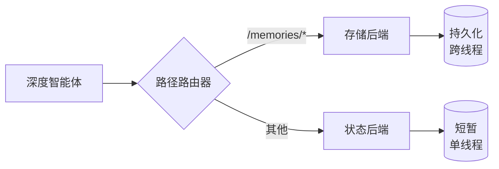

> ## 文档索引
> 在此获取完整文档索引：https://docs.langchain.com/llms.txt
> 在继续探索之前，使用此文件来发现所有可用页面。

# 长期记忆

> 了解如何通过跨线程持久化记忆来扩展深度智能体

Deep agents 自带一个本地文件系统用于卸载记忆。默认情况下，该文件系统存储在智能体状态中，并且**仅对单个线程是临时的（transient）**——对话结束后文件会丢失。

你可以通过使用 `CompositeBackend` 将特定路径路由到持久化存储来为 Deep agents 扩展**长期记忆**。这支持混合存储：部分文件可跨线程持久化，而其他文件仍保持短暂（ephemeral）。



## 设置

通过使用 `CompositeBackend` 将 `/memories/` 路径路由到 `StoreBackend` 来配置长期记忆：

```typescript  theme={null}
import { createDeepAgent } from "deepagents";
import { CompositeBackend, StateBackend, StoreBackend } from "deepagents";
import { InMemoryStore } from "@langchain/langgraph-checkpoint";

const agent = createDeepAgent({
  store: new InMemoryStore(), // 适用于本地开发；LangSmith Deployment 可省略
  backend: (config) =>
    new CompositeBackend(
      new StateBackend(config), // 短暂存储
      { "/memories/": new StoreBackend(config) }, // 持久化存储
    ),
});
```

## 工作原理

当使用 `CompositeBackend` 时，Deep agents 会维护**两套彼此独立的文件系统**：

### 1. 短期（临时）文件系统

* 存储在智能体状态中（通过 `StateBackend`）
* 仅在单个线程内持久化
* 线程结束后文件会丢失
* 通过标准路径访问：`/notes.txt`、`/workspace/draft.md`

### 2. 长期（持久化）文件系统

* 存储在 LangGraph Store 中（通过 `StoreBackend`）
* 在所有线程与对话之间持久化
* 智能体重启后仍然存在
* 通过带 `/memories/` 前缀的路径访问：`/memories/preferences.txt`

### 路径路由

`CompositeBackend` 基于路径前缀对文件操作进行路由：

* 路径以 `/memories/` 开头的文件存入 Store（持久化）
* 不带该前缀的文件保留在临时状态中
* 所有文件系统工具（`ls`、`read_file`、`write_file`、`edit_file`）对两者都生效

<Note>
  `CompositeBackend` 会在存储前剥离路由前缀。例如，`/memories/preferences.txt` 会以 `/preferences.txt` 的形式存储在 `StoreBackend` 中。智能体始终使用完整路径。更多细节请参阅 [CompositeBackend](/oss/javascript/deepagents/backends#compositebackend-router)。
</Note>

```typescript  theme={null}
// 临时文件（线程结束后丢失）
await agent.invoke({
  messages: [{ role: "user", content: "将草稿写入 /draft.txt" }],
});

// 持久化文件（可跨线程保留）
await agent.invoke({
  messages: [{ role: "user", content: "将最终报告保存到 /memories/report.txt" }],
});
```

## 跨线程持久化

`/memories/` 中的文件可从任意线程访问：

```typescript  theme={null}
import { v4 as uuidv4 } from "uuid";

// 线程 1：写入长期记忆
const config1 = { configurable: { thread_id: uuidv4() } };
await agent.invoke(
  {
    messages: [
      { role: "user", content: "将我的偏好保存到 /memories/preferences.txt" },
    ],
  },
  config1,
);

// 线程 2：从长期记忆读取（不同对话！）
const config2 = { configurable: { thread_id: uuidv4() } };
await agent.invoke(
  {
    messages: [{ role: "user", content: "我的偏好是什么？" }],
  },
  config2,
);
// 智能体可以从第一个线程读取 /memories/preferences.txt
```

## 从外部代码访问记忆（LangSmith）

如果你将智能体部署在 LangSmith 上，可以在服务器端代码（智能体之外）中使用 [Store API](/langsmith/agent-server-api/store) 读取或写入记忆。`StoreBackend` 使用命名空间 `(assistant_id, "filesystem")` 来存储文件。

```typescript  theme={null}
import { Client } from "@langchain/langgraph-sdk";

const client = new Client({ apiUrl: "<DEPLOYMENT_URL>" });

// 读取记忆文件（路径不含 /memories/ 前缀）
const item = await client.store.getItem([assistantId, "filesystem"], "/preferences.txt");

// 写入记忆文件
await client.store.putItem(
  [assistantId, "filesystem"],
  "/preferences.txt",
  {
    content: ["line 1", "line 2"],
    created_at: "2024-01-15T10:30:00Z",
    modified_at: "2024-01-15T10:30:00Z",
  },
);

// 搜索条目
const items = await client.store.searchItems([assistantId, "filesystem"]);
```

<Note>
  由于 `CompositeBackend` 会在存储前剥离 `/memories/` 前缀，因此 key 不包含该前缀。更多细节请参阅[路径路由](#path-routing)。
</Note>

更多信息请参阅 [Store API 参考](/langsmith/agent-server-api/store)。

## 使用场景

### 用户偏好

存储可跨会话持久化的用户偏好：

```typescript  theme={null}
const agent = createDeepAgent({
  store: new InMemoryStore(),
  backend: (config) =>
    new CompositeBackend(new StateBackend(config), {
      "/memories/": new StoreBackend(config),
    }),
  systemPrompt: `当用户告诉你他们的偏好时，将其保存到 /memories/user_preferences.txt，以便你在未来对话中记住。`,
});
```

### 自我改进的指令

智能体可以基于反馈更新自身指令：

```typescript  theme={null}
const agent = createDeepAgent({
  store: new InMemoryStore(),
  backend: (config) =>
    new CompositeBackend(new StateBackend(config), {
      "/memories/": new StoreBackend(config),
    }),
  systemPrompt: `你有一个位于 /memories/instructions.txt 的文件，其中包含额外指令与偏好。

  请在对话开始时读取该文件，以了解用户偏好。

  当用户给出类似“请始终做 X”或“我更喜欢 Y”这样的反馈时，使用 edit_file 工具更新 /memories/instructions.txt。`,
});
```

随着时间推移，指令文件会积累用户偏好，从而帮助智能体不断改进。

### 知识库

在多次对话中逐步构建知识：

```typescript  theme={null}
// 对话 1：了解一个项目
await agent.invoke({
  messages: [
    { role: "user", content: "我们正在用 React 构建一个 Web 应用。请保存项目笔记。" },
  ],
});

// 对话 2：使用这些知识
await agent.invoke({
  messages: [{ role: "user", content: "我们在用什么框架？" }],
});
// 智能体会从上一轮对话读取 /memories/project_notes.txt
```

### 研究项目

跨会话维护研究状态：

```typescript  theme={null}
const researchAgent = createDeepAgent({
  store: new InMemoryStore(),
  backend: (config) =>
    new CompositeBackend(new StateBackend(config), {
      "/memories/": new StoreBackend(config),
    }),
  systemPrompt: `你是一名研究助手。

  将你的研究进度保存到 /memories/research/：
  - /memories/research/sources.txt - 找到的来源列表
  - /memories/research/notes.txt - 关键发现与笔记
  - /memories/research/report.md - 最终报告草稿

  这使研究可以跨多次会话持续进行。`,
});
```

## Store 实现

任何 LangGraph `BaseStore` 实现都可使用：

### InMemoryStore（开发）

适合测试与开发，但重启后数据会丢失：

```typescript  theme={null}
import { InMemoryStore } from "@langchain/langgraph-checkpoint";
import {
  createDeepAgent,
  CompositeBackend,
  StateBackend,
  StoreBackend,
} from "deepagents";

const store = new InMemoryStore();
const agent = createDeepAgent({
  store,
  backend: (config) =>
    new CompositeBackend(new StateBackend(config), {
      "/memories/": new StoreBackend(config),
    }),
});
```

### PostgresStore（生产）

在生产环境中使用持久化 store：

```typescript  theme={null}
import { PostgresStore } from "@langchain/langgraph-checkpoint-postgres";
import {
  createDeepAgent,
  CompositeBackend,
  StateBackend,
  StoreBackend,
} from "deepagents";

const store = new PostgresStore({
  connectionString: process.env.DATABASE_URL,
});
const agent = createDeepAgent({
  store,
  backend: (config) =>
    new CompositeBackend(new StateBackend(config), {
      "/memories/": new StoreBackend(config),
    }),
});
```

## FileData schema

通过 `StoreBackend` 存储的文件使用以下 schema：

```python  theme={null}
{
    "content": ["line 1", "line 2", "line 3"],  # 字符串列表（每行一个）
    "created_at": "2024-01-15T10:30:00Z",       # ISO 8601 时间戳
    "modified_at": "2024-01-15T11:45:00Z"       # ISO 8601 时间戳
}
```

你可以使用 `create_file_data` 辅助函数来创建格式正确的 file data：

```typescript  theme={null}
import { createFileData } from "deepagents";

const fileData = createFileData("你好\n世界");
// { content: ['你好', '世界'], created_at: '...', modified_at: '...' }
```

关于后端协议的更多细节，请参阅[后端](/oss/javascript/deepagents/backends#protocol-reference)。

## 最佳实践

### 使用描述性路径

使用清晰的路径组织持久化文件：

```
/memories/user_preferences.txt
/memories/research/topic_a/sources.txt
/memories/research/topic_a/notes.txt
/memories/project/requirements.md
```

### 记录记忆结构

在你的系统提示词中告知智能体哪些内容存储在哪里：

```
你的持久化记忆结构：
- /memories/preferences.txt：用户偏好与设置
- /memories/context/：关于用户的长期上下文
- /memories/knowledge/：随着时间积累的事实与信息
```

### 清理旧数据

实现对过期持久化文件的定期清理，以保持存储规模可控。

### 选择合适的存储

* **开发**：使用 `InMemoryStore` 以便快速迭代
* **生产**：使用 `PostgresStore` 或其他持久化 store
* **多租户**：考虑在 store 中使用基于 `assistant_id` 的命名空间

***

<Callout icon="edit">
  [在 GitHub 上编辑此页面](https://github.com/langchain-ai/docs/edit/main/src/oss/deepagents/long-term-memory.mdx)或[提交 issue](https://github.com/langchain-ai/docs/issues/new/choose)。
</Callout>

<Callout icon="terminal-2">
  通过 MCP 将[这些文档](/use-these-docs)连接到 Claude、VSCode 等，以获得实时答案。
</Callout>
