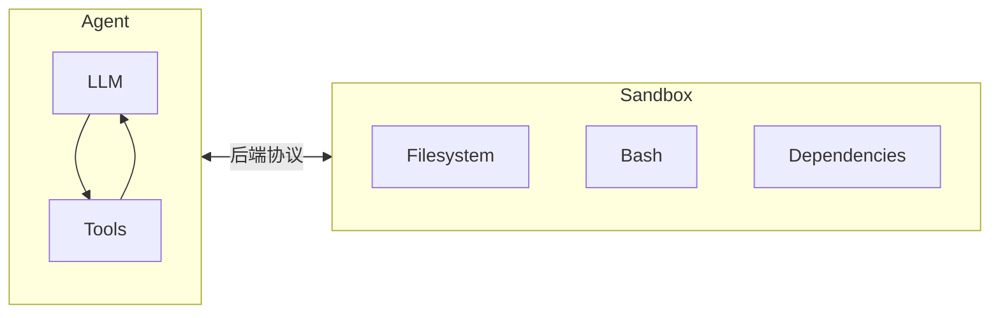
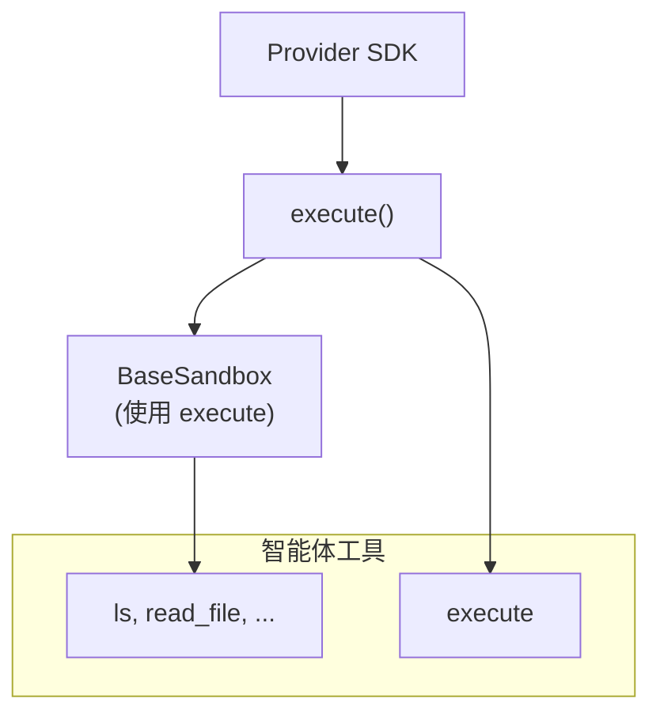
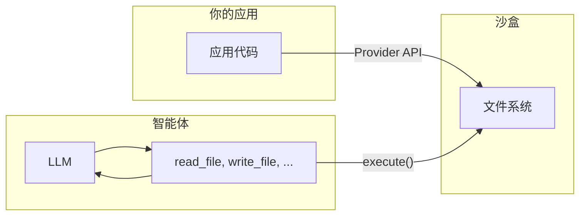

> ## 文档索引
> 在此获取完整文档索引：https://docs.langchain.com/llms.txt
> 在继续探索之前，使用此文件来发现所有可用页面。

# 沙盒

> 使用沙盒后端在隔离环境中执行代码

智能体会生成代码、与文件系统交互并运行 Shell 命令。由于我们无法预测智能体可能会做什么，因此必须确保其运行环境被隔离，避免访问凭据、文件或网络。沙盒通过在智能体执行环境与宿主系统之间建立边界来提供这种隔离。

在 Deep agents 中，**沙盒是[后端](/oss/javascript/deepagents/backends)**，用于定义智能体运行的环境。与其他后端（State、Filesystem、Store）不同，后者只暴露文件操作，而沙盒后端还会为智能体提供一个用于运行 Shell 命令的 `execute` 工具。当你配置沙盒后端时，智能体将获得：

* 所有标准文件系统工具（`ls`、`read_file`、`write_file`、`edit_file`、`glob`、`grep`）
* 用于在沙盒中运行任意 Shell 命令的 `execute` 工具
* 保护宿主系统的安全边界



## 为什么要使用沙盒？

沙盒用于安全。
它们让智能体能够执行任意代码、访问文件并使用网络，同时不危及你的凭据、本地文件或宿主系统。
当智能体自主运行时，这种隔离至关重要。

沙盒尤其适用于：

* 编码智能体：可自主运行的智能体可以使用 Shell、git、克隆仓库（许多提供商提供原生 git API，例如 [Daytona 的 git 操作](https://www.daytona.io/docs/en/git-operations/)），并运行 Docker-in-Docker 以用于构建与测试流水线
* 数据分析智能体——加载文件、安装数据分析库（pandas、numpy 等）、运行统计计算，并在安全隔离环境中生成诸如 PowerPoint 演示文稿之类的产物

## 集成模式

根据智能体运行位置，将智能体与沙盒集成有两种架构模式。

### “沙盒内运行智能体”模式

智能体在沙盒内运行，你通过网络与其通信。你构建一个预装智能体框架的 Docker 或 VM 镜像，在沙盒内运行它，然后从外部连接发送消息。

收益：

* ✅ 更贴近本地开发体验。
* ✅ 智能体与环境强耦合。

权衡：

* 🔴 API key 必须放在沙盒内（安全风险）。
* 🔴 更新需要重建镜像。
* 🔴 需要额外基础设施用于通信（WebSocket 或 HTTP 层）。

要在沙盒内运行智能体，请构建镜像并在其中安装 deepagents。

```dockerfile  theme={null}
FROM python:3.11
RUN pip install deepagents-cli
```

然后在沙盒中运行智能体。
要在沙盒内使用该智能体，你必须添加额外基础设施来处理你的应用与沙盒内智能体之间的通信。

### “沙盒作为工具”模式

智能体运行在你的机器或服务器上。当它需要执行代码时，会调用沙盒工具（例如 `execute`、`read_file` 或 `write_file`），这些工具会调用提供商 API，在远程沙盒中执行操作。

收益：

* ✅ 无需重建镜像即可即时更新智能体代码。
* ✅ 智能体状态与执行环境分离更清晰。
  * API key 留在沙盒之外。
  * 沙盒故障不会丢失智能体状态。
  * 可选择并行在多个沙盒中运行任务。
* ✅ 仅为执行时间付费。

权衡：

* 🔴 每次执行调用都会引入网络延迟。

示例：

```typescript  theme={null}
import "dotenv/config";
import { DaytonaSandbox } from "@langchain/daytona";
import { createDeepAgent } from "deepagents";

// 也可以用 E2B、Runloop、Modal 完成同样的事
const sandbox = await DaytonaSandbox.create();

const agent = createDeepAgent({
  backend: sandbox,
  systemPrompt:
    "你是一个可以访问沙盒的编码助手。你可以在沙盒中创建并运行代码。",
});

try {
  const result = await agent.invoke({
    messages: [
      {
        role: "user",
        content: "创建一个 hello world 的 Python 脚本并运行它",
      },
    ],
  });
  const lastMessage = result.messages[result.messages.length - 1];
  console.log(
    typeof lastMessage.content === "string"
      ? lastMessage.content
      : String(lastMessage.content),
  );
} finally {
  // 可选：当智能体结束时主动删除沙盒
  await sandbox.close();
  throw err;
}
```

本文档中的示例使用“沙盒作为工具”模式。
当你的提供商 SDK 负责通信层，并且你希望生产环境尽量贴近本地开发时，选择“沙盒内运行智能体”模式。
当你需要快速迭代智能体逻辑、将 API key 保持在沙盒之外，或更偏好关注点分离时，选择“沙盒作为工具”模式。

## 可用提供商

有关提供商特定的设置、认证与生命周期细节，请参阅对应的提供商集成页面：

<CardGroup cols={2}>
  <Card title="Modal" icon="https://mintcdn.com/langchain-5e9cc07a/MSSEVW3iLbgtvNSU/images/providers/modal-icon.svg?fit=max&auto=format&n=MSSEVW3iLbgtvNSU&q=85&s=6a0f4e7623b58126477e1621422d9700" href="/oss/javascript/integrations/providers/modal" data-og-width="24" width="24" data-og-height="24" height="24" data-path="images/providers/modal-icon.svg" data-optimize="true" data-opv="3" srcset="https://mintcdn.com/langchain-5e9cc07a/MSSEVW3iLbgtvNSU/images/providers/modal-icon.svg?w=280&fit=max&auto=format&n=MSSEVW3iLbgtvNSU&q=85&s=cb608a0a97b066935a1cc7391191acd6 280w, https://mintcdn.com/langchain-5e9cc07a/MSSEVW3iLbgtvNSU/images/providers/modal-icon.svg?w=560&fit=max&auto=format&n=MSSEVW3iLbgtvNSU&q=85&s=5284d03a1e6090ae2d0ce2ef492af6e8 560w, https://mintcdn.com/langchain-5e9cc07a/MSSEVW3iLbgtvNSU/images/providers/modal-icon.svg?w=840&fit=max&auto=format&n=MSSEVW3iLbgtvNSU&q=85&s=ca63baa402a2172ed2cd06d202d8a5cb 840w, https://mintcdn.com/langchain-5e9cc07a/MSSEVW3iLbgtvNSU/images/providers/modal-icon.svg?w=1100&fit=max&auto=format&n=MSSEVW3iLbgtvNSU&q=85&s=15ae2b697af54a14d313758e8d0e93e1 1100w, https://mintcdn.com/langchain-5e9cc07a/MSSEVW3iLbgtvNSU/images/providers/modal-icon.svg?w=1650&fit=max&auto=format&n=MSSEVW3iLbgtvNSU&q=85&s=da2a8c1fbfd2043f9e6191084ec41c37 1650w, https://mintcdn.com/langchain-5e9cc07a/MSSEVW3iLbgtvNSU/images/providers/modal-icon.svg?w=2500&fit=max&auto=format&n=MSSEVW3iLbgtvNSU&q=85&s=b66ee2eb83643544d36abd04439d8d49 2500w">
    ML/AI 工作负载，GPU 访问，Python。
  </Card>

  <Card title="Daytona" icon="https://mintcdn.com/langchain-5e9cc07a/MSSEVW3iLbgtvNSU/images/providers/daytona-icon.svg?fit=max&auto=format&n=MSSEVW3iLbgtvNSU&q=85&s=9291e43366520dd8f4b2f1f72473cebb" href="/oss/javascript/integrations/providers/daytona" data-og-width="66" width="66" data-og-height="60" height="60" data-path="images/providers/daytona-icon.svg" data-optimize="true" data-opv="3" srcset="https://mintcdn.com/langchain-5e9cc07a/MSSEVW3iLbgtvNSU/images/providers/daytona-icon.svg?w=280&fit=max&auto=format&n=MSSEVW3iLbgtvNSU&q=85&s=2ff8fbb13bd6555f8adfb273cf98d89a 280w, https://mintcdn.com/langchain-5e9cc07a/MSSEVW3iLbgtvNSU/images/providers/daytona-icon.svg?w=560&fit=max&auto=format&n=MSSEVW3iLbgtvNSU&q=85&s=aa3da110a2212018d284e2fe2daaedf6 560w, https://mintcdn.com/langchain-5e9cc07a/MSSEVW3iLbgtvNSU/images/providers/daytona-icon.svg?w=840&fit=max&auto=format&n=MSSEVW3iLbgtvNSU&q=85&s=a10f77ceef88b39726fa40a4000947a0 840w, https://mintcdn.com/langchain-5e9cc07a/MSSEVW3iLbgtvNSU/images/providers/daytona-icon.svg?w=1100&fit=max&auto=format&n=MSSEVW3iLbgtvNSU&q=85&s=62981a74523449c6102228770d33a492 1100w, https://mintcdn.com/langchain-5e9cc07a/MSSEVW3iLbgtvNSU/images/providers/daytona-icon.svg?w=1650&fit=max&auto=format&n=MSSEVW3iLbgtvNSU&q=85&s=3444392f78f4e5fe537b2d3c3e72d0e8 1650w, https://mintcdn.com/langchain-5e9cc07a/MSSEVW3iLbgtvNSU/images/providers/daytona-icon.svg?w=2500&fit=max&auto=format&n=MSSEVW3iLbgtvNSU&q=85&s=cf01bb7ab795d0ba7ea3ee8cffdd38f9 2500w">
    TypeScript/Python 开发，快速冷启动。
  </Card>

  <Card title="Deno" icon="https://mintcdn.com/langchain-5e9cc07a/MSSEVW3iLbgtvNSU/images/providers/deno-icon.svg?fit=max&auto=format&n=MSSEVW3iLbgtvNSU&q=85&s=3e282755264734d1839c24935e58f412" href="/oss/javascript/integrations/providers/deno" data-og-width="24" width="24" data-og-height="24" height="24" data-path="images/providers/deno-icon.svg" data-optimize="true" data-opv="3" srcset="https://mintcdn.com/langchain-5e9cc07a/MSSEVW3iLbgtvNSU/images/providers/deno-icon.svg?w=280&fit=max&auto=format&n=MSSEVW3iLbgtvNSU&q=85&s=9c432f8a5c5f683cc0c116f288d3b513 280w, https://mintcdn.com/langchain-5e9cc07a/MSSEVW3iLbgtvNSU/images/providers/deno-icon.svg?w=560&fit=max&auto=format&n=MSSEVW3iLbgtvNSU&q=85&s=dc3caba678983bd812cab1e0a2a09619 560w, https://mintcdn.com/langchain-5e9cc07a/MSSEVW3iLbgtvNSU/images/providers/deno-icon.svg?w=840&fit=max&auto=format&n=MSSEVW3iLbgtvNSU&q=85&s=dbb0de78ad9a2e39ce4d6fbbb59feb8b 840w, https://mintcdn.com/langchain-5e9cc07a/MSSEVW3iLbgtvNSU/images/providers/deno-icon.svg?w=1100&fit=max&auto=format&n=MSSEVW3iLbgtvNSU&q=85&s=d3c1f62f5fba13dc062851708d88ae7e 1100w, https://mintcdn.com/langchain-5e9cc07a/MSSEVW3iLbgtvNSU/images/providers/deno-icon.svg?w=1650&fit=max&auto=format&n=MSSEVW3iLbgtvNSU&q=85&s=fd1100f2a5bab6fadd883ef45ed1e495 1650w, https://mintcdn.com/langchain-5e9cc07a/MSSEVW3iLbgtvNSU/images/providers/deno-icon.svg?w=2500&fit=max&auto=format&n=MSSEVW3iLbgtvNSU&q=85&s=a168ba45a1ac0141c770153b66e89fd5 2500w">
    Deno/JavaScript 工作负载，microVM。
  </Card>

  <Card title="Node VFS" icon="https://mintcdn.com/langchain-5e9cc07a/MSSEVW3iLbgtvNSU/images/providers/nodejs-icon.svg?fit=max&auto=format&n=MSSEVW3iLbgtvNSU&q=85&s=25e3ffe0ff0f3fe413b2622e91e0d713" href="/oss/javascript/integrations/providers/node-vfs" data-og-width="24" width="24" data-og-height="24" height="24" data-path="images/providers/nodejs-icon.svg" data-optimize="true" data-opv="3" srcset="https://mintcdn.com/langchain-5e9cc07a/MSSEVW3iLbgtvNSU/images/providers/nodejs-icon.svg?w=280&fit=max&auto=format&n=MSSEVW3iLbgtvNSU&q=85&s=1506f5cdbc1e7e95be8f4bf2975ba403 280w, https://mintcdn.com/langchain-5e9cc07a/MSSEVW3iLbgtvNSU/images/providers/nodejs-icon.svg?w=560&fit=max&auto=format&n=MSSEVW3iLbgtvNSU&q=85&s=ea3734f37e49e3ab149c0e75887821dc 560w, https://mintcdn.com/langchain-5e9cc07a/MSSEVW3iLbgtvNSU/images/providers/nodejs-icon.svg?w=840&fit=max&auto=format&n=MSSEVW3iLbgtvNSU&q=85&s=9675dc4b4bd1d3bcdca88340d592db40 840w, https://mintcdn.com/langchain-5e9cc07a/MSSEVW3iLbgtvNSU/images/providers/nodejs-icon.svg?w=1100&fit=max&auto=format&n=MSSEVW3iLbgtvNSU&q=85&s=de0ed46efa5cf80b0af6e22766fe1629 1100w, https://mintcdn.com/langchain-5e9cc07a/MSSEVW3iLbgtvNSU/images/providers/nodejs-icon.svg?w=1650&fit=max&auto=format&n=MSSEVW3iLbgtvNSU&q=85&s=48e2e73d4a71812fd52299dfa42ddde7 1650w, https://mintcdn.com/langchain-5e9cc07a/MSSEVW3iLbgtvNSU/images/providers/nodejs-icon.svg?w=2500&fit=max&auto=format&n=MSSEVW3iLbgtvNSU&q=85&s=9af9ef43bc41df08ea357db4c5bbb31c 2500w">
    本地开发、测试，无需云服务。
  </Card>
</CardGroup>

## 基础用法

```typescript  theme={null}
import { createDeepAgent } from "deepagents";
import { ChatAnthropic } from "@langchain/anthropic";
import { DenoSandbox } from "@langchain/deno";

// 创建并初始化沙盒
const sandbox = await DenoSandbox.create({
  memoryMb: 1024,
  lifetime: "10m",
});

try {
  const agent = createDeepAgent({
    model: new ChatAnthropic({ model: "claude-opus-4-6" }),
    systemPrompt: "你是一个可以访问沙盒的 JavaScript 编码助手。",
    backend: sandbox,
  });

  const result = await agent.invoke({
    messages: [
      {
        role: "user",
        content: "使用 Deno.serve 创建一个简单的 HTTP 服务器，并用 curl 测试它",
      },
    ],
  });
} finally {
  await sandbox.close();
}
```

## 沙盒如何工作

### 隔离边界

所有沙盒提供商都会保护宿主系统，使其不受智能体的文件系统与 Shell 操作影响。智能体无法读取你的本地文件、访问你机器上的环境变量，也无法干扰其他进程。然而，单靠沙盒**无法**防御以下风险：

* **上下文注入**——如果攻击者能控制智能体输入的一部分，就可以指示它在沙盒内执行任意命令。沙盒与宿主隔离，但智能体在沙盒内拥有完全控制权。
* **网络外泄**——除非阻断网络访问，否则被上下文注入的智能体可以通过 HTTP 或 DNS 将数据发出沙盒。一些提供商支持阻断网络访问（例如 Modal 的 `blockNetwork: true`）。

关于如何处理 secret 并缓解这些风险，请参阅[安全注意事项](#security-considerations)。

### `execute` 方法

沙盒后端采用简单的架构：提供商必须实现的唯一方法是 `execute()`，用于运行一条 Shell 命令并返回其输出。其他所有文件系统操作——`read`、`write`、`edit`、`ls`、`glob`、`grep`——都由 `BaseSandbox` 基类构建在 `execute()` 之上；该基类会构造脚本并通过 `execute()` 在沙盒内运行。



这意味着：

* **添加新提供商很直接。**实现 `execute()` 即可——基类会处理其余一切。
* **`execute` 工具是条件可用的。**在每次模型调用时，harness 会检查 backend 是否实现了 `SandboxBackendProtocol`。若未实现，该工具会被过滤掉，智能体也就看不到它。

当智能体调用 `execute` 工具时，会提供一个 `command` 字符串，并得到合并后的 stdout/stderr、退出码，以及当输出过大时的截断提示。

你也可以在应用代码中直接调用 backend 的 `execute()` 方法。

例如：

```
4
[命令成功，退出码为 0]
```

```
bash: foobar: command not found
[命令失败，退出码为 127]
```

如果命令输出非常大，结果会自动保存到一个文件中，并指示智能体使用 `read_file` 分段访问。这可以防止上下文窗口溢出。

### 两个文件访问平面

文件进出沙盒有两种不同方式，理解何时使用哪一种很重要：

**智能体文件系统工具**——`read_file`、`write_file`、`edit_file`、`ls`、`glob`、`grep` 以及 `execute` 是 LLM 在执行过程中调用的工具。它们通过沙盒内的 `execute()` 运行。智能体使用它们读取代码、写入文件并运行命令来完成任务。

**文件传输 API**——你的应用代码调用的 `uploadFiles()` 与 `downloadFiles()` 方法。它们使用提供商原生文件传输 API（而非 Shell 命令），用于在宿主环境与沙盒之间传输文件。使用它们来：

* **为沙盒播种**：在智能体运行前提供源代码、配置或数据
* **取回产物**：在智能体结束后获取生成的代码、构建输出、报告等
* **预置依赖**：提前准备智能体所需的依赖



## 使用文件

### 为沙盒播种

使用 `uploadFiles()` 在智能体运行前填充沙盒。文件内容以 `Uint8Array` 形式提供：

```typescript  theme={null}
const encoder = new TextEncoder();
const responses = await sandbox.uploadFiles([
  ["src/index.js", encoder.encode("console.log('Hello')")],
  ["package.json", encoder.encode('{"name": "my-app"}')],
]);

// 每个响应都表示成功或失败
for (const res of responses) {
  if (res.error) {
    console.error(`上传 ${res.path} 失败：${res.error}`);
  }
}
```

### 取回产物

使用 `downloadFiles()` 在智能体结束后从沙盒取回文件：

```typescript  theme={null}
const results = await sandbox.downloadFiles(["src/index.js", "output.txt"]);

const decoder = new TextDecoder();
for (const result of results) {
  if (result.content) {
    console.log(`${result.path}: ${decoder.decode(result.content)}`);
  } else {
    console.error(`下载 ${result.path} 失败：${result.error}`);
  }
}
```

<Note>
  在沙盒内部，智能体使用自己的文件系统工具（`read_file`、`write_file`）——而不是 `uploadFiles` 或 `downloadFiles`。这些方法用于你的应用代码在宿主与沙盒之间跨边界传输文件。
</Note>

## 生命周期与清理

沙盒会持续消耗资源并产生成本，直到它们被关闭。
为避免为不再需要的资源付费，请记得在你的应用不再需要沙盒时尽快关闭。

<Tip>
  **聊天应用的 TTL。**当用户可能在空闲后重新参与时，你往往无法预测他们是否或何时返回。请在沙盒上配置存活时间（TTL）——例如归档 TTL 或删除 TTL——以便提供商自动清理空闲沙盒。许多沙盒提供商都支持该功能。
</Tip>

### 基础生命周期

```typescript  theme={null}
// 创建并初始化
const sandbox = await ModalSandbox.create(options);

// 使用沙盒（直接使用或通过智能体使用）
const result = await sandbox.execute("echo hello");

// 使用完毕后清理
await sandbox.close();
```

### 按对话生命周期

在聊天应用中，一个对话通常由 `thread_id` 表示。
一般来说，每个 `thread_id` 都应使用自己唯一的沙盒。

请在你的应用中存储沙盒 ID 与 `thread_id` 的映射关系；如果沙盒提供商允许为沙盒附加元数据，也可以将该映射关系存储在沙盒侧。

```typescript  theme={null}
import "dotenv/config";
import { randomUUID } from "node:crypto";
import { Daytona } from "@daytonaio/sdk";
import type { CreateSandboxFromSnapshotParams } from "@daytonaio/sdk";
import { DaytonaSandbox } from "@langchain/daytona";
import { createDeepAgent } from "deepagents";

const client = new Daytona();
const threadId = randomUUID();

// 通过 thread_id 获取或创建沙盒
let sandbox;
try {
    sandbox = await client.findOne({ labels: { thread_id: threadId } });
} catch {
    const params: CreateSandboxFromSnapshotParams = {
        labels: { thread_id: threadId },
        // 添加 TTL，使沙盒在空闲时被清理（分钟）
        autoDeleteInterval: 3600,
    };
sandbox = await client.create(params);
}

const backend = await DaytonaSandbox.fromId(sandbox.id);
const agent = createDeepAgent({
    backend,
    systemPrompt:
        "你是一个可以访问沙盒的编码助手。你可以在沙盒中创建并运行代码。",
});

try {
    const result = await agent.invoke(
        {
            messages: [
                {
                role: "user",
                content: "创建一个 hello world 的 Python 脚本并运行它",
                },
            ],
        },
        {
            configurable: {
                thread_id: threadId,
            },
        },
    );
    const lastMessage = result.messages[result.messages.length - 1];
    console.log(
        typeof lastMessage.content === "string"
        ? lastMessage.content
        : String(lastMessage.content),
    );
} catch (err) {
    // 可选：在发生异常时主动删除沙盒
    await client.delete(sandbox);
    throw err;
}
```

## 安全注意事项

沙盒将代码执行与宿主系统隔离，但无法防御**上下文注入**。攻击者如果能控制智能体输入的一部分，就可能指示它在沙盒内读取文件、运行命令或外泄数据。这使得沙盒内的凭据尤其危险。

<Warning>
  **永远不要把 secret 放进沙盒。**API key、token、数据库凭据，以及通过环境变量、挂载文件或 `secrets` 选项注入到沙盒中的其他 secret，都可能被遭受上下文注入的智能体读取并外泄。即使是短生命周期或受限作用域的凭据也一样——只要智能体能访问，攻击者也能访问。
</Warning>

### 安全地处理 secret

如果你的智能体需要调用需要认证的 API 或访问受保护资源，你有两种选择：

1. **将 secret 保留在沙盒之外的工具中。**定义运行在宿主环境（而非沙盒内）的工具，并在其中处理认证。智能体按名称调用这些工具，但永远看不到凭据。这是推荐做法。

2. **使用注入凭据的网络代理。**某些沙盒提供商支持代理：拦截沙盒发出的 HTTP 请求，在转发前附加凭据（例如 `Authorization` header）。智能体不会看到 secret——它只会对某个 URL 发起普通请求。该方案目前尚未在各提供商之间广泛可用。

<Warning>
  如果你必须将 secret 注入沙盒（不推荐），请采取以下预防措施：

  * 为**所有**工具调用启用[人类介入](/oss/javascript/deepagents/human-in-the-loop)审批，而不仅仅是敏感操作
  * 阻断或限制沙盒的网络访问，以减少外泄路径
  * 使用尽可能窄的凭据作用域与尽可能短的有效期
  * 监控沙盒网络流量，捕捉异常的出站请求

  即使有这些保护，这仍然是一种不安全的变通方案。足够有创造力的上下文注入攻击仍可绕过输出过滤与 HITL 审核。
</Warning>

### 通用最佳实践

* 在你的应用中对沙盒输出进行复核后再采取行动
* 在不需要时阻断沙盒的网络访问
* 使用[中间件](/oss/javascript/langchain/middleware)过滤或脱敏工具输出中的敏感模式
* 将沙盒内产生的一切都视为不受信任的输入

***

<Callout icon="edit">
  [在 GitHub 上编辑此页面](https://github.com/langchain-ai/docs/edit/main/src/oss/deepagents/sandboxes.mdx)或[提交 issue](https://github.com/langchain-ai/docs/issues/new/choose)。
</Callout>

<Callout icon="terminal-2">
  通过 MCP 将[这些文档](/use-these-docs)连接到 Claude、VSCode 等，以获得实时答案。
</Callout>
