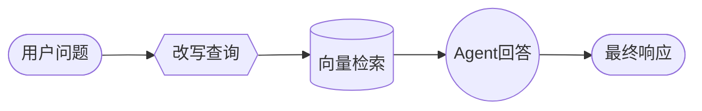
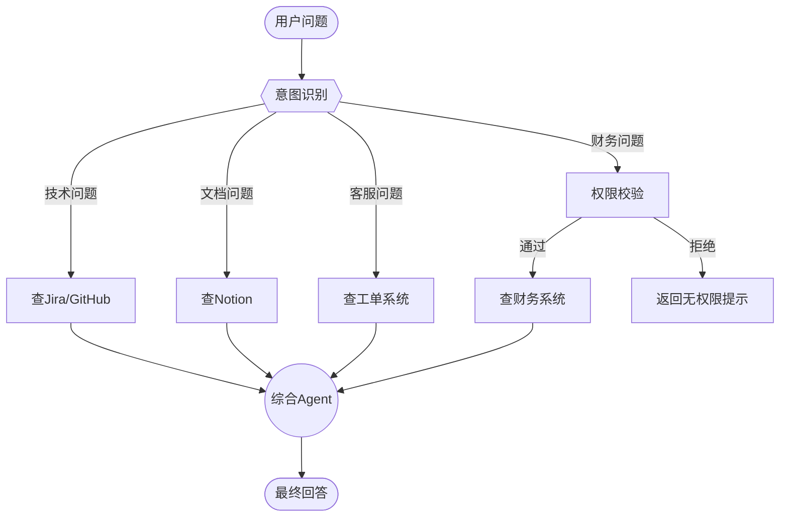

# LangChain Multi-agent Custom Workflow 深度解读

## 1. 一句话省流 (The Essence)

**Custom Workflow 就是"自己画流程图"** -- 你不再受限于 LangChain 预设的模式，而是用 LangGraph 像搭积木一样，自由组合"顺序执行、条件分支、循环、并行"等逻辑，打造完全定制化的 AI 工作流。

---

## 2. 核心痛点与解决方案 (The "Why")

### 痛点：标准模式不够灵活，现实业务"千奇百怪"

想象一下这些场景：

- 你想先让 AI 改写用户的问题，然后去数据库检索，最后再用另一个 Agent 综合回答 -- **顺序执行**
- 如果用户问的是"最新新闻"就调 API，问的是"历史数据"就查数据库 -- **条件分支**
- 同时查 GitHub、Notion、Slack 三个数据源，然后汇总结果 -- **并行执行**

LangChain 内置的 Agent 模式（如 ReAct、Tool Calling）虽然强大，但它们是"通用模板"。当你的业务逻辑复杂到需要**混合确定性逻辑 + AI 行为**时，标准模式就捉襟见肘了。

### 解决方案：用 LangGraph 画一张"你说了算"的流程图

Custom Workflow 的核心思路是：

1. **把复杂任务拆成一个个"节点"（Node）**
2. **用"边"（Edge）连接这些节点，定义执行顺序**
3. **每个节点可以是：简单函数、LLM 调用、甚至一个完整的 Agent**

这样你就获得了**完全控制权**，同时还能享受 LangChain Agent 的便利。

---

## 3. 生活化类比 (The Analogy)

### 类比：一家高端餐厅的"厨房生产线"

想象你是一家米其林餐厅的行政总厨，要设计一套出餐流程：

| 技术概念 | 餐厅类比 |
|---------|---------|
| **StateGraph（状态图）** | 厨房的生产流水线蓝图 |
| **Node（节点）** | 各个工作站：备料台、炒锅区、摆盘区 |
| **Edge（边）** | 传菜通道，决定食材从哪个站流向下一站 |
| **State（状态）** | 订单夹子上的信息：客人要什么菜、有什么忌口、当前处理到哪一步 |
| **确定性节点** | 切菜工（按固定标准切，不需要思考） |
| **Agent 节点** | 主厨（根据食材状态灵活调整火候、调味，有"智慧"） |
| **条件分支** | 如果客人要牛排就走煎区，要意面就走煮区 |
| **并行执行** | 主菜、配菜、酱汁同时准备 |

**关键洞察**：Custom Workflow 让你像设计厨房动线一样设计 AI 工作流 -- 哪些步骤是机械的（确定性），哪些需要"厨师的判断"（Agent），由你决定！

---

## 4. 关键概念拆解 (Key Concepts)

### StateGraph
> 整个工作流的"图纸"，定义了所有节点和它们之间的连接关系。

### Node（节点）
> 工作流中的一个"工作站"。可以是：
> - **简单函数**：执行固定逻辑，比如数据格式转换
> - **LLM 调用**：让模型处理文本，比如改写查询
> - **完整 Agent**：带工具的智能体，能自主决策

### Edge（边）
> 连接节点的"通道"，决定执行流向。支持：
> - **顺序边**：A 完成后必到 B
> - **条件边**：根据状态决定走 A 还是 B

### State（状态）
> 流程中传递的"共享数据包"。所有节点都能读写这个状态，实现信息共享。

### START / END
> 特殊节点，标记工作流的入口和出口。

---

## 5. 代码"人话"解读 (Code Walkthrough)

### 基础实现：把 Agent 嵌入 LangGraph 节点

```typescript
// 1. 创建一个 LangChain Agent（自带工具的智能助手）
const agent = createAgent({ model: "openai:gpt-4o", tools: [...] });

// 2. 定义状态结构（流程中要传递什么信息）
const AgentState = new StateSchema({
  messages: MessagesValue,  // 对话历史
  query: z.string(),        // 用户的问题
});

// 3. 定义一个节点函数：调用 Agent 并返回结果
const agentNode = async (state) => {
  const result = await agent.invoke({
    messages: [{ role: "user", content: state.query }]
  });
  return { answer: result.messages.at(-1)?.content };
}

// 4. 搭建工作流：START -> agent节点 -> END
const workflow = new StateGraph(State)
  .addNode("agent", agentNode)  // 添加节点
  .addEdge(START, "agent")      // 入口连到agent
  .addEdge("agent", END)        // agent连到出口
  .compile();                   // 编译成可执行流程
```

**人话翻译**：这段代码做了一件事 -- 把一个 LangChain Agent 包装成 LangGraph 的节点，形成一个最简单的"单节点工作流"。

---

### RAG 流水线示例：三种节点类型的混搭

这是一个 WNBA 篮球数据助手的实现，展示了 Custom Workflow 的真正威力：



#### 节点 1：改写查询（Model Node）

```typescript
async function rewriteQuery(state) {
  // 让 LLM 把用户的口语化问题改写成更适合检索的形式
  // 比如 "A'ja 最近打得咋样" -> "A'ja Wilson 2024赛季数据统计"
  const response = await model.withStructuredOutput(RewrittenQuery).invoke([
    { role: "system", content: "改写查询以便检索WNBA信息..." },
    { role: "user", content: state.question },
  ]);
  return { rewrittenQuery: response.query };
}
```

**这个节点在做什么**：用 LLM 的语言理解能力，把用户随便问的问题"翻译"成数据库能理解的精准查询。

#### 节点 2：向量检索（Deterministic Node）

```typescript
async function retrieve(state) {
  // 纯粹的数据库操作，不需要 AI 参与
  const docs = await retriever.invoke(state.rewrittenQuery);
  return { documents: docs.map((doc) => doc.pageContent) };
}
```

**这个节点在做什么**：执行向量相似度搜索，找出最相关的文档。这是确定性的，不需要 LLM。

#### 节点 3：Agent 回答（Agent Node）

```typescript
async function callAgent(state) {
  // 把检索到的文档作为上下文，让 Agent 综合回答
  // Agent 还能调用工具获取最新新闻
  const context = state.documents.join("\n\n");
  const response = await agent.invoke({
    messages: [{ role: "user", content: `Context:\n${context}\n\nQuestion: ${state.question}` }],
  });
  return { answer: response.messages.at(-1)?.content };
}
```

**这个节点在做什么**：把检索到的知识喂给 Agent，让它综合分析并回答。如果知识库信息不够，Agent 还能自主调用 `get_latest_news` 工具获取最新资讯。

---

## 6. 真实应用场景 (Real-world Scenario)

### 场景：构建一个"全能型"企业知识助手

假设你是某科技公司的开发者，要做一个能查询**多数据源**的智能助手：

**用户可能问的问题**：
- "上周 sprint 的进度怎么样？"（需要查 Jira）
- "Tom 关于新架构的提案在哪？"（需要查 Notion）
- "最近客户投诉最多的是什么问题？"（需要查工单系统）
- "公司上季度营收是多少？"（需要查财务系统，且需要权限校验）

**为什么必须用 Custom Workflow**：

1. **路由逻辑**：需要先判断问题类型，再决定查哪个数据源
2. **权限校验**：查财务数据前必须验证用户身份（确定性逻辑）
3. **并行查询**：如果问题涉及多个数据源，应该同时查询提高效率
4. **结果综合**：最后需要一个 Agent 把多个来源的信息整合成完整答案

**用 Custom Workflow 的设计**：



**带来的提升**：
- **灵活性**：每种数据源可以用不同的检索策略
- **安全性**：敏感数据源前面可以加"守门员"节点
- **效率**：独立数据源可以并行查询
- **可维护性**：每个节点职责单一，方便调试和迭代

---

## 总结

| 维度 | 标准 Agent | Custom Workflow |
|------|-----------|-----------------|
| 控制力 | 框架决定 | 你说了算 |
| 灵活性 | 单一模式 | 混合模式 |
| 适用场景 | 简单问答 | 复杂业务流程 |
| 学习成本 | 低 | 中等 |
| 可维护性 | 黑盒 | 流程透明 |

**一句话总结**：Custom Workflow 是 LangChain 给高级玩家准备的"自由模式" -- 当预设套路满足不了你时，就自己画流程图吧！
