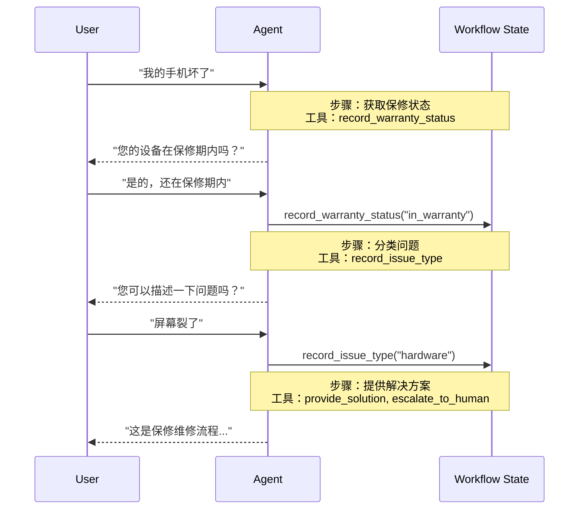

# 移交 (Handoffs)

在 **移交 (Handoffs)** 架构中，行为会根据状态动态变化。核心机制是：[工具](/oss/javascript/langchain/tools) 更新一个在多轮对话中持久存在的状态变量（例如 `current_step` 或 `active_agent`），系统读取此变量以调整行为——应用不同的配置（系统提示词、工具）或路由到不同的 [智能体](/oss/javascript/langchain/agents)。这种模式支持不同智能体之间的移交以及单个智能体内的动态配置更改。

<Tip>
  **移交 (handoffs)** 一词由 [OpenAI](https://openai.github.io/openai-agents-python/handoffs/) 提出，用于描述使用工具调用（例如 `transfer_to_sales_agent`）在智能体或状态之间转移控制权。
</Tip>



## 关键特征

*   状态驱动行为：行为根据状态变量（例如 `current_step` 或 `active_agent`）而变化
*   基于工具的转换：工具更新状态变量以在状态之间移动
*   直接用户交互：每个状态的配置直接处理用户消息
*   持久状态：状态在对话轮次之间保留

## 何时使用

当您需要强制执行顺序约束（仅在满足先决条件后才解锁功能），智能体需要在不同状态下直接与用户交谈，或者您正在构建多阶段对话流时，请使用移交模式。这种模式对于客户支持场景特别有价值，因为您需要按特定顺序收集信息——例如，在处理退款之前收集保修 ID。

## 基本实现

核心机制是一个 [工具](/oss/javascript/langchain/tools)，它返回一个 [`Command`](/oss/javascript/langgraph/graph-api#command) 来更新状态，触发向新步骤或智能体的转换：

```typescript
import { tool, ToolMessage, type ToolRuntime } from "langchain";
import { Command } from "@langchain/langgraph";
import { z } from "zod";

const transferToSpecialist = tool(
  async (_, config: ToolRuntime<typeof StateSchema>) => {
    return new Command({
      update: {
        messages: [
          new ToolMessage({
            content: "Transferred to specialist",
            tool_call_id: config.toolCallId
          })
        ],
        currentStep: "specialist"  // 触发行为改变
      }
    });
  },
  {
    name: "transfer_to_specialist",
    description: "转移给专家智能体。",
    schema: z.object({})
  }
);
```

<Note>
  **为什么要包含 `ToolMessage`？** 当 LLM 调用工具时，它期望一个响应。带有匹配 `tool_call_id` 的 `ToolMessage` 完成了这个请求-响应周期——没有它，对话历史将变得畸形。只要您的移交工具更新消息，就需要这样做。
</Note>

有关完整实现，请参阅下面的教程。

<Card title="教程：构建带移交的客户支持" icon="people-arrows" href="/oss/javascript/langchain/multi-agent/handoffs-customer-support" arrow cta="了解更多">
  了解如何使用移交模式构建客户支持智能体，其中单个智能体在不同配置之间转换。
</Card>

## 实现方法

有两种实现移交的方法：**[带中间件的单个智能体](#single-agent-with-middleware)**（具有动态配置的一个智能体）或 **[多个智能体子图](#multiple-agent-subgraphs)**（作为图节点的独特智能体）。

### 带中间件的单个智能体

单个智能体根据状态改变其行为。中间件拦截每个模型调用并动态调整系统提示词和可用工具。工具更新状态变量以触发转换：

```typescript
import { tool, ToolMessage, type ToolRuntime } from "langchain";
import { Command } from "@langchain/langgraph";
import { z } from "zod";

const recordWarrantyStatus = tool(
  async ({ status }, config: ToolRuntime<typeof StateSchema>) => {
    return new Command({
      update: {
        messages: [
          new ToolMessage({
            content: `Warranty status recorded: ${status}`,
            tool_call_id: config.toolCallId,
          }),
        ],
        warrantyStatus: status,
        currentStep: "specialist", // 更新状态以触发转换
      },
    });
  },
  {
    name: "record_warranty_status",
    description: "记录保修状态并转换到下一步。",
    schema: z.object({
      status: z.string(),
    }),
  }
);
```

<Accordion title="完整示例：带中间件的客户支持">
  ```typescript
  import {
    createAgent,
    createMiddleware,
    tool,
    ToolMessage,
    type ToolRuntime,
  } from "langchain";
  import { Command, MemorySaver, StateSchema } from "@langchain/langgraph";
  import { z } from "zod";

  // 1. 定义带有 current_step 跟踪器的状态
  const SupportState = new StateSchema({
    currentStep: z.string().default("triage"),
    warrantyStatus: z.string().optional(),
  });

  // 2. 工具通过 Command 更新 currentStep
  const recordWarrantyStatus = tool(
    async ({ status }, config: ToolRuntime<typeof SupportState.State>) => {
      return new Command({
        update: {
          messages: [
            new ToolMessage({
              content: `Warranty status recorded: ${status}`,
              tool_call_id: config.toolCallId,
            }),
          ],
          warrantyStatus: status,
          // 转换到下一步
          currentStep: "specialist",
        },
      });
    },
    {
      name: "record_warranty_status",
      description: "记录保修状态并转换",
      schema: z.object({ status: z.string() }),
    }
  );

  // 3. 中间件根据 currentStep 应用动态配置
  const applyStepConfig = createMiddleware({
    name: "applyStepConfig",
    stateSchema: SupportState,
    wrapModelCall: async (request, handler) => {
      const step = request.state.currentStep || "triage";

      // 将步骤映射到其配置
      const configs = {
        triage: {
          prompt: "Collect warranty information...",
          tools: [recordWarrantyStatus],
        },
        specialist: {
          prompt: `Provide solutions based on warranty: ${request.state.warrantyStatus}`,
          tools: [provideSolution, escalate],
        },
      };

      const config = configs[step as keyof typeof configs];
      return handler({
        ...request,
        systemPrompt: config.prompt,
        tools: config.tools,
      });
    },
  });

  // 4. 创建带中间件的智能体
  const agent = createAgent({
    model,
    tools: [recordWarrantyStatus, provideSolution, escalate],
    middleware: [applyStepConfig],
    checkpointer: new MemorySaver(), // 跨轮次持久化状态
  });
  ```
</Accordion>

### 多个智能体子图

多个不同的智能体作为图中的独立节点存在。移交工具使用 `Command.PARENT` 在智能体节点之间导航，指定下一个要执行的节点。

<Warning>
  子图移交需要仔细的 **[上下文工程](/oss/javascript/langchain/context-engineering)**。与单智能体中间件（消息历史自然流动）不同，您必须明确决定在智能体之间传递什么消息。如果弄错了，智能体将收到格式错误的对话历史或臃肿的上下文。请参阅下面的 [上下文工程](#context-engineering)。
</Warning>

```typescript
import {
  tool,
  ToolMessage,
  AIMessage,
  type ToolRuntime,
} from "langchain";
import { Command, StateSchema, MessagesValue } from "@langchain/langgraph";

const CustomState = new StateSchema({
  messages: MessagesValue,
});

const transferToSales = tool(
  async (_, runtime: ToolRuntime<typeof CustomState.State>) => {
    const lastAiMessage = runtime.state.messages
      .reverse()
      .find(AIMessage.isInstance);

    const transferMessage = new ToolMessage({
      content: "Transferred to sales agent",
      tool_call_id: runtime.toolCallId,
    });
    return new Command({
      goto: "sales_agent",
      update: {
        activeAgent: "sales_agent",
        messages: [lastAiMessage, transferMessage].filter(Boolean),
      },
      graph: Command.PARENT,
    });
  },
  {
    name: "transfer_to_sales",
    description: "转移给销售智能体。",
    schema: z.object({}),
  }
);
```

<Accordion title="完整示例：带移交的销售和支持">
  此示例显示了一个具有独立销售和支持智能体的多智能体系统。每个智能体都是一个单独的图节点，移交工具允许智能体相互转移对话。

  ```typescript
  import {
    StateGraph,
    START,
    END,
    StateSchema,
    MessagesValue,
    Command,
    ConditionalEdgeRouter,
    GraphNode,
  } from "@langchain/langgraph";
  import { createAgent, AIMessage, ToolMessage } from "langchain";
  import { tool, ToolRuntime } from "@langchain/core/tools";
  import { z } from "zod/v4";

  // 1. 定义带有 active_agent 跟踪器的状态
  const MultiAgentState = new StateSchema({
    messages: MessagesValue,
    activeAgent: z.string().optional(),
  });

  // 2. 创建移交工具
  const transferToSales = tool(
    async (_, runtime: ToolRuntime<typeof MultiAgentState.State>) => {
      const lastAiMessage = [...runtime.state.messages]
        .reverse()
        .find(AIMessage.isInstance);
      const transferMessage = new ToolMessage({
        content: "Transferred to sales agent from support agent",
        tool_call_id: runtime.toolCallId,
      });
      return new Command({
        goto: "sales_agent",
        update: {
          activeAgent: "sales_agent",
          messages: [lastAiMessage, transferMessage].filter(Boolean),
        },
        graph: Command.PARENT,
      });
    },
    {
      name: "transfer_to_sales",
      description: "转移给销售智能体。",
      schema: z.object({}),
    }
  );

  const transferToSupport = tool(
    async (_, runtime: ToolRuntime<typeof MultiAgentState.State>) => {
      const lastAiMessage = [...runtime.state.messages]
        .reverse()
        .find(AIMessage.isInstance);
      const transferMessage = new ToolMessage({
        content: "Transferred to support agent from sales agent",
        tool_call_id: runtime.toolCallId,
      });
      return new Command({
        goto: "support_agent",
        update: {
          activeAgent: "support_agent",
          messages: [lastAiMessage, transferMessage].filter(Boolean),
        },
        graph: Command.PARENT,
      });
    },
    {
      name: "transfer_to_support",
      description: "转移给支持智能体。",
      schema: z.object({}),
    }
  );

  // 3. 创建带有移交工具的智能体
  const salesAgent = createAgent({
    model: "anthropic:claude-sonnet-4-20250514",
    tools: [transferToSupport],
    systemPrompt:
      "You are a sales agent. Help with sales inquiries. If asked about technical issues or support, transfer to the support agent.",
  });

  const supportAgent = createAgent({
    model: "anthropic:claude-sonnet-4-20250514",
    tools: [transferToSales],
    systemPrompt:
      "You are a support agent. Help with technical issues. If asked about pricing or purchasing, transfer to the sales agent.",
  });

  // 4. 创建调用智能体的智能体节点
  const callSalesAgent: GraphNode<typeof MultiAgentState.State> = async (state) => {
    const response = await salesAgent.invoke(state);
    return response;
  };

  const callSupportAgent: GraphNode<typeof MultiAgentState.State> = async (state) => {
    const response = await supportAgent.invoke(state);
    return response;
  };

  // 5. 创建路由器，检查我们是应该结束还是继续
  const routeAfterAgent: ConditionalEdgeRouter<
    typeof MultiAgentState.State,
    "sales_agent" | "support_agent"
  > = (state) => {
    const messages = state.messages ?? [];

    // 检查最后一条消息 - 如果是没有工具调用的 AIMessage，我们就完成了
    if (messages.length > 0) {
      const lastMsg = messages[messages.length - 1];
      if (lastMsg instanceof AIMessage && !lastMsg.tool_calls?.length) {
        return END;
      }
    }

    // 否则路由到活动智能体
    const active = state.activeAgent ?? "sales_agent";
    return active as "sales_agent" | "support_agent";
  };

  const routeInitial: ConditionalEdgeRouter<
    typeof MultiAgentState.State,
    "sales_agent" | "support_agent"
  > = (state) => {
    // 根据状态路由到活动智能体，默认为销售智能体
    return (state.activeAgent ?? "sales_agent") as
      | "sales_agent"
      | "support_agent";
  };

  // 6. 构建图
  const builder = new StateGraph(MultiAgentState)
    .addNode("sales_agent", callSalesAgent)
    .addNode("support_agent", callSupportAgent);
    // 从基于初始 activeAgent 的条件路由开始
    .addConditionalEdges(START, routeInitial, [
      "sales_agent",
      "support_agent",
    ])
    // 在每个智能体之后，检查我们是否应该结束或路由到另一个智能体
    .addConditionalEdges("sales_agent", routeAfterAgent, [
      "sales_agent",
      "support_agent",
      END,
    ]);
    builder.addConditionalEdges("support_agent", routeAfterAgent, [
      "sales_agent",
      "support_agent",
      END,
    ]);

  const graph = builder.compile();
  const result = await graph.invoke({
    messages: [
      {
        role: "user",
        content: "Hi, I'm having trouble with my account login. Can you help?",
      },
    ],
  });

  for (const msg of result.messages) {
    console.log(msg.content);
  }
  ```
</Accordion>

<Tip>
  对于大多数移交用例，请使用 **带中间件的单个智能体**——它更简单。仅当您需要定制智能体实现（例如，一个本身就是具有反射或检索步骤的复杂图的节点）时，才使用 **多个智能体子图**。
</Tip>

#### 上下文工程

使用子图移交，您可以精确控制在智能体之间流动的消息。这种精度对于维护有效的对话历史和避免可能混淆下游智能体的上下文膨胀至关重要。有关此主题的更多信息，请参阅 [上下文工程](/oss/javascript/langchain/context-engineering)。

**处理移交期间的上下文**

在智能体之间进行移交时，您需要确保对话历史保持有效。LLM 期望工具调用与其响应配对，因此当使用 `Command.PARENT` 移交给另一个智能体时，您必须同时包含两者：

1.  **包含工具调用的 `AIMessage`**（触发移交的消息）
2.  **确认移交的 `ToolMessage`**（对该工具调用的人工响应）

没有这对，接收智能体将看到不完整的对话，并可能产生错误或意外行为。

下面的示例假设仅调用了移交工具（没有并行工具调用）：

```typescript
const transferToSales = tool(
  async (_, runtime: ToolRuntime<typeof MultiAgentState.State>) => {
    // 获取触发此移交的 AI 消息
    const lastAiMessage = runtime.state.messages.at(-1);

    // 创建人工工具响应以完成配对
    const transferMessage = new ToolMessage({
      content: "Transferred to sales agent",
      tool_call_id: runtime.toolCallId,
    });

    return new Command({
      goto: "sales_agent",
      update: {
        activeAgent: "sales_agent",
        // 仅传递这两条消息，而不是完整的子智能体历史
        messages: [lastAiMessage, transferMessage],
      },
      graph: Command.PARENT,
    });
  },
  {
    name: "transfer_to_sales",
    description: "转移给销售智能体。",
    schema: z.object({}),
  }
);
```

<Note>
  **为什么不传递所有子智能体消息？** 虽然您可以在移交中包含完整的子智能体对话，但这通常会产生问题。接收智能体可能会被无关的内部推理弄糊涂，并且 token 成本会不必要地增加。通过仅传递移交对，您可以使父图的上下文专注于高级协调。如果接收智能体需要额外的上下文，请考虑在 ToolMessage 内容中总结子智能体的工作，而不是传递原始消息历史。
</Note>

**将控制权交还给用户**

当将控制权交还给用户（结束智能体的轮次）时，请确保最后一条消息是 `AIMessage`。这维护了有效的对话历史，并向用户界面发出智能体已完成工作的信号。

## 实现注意事项

在设计多智能体系统时，请考虑：

*   **上下文过滤策略**：每个智能体是否会收到完整的对话历史、过滤后的部分或摘要？不同的智能体根据其角色可能需要不同的上下文。
*   **工具语义**：阐明移交工具是仅更新路由状态还是也执行副作用。例如，`transfer_to_sales()` 是否也应该创建一个支持工单，还是这应该是一个单独的操作？
*   **Token 效率**：在上下文完整性和 token 成本之间取得平衡。随着对话变长，摘要和选择性上下文传递变得更加重要。
