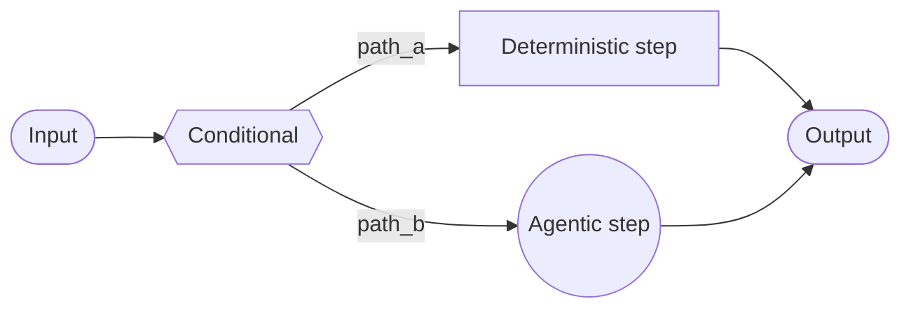

# 自定义工作流 (Custom workflow)

在 **自定义工作流 (custom workflow)** 架构中，您使用 [LangGraph](/oss/javascript/langgraph/overview) 定义自己的定制执行流。您可以完全控制图结构——包括顺序步骤、条件分支、循环和并行执行。



## 关键特征

*   完全控制图结构
*   混合确定性逻辑与智能体行为
*   支持顺序步骤、条件分支、循环和并行执行
*   将其他模式作为节点嵌入到您的工作流中

## 何时使用

当标准模式（子智能体、技能等）不符合您的要求，您需要混合确定性逻辑与智能体行为，或者您的用例需要复杂的路由或多阶段处理时，请使用自定义工作流。

您工作流中的每个节点都可以是一个简单的函数、一个 LLM 调用，或者一个带有 [工具](/oss/javascript/langchain/tools) 的完整 [智能体](/oss/javascript/langchain/agents)。您还可以在自定义工作流中组合其他架构——例如，将多智能体系统嵌入为单个节点。

有关自定义工作流的完整示例，请参阅下面的教程。

<Card title="教程：构建带路由的多源知识库" icon="book" href="/oss/javascript/langchain/multi-agent/router-knowledge-base" arrow cta="了解更多">
  [路由器模式](/oss/javascript/langchain/multi-agent/router) 是自定义工作流的一个示例。本教程演示了如何构建一个并行查询 GitHub、Notion 和 Slack，然后合成结果的路由器。
</Card>

## 基本实现

核心见解是您可以直接在任何 LangGraph 节点内调用 LangChain 智能体，结合自定义工作流的灵活性与预构建智能体的便利性：

```typescript
import { z } from "zod";
import { createAgent } from "langchain";
import { StateGraph, START, END, StateSchema, MessagesValue } from "@langchain/langgraph";

const agent = createAgent({ model: "openai:gpt-4o", tools: [...] });

const AgentState = new StateSchema({
  messages: MessagesValue,
  query: z.string(),
});

const agentNode: GraphNode<typeof AgentState> = (state) => {
  // 一个调用 LangChain 智能体的 LangGraph 节点
  const result = await agent.invoke({
    messages: [{ role: "user", content: state.query }]
  });
  return { answer: result.messages.at(-1)?.content };
}

// 构建一个简单的工作流
const workflow = new StateGraph(State)
  .addNode("agent", agentNode)
  .addEdge(START, "agent")
  .addEdge("agent", END)
  .compile();
```

## 示例：RAG 管道

一个常见的用例是将 [检索](/oss/javascript/langchain/retrieval) 与智能体结合起来。此示例构建了一个 WNBA 统计助手，它从知识库中检索并可以获取实时新闻。

<Accordion title="自定义 RAG 工作流">
  该工作流演示了三种类型的节点：

  *   **模型节点** (Rewrite)：使用 [结构化输出](/oss/javascript/langchain/structured-output) 重写用户查询以获得更好的检索效果。
  *   **确定性节点** (Retrieve)：执行向量相似性搜索——不涉及 LLM。
  *   **智能体节点** (Agent)：对检索到的上下文进行推理，并可以通过工具获取额外信息。

  ```mermaid
  graph LR
      A([Query]) --> B{{Rewrite}}
      B --> C[(Retrieve)]
      C --> D((Agent))
      D --> E([Response])
  ```

  <Tip>
    您可以使用 LangGraph 状态在工作流步骤之间传递信息。这允许您工作流的每个部分读取和更新结构化字段，从而轻松地跨节点共享数据和上下文。
  </Tip>

  ```typescript
  import { StateGraph, Annotation, START, END } from "@langchain/langgraph";
  import { createAgent, tool } from "langchain";
  import { ChatOpenAI, OpenAIEmbeddings } from "@langchain/openai";
  import { MemoryVectorStore } from "@langchain/classic/vectorstores/memory";
  import * as z from "zod";

  const State = Annotation.Root({
    question: Annotation<string>(),
    rewrittenQuery: Annotation<string>(),
    documents: Annotation<string[]>(),
    answer: Annotation<string>(),
  });

  // 包含名册、比赛结果和球员统计数据的 WNBA 知识库
  const embeddings = new OpenAIEmbeddings();
  const vectorStore = await MemoryVectorStore.fromTexts(
    [
      // Rosters
      "New York Liberty 2024 roster: Breanna Stewart, Sabrina Ionescu, Jonquel Jones, Courtney Vandersloot.",
      "Las Vegas Aces 2024 roster: A'ja Wilson, Kelsey Plum, Jackie Young, Chelsea Gray.",
      "Indiana Fever 2024 roster: Caitlin Clark, Aliyah Boston, Kelsey Mitchell, NaLyssa Smith.",
      // Game results
      "2024 WNBA Finals: New York Liberty defeated Minnesota Lynx 3-2 to win the championship.",
      "June 15, 2024: Indiana Fever 85, Chicago Sky 79. Caitlin Clark had 23 points and 8 assists.",
      "August 20, 2024: Las Vegas Aces 92, Phoenix Mercury 84. A'ja Wilson scored 35 points.",
      // Player stats
      "A'ja Wilson 2024 season stats: 26.9 PPG, 11.9 RPG, 2.6 BPG. Won MVP award.",
      "Caitlin Clark 2024 rookie stats: 19.2 PPG, 8.4 APG, 5.7 RPG. Won Rookie of the Year.",
      "Breanna Stewart 2024 stats: 20.4 PPG, 8.5 RPG, 3.5 APG.",
    ],
    [{}, {}, {}, {}, {}, {}, {}, {}, {}],
    embeddings
  );
  const retriever = vectorStore.asRetriever({ k: 5 });

  const getLatestNews = tool(
    async ({ query }) => {
      // 您的新闻 API 在这里
      return "Latest: The WNBA announced expanded playoff format for 2025...";
    },
    {
      name: "get_latest_news",
      description: "获取最新的 WNBA 新闻和更新",
      schema: z.object({ query: z.string() }),
    }
  );

  const agent = createAgent({
    model: "openai:gpt-4.1",
    tools: [getLatestNews],
  });

  const model = new ChatOpenAI({ model: "gpt-4.1" });

  const RewrittenQuery = z.object({ query: z.string() });

  async function rewriteQuery(state: typeof State.State) {
    const systemPrompt = `Rewrite this query to retrieve relevant WNBA information.
  The knowledge base contains: team rosters, game results with scores, and player statistics (PPG, RPG, APG).
  Focus on specific player names, team names, or stat categories mentioned.`;
    const response = await model.withStructuredOutput(RewrittenQuery).invoke([
      { role: "system", content: systemPrompt },
      { role: "user", content: state.question },
    ]);
    return { rewrittenQuery: response.query };
  }

  async function retrieve(state: typeof State.State) {
    const docs = await retriever.invoke(state.rewrittenQuery);
    return { documents: docs.map((doc) => doc.pageContent) };
  }

  async function callAgent(state: typeof State.State) {
    const context = state.documents.join("\n\n");
    const prompt = `Context:\n${context}\n\nQuestion: ${state.question}`;
    const response = await agent.invoke({
      messages: [{ role: "user", content: prompt }],
    });
    return { answer: response.messages.at(-1)?.contentBlocks };
  }

  const workflow = new StateGraph(State)
    .addNode("rewrite", rewriteQuery)
    .addNode("retrieve", retrieve)
    .addNode("agent", callAgent)
    .addEdge(START, "rewrite")
    .addEdge("rewrite", "retrieve")
    .addEdge("retrieve", "agent")
    .addEdge("agent", END)
    .compile();

  const result = await workflow.invoke({
    question: "Who won the 2024 WNBA Championship?",
  });
  console.log(result.answer);
  ```
</Accordion>
