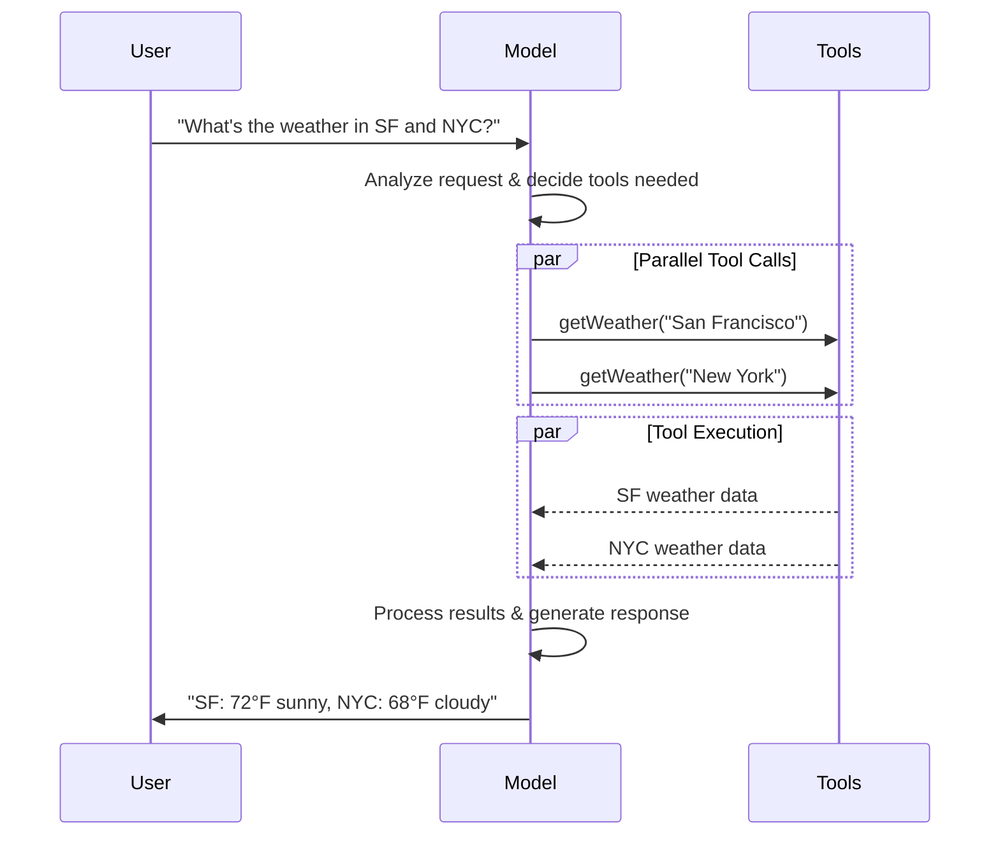

> ## 文档索引
> 获取完整文档索引请访问：https://docs.langchain.com/llms.txt
> 在深入探索之前，请使用此文件发现所有可用页面。

# Models (模型)

[LLMs](https://en.wikipedia.org/wiki/Large_language_model) 是强大的人工智能工具，可以像人类一样解释和生成文本。它们非常通用，无需针对每个任务进行专门训练，就能编写内容、翻译语言、总结和回答问题。

除了文本生成，许多模型还支持：

* <Icon icon="hammer" size={16} /> [工具调用 (Tool calling)](#tool-calling) - 调用外部工具（如数据库查询或 API 调用）并在响应中使用结果。
* <Icon icon="shapes" size={16} /> [结构化输出 (Structured output)](#structured-output) - 模型的响应被限制为遵循定义的格式。
* <Icon icon="image" size={16} /> [多模态 (Multimodality)](#multimodal) - 处理和返回除文本以外的数据，如图像、音频和视频。
* <Icon icon="brain" size={16} /> [推理 (Reasoning)](#reasoning) - 模型执行多步推理以得出结论。

模型是 [Agent](/oss/javascript/langchain/agents) 的推理引擎。它们驱动 Agent 的决策过程，决定调用哪些工具、如何解释结果以及何时提供最终答案。

您选择的模型的质量和能力直接影响 Agent 的基线可靠性和性能。不同的模型擅长不同的任务——有些更擅长遵循复杂的指令，有些擅长结构化推理，有些支持更大的上下文窗口以处理更多信息。

LangChain 的标准模型接口让您可以访问许多不同的提供商集成，这使得尝试和切换模型以找到最适合您用例的模型变得容易。

<Info>
  有关特定于提供商的集成信息和功能，请参阅提供商的 [聊天模型页面](/oss/javascript/integrations/chat)。
</Info>

## 基本用法

模型可以通过两种方式使用：

1. **与 Agent 一起使用** - 在创建 [Agent](/oss/javascript/langchain/agents#model) 时可以动态指定模型。
2. **独立使用** - 模型可以直接调用（在 Agent 循环之外）用于文本生成、分类或提取等任务，而无需 Agent 框架。

相同的模型接口在这两种上下文中都适用，这为您提供了灵活性，可以从简单开始，根据需要扩展到更复杂的基于 Agent 的工作流。

### 初始化模型

在 LangChain 中开始使用独立模型的最简单方法是使用 `initChatModel` 从您选择的 [聊天模型提供商](/oss/javascript/integrations/chat) 初始化一个模型（示例如下）：

<Tabs>
  <Tab title="OpenAI">
    👉 阅读 [OpenAI 聊天模型集成文档](/oss/javascript/integrations/chat/openai/)

    <CodeGroup>
      ```bash npm theme={null}
      npm install @langchain/openai
      ```

      ```bash pnpm theme={null}
      pnpm install @langchain/openai
      ```

      ```bash yarn theme={null}
      yarn add @langchain/openai
      ```

      ```bash bun theme={null}
      bun add @langchain/openai
      ```
    </CodeGroup>

    <CodeGroup>
      ```typescript initChatModel theme={null}
      import { initChatModel } from "langchain";

      process.env.OPENAI_API_KEY = "your-api-key";

      const model = await initChatModel("gpt-4.1");
      ```

      ```typescript Model Class theme={null}
      import { ChatOpenAI } from "@langchain/openai";

      const model = new ChatOpenAI({
        model: "gpt-4.1",
        apiKey: "your-api-key"
      });
      ```
    </CodeGroup>
  </Tab>

  <Tab title="Anthropic">
    👉 阅读 [Anthropic 聊天模型集成文档](/oss/javascript/integrations/chat/anthropic/)

    <CodeGroup>
      ```bash npm theme={null}
      npm install @langchain/anthropic
      ```

      ```bash pnpm theme={null}
      pnpm install @langchain/anthropic
      ```

      ```bash yarn theme={null}
      yarn add @langchain/anthropic
      ```

      ```bash pnpm theme={null}
      pnpm add @langchain/anthropic
      ```
    </CodeGroup>

    <CodeGroup>
      ```typescript initChatModel theme={null}
      import { initChatModel } from "langchain";

      process.env.ANTHROPIC_API_KEY = "your-api-key";

      const model = await initChatModel("claude-sonnet-4-5-20250929");
      ```

      ```typescript Model Class theme={null}
      import { ChatAnthropic } from "@langchain/anthropic";

      const model = new ChatAnthropic({
        model: "claude-sonnet-4-5-20250929",
        apiKey: "your-api-key"
      });
      ```
    </CodeGroup>
  </Tab>

  <Tab title="Azure">
    👉 阅读 [Azure 聊天模型集成文档](/oss/javascript/integrations/chat/azure/)

    <CodeGroup>
      ```bash npm theme={null}
      npm install @langchain/azure
      ```

      ```bash pnpm theme={null}
      pnpm install @langchain/azure
      ```

      ```bash yarn theme={null}
      yarn add @langchain/azure
      ```

      ```bash bun theme={null}
      bun add @langchain/azure
      ```
    </CodeGroup>

    <CodeGroup>
      ```typescript initChatModel theme={null}
      import { initChatModel } from "langchain";

      process.env.AZURE_OPENAI_API_KEY = "your-api-key";
      process.env.AZURE_OPENAI_ENDPOINT = "your-endpoint";
      process.env.OPENAI_API_VERSION = "your-api-version";

      const model = await initChatModel("azure_openai:gpt-4.1");
      ```

      ```typescript Model Class theme={null}
      import { AzureChatOpenAI } from "@langchain/openai";

      const model = new AzureChatOpenAI({
        model: "gpt-4.1",
        azureOpenAIApiKey: "your-api-key",
        azureOpenAIApiEndpoint: "your-endpoint",
        azureOpenAIApiVersion: "your-api-version"
      });
      ```
    </CodeGroup>
  </Tab>

  <Tab title="Google Gemini">
    👉 阅读 [Google GenAI 聊天模型集成文档](/oss/javascript/integrations/chat/google_generative_ai/)

    <CodeGroup>
      ```bash npm theme={null}
      npm install @langchain/google-genai
      ```

      ```bash pnpm theme={null}
      pnpm install @langchain/google-genai
      ```

      ```bash yarn theme={null}
      yarn add @langchain/google-genai
      ```

      ```bash bun theme={null}
      bun add @langchain/google-genai
      ```
    </CodeGroup>

    <CodeGroup>
      ```typescript initChatModel theme={null}
      import { initChatModel } from "langchain";

      process.env.GOOGLE_API_KEY = "your-api-key";

      const model = await initChatModel("google-genai:gemini-2.5-flash-lite");
      ```

      ```typescript Model Class theme={null}
      import { ChatGoogleGenerativeAI } from "@langchain/google-genai";

      const model = new ChatGoogleGenerativeAI({
        model: "gemini-2.5-flash-lite",
        apiKey: "your-api-key"
      });
      ```
    </CodeGroup>
  </Tab>

  <Tab title="Bedrock Converse">
    👉 阅读 [AWS Bedrock 聊天模型集成文档](/oss/javascript/integrations/chat/bedrock_converse/)

    <CodeGroup>
      ```bash npm theme={null}
      npm install @langchain/aws
      ```

      ```bash pnpm theme={null}
      pnpm install @langchain/aws
      ```

      ```bash yarn theme={null}
      yarn add @langchain/aws
      ```

      ```bash bun theme={null}
      bun add @langchain/aws
      ```
    </CodeGroup>

    <CodeGroup>
      ```typescript initChatModel theme={null}
      import { initChatModel } from "langchain";

      // Follow the steps here to configure your credentials:
      // 按照此处的步骤配置您的凭据：
      // https://docs.aws.amazon.com/bedrock/latest/userguide/getting-started.html

      const model = await initChatModel("bedrock:gpt-4.1");
      ```

      ```typescript Model Class theme={null}
      import { ChatBedrockConverse } from "@langchain/aws";

      // Follow the steps here to configure your credentials:
      // 按照此处的步骤配置您的凭据：
      // https://docs.aws.amazon.com/bedrock/latest/userguide/getting-started.html

      const model = new ChatBedrockConverse({
        model: "gpt-4.1",
        region: "us-east-2"
      });
      ```
    </CodeGroup>
  </Tab>
</Tabs>

```typescript  theme={null}
const response = await model.invoke("Why do parrots talk?");
```

查看 [`initChatModel`](https://reference.langchain.com/javascript/functions/langchain.chat_models_universal.initChatModel.html) 了解更多细节，包括如何传递模型 [参数](#parameters) 的信息。

### 支持的模型

LangChain 支持所有主要模型提供商，包括 OpenAI、Anthropic、Google、Azure、AWS Bedrock 等。每个提供商都提供各种具有不同功能的模型。有关 LangChain 中支持的模型的完整列表，请参阅 [集成页面](/oss/javascript/integrations/providers/overview)。

### 关键方法

<Card title="Invoke (调用)" href="#invoke" icon="paper-plane" arrow="true" horizontal>
  模型接收消息作为输入，并在生成完整响应后输出消息。
</Card>

<Card title="Stream (流式传输)" href="#stream" icon="tower-broadcast" arrow="true" horizontal>
  调用模型，但在输出实时生成时流式传输输出。
</Card>

<Card title="Batch (批处理)" href="#batch" icon="grip" arrow="true" horizontal>
  批量向模型发送多个请求，以实现更高效的处理。
</Card>

<Info>
  除了聊天模型，LangChain 还提供对其他相邻技术的支持，如嵌入模型和向量存储。详情请参阅 [集成页面](/oss/javascript/integrations/providers/overview)。
</Info>

## 参数 (Parameters)

聊天模型接受可用于配置其行为的参数。支持的完整参数集因模型和提供商而异，但标准参数包括：

<ParamField body="model" type="string" required>
  您想与提供商一起使用的特定模型的名称或标识符。您还可以使用 '{model_provider}:{model}' 格式在单个参数中指定模型及其提供商，例如 'openai:o1'。
</ParamField>

<ParamField body="apiKey" type="string">
  与模型提供商进行身份验证所需的密钥。这通常在您注册访问模型时颁发。通常通过设置 <Tooltip tip="其值在程序外部设置的变量，通常通过操作系统或微服务内置的功能。">环境变量</Tooltip> 来访问。
</ParamField>

<ParamField body="temperature" type="number">
  控制模型输出的随机性。较高的数字使响应更具创造性；较低的数字使它们更具确定性。
</ParamField>

<ParamField body="maxTokens" type="number">
  限制响应中的 <Tooltip tip="模型读取和生成的基本单位。提供商可能有不同的定义，但一般来说，它们可以代表整个或部分单词。">token</Tooltip> 总数，有效控制输出的长度。
</ParamField>

<ParamField body="timeout" type="number">
  在取消请求之前等待模型响应的最长时间（以秒为单位）。
</ParamField>

<ParamField body="maxRetries" type="number">
  如果请求由于网络超时或速率限制等问题而失败，系统尝试重新发送请求的最大次数。
</ParamField>

使用 `initChatModel` 时，将这些参数作为内联参数传递：

```typescript Initialize using model parameters theme={null}
const model = await initChatModel(
    "claude-sonnet-4-5-20250929",
    { temperature: 0.7, timeout: 30, max_tokens: 1000 }
)
```

<Info>
  每个聊天模型集成可能具有用于控制提供商特定功能的其他参数。

  例如，[`ChatOpenAI`](https://reference.langchain.com/javascript/classes/_langchain_openai.ChatOpenAI.html) 具有 `use_responses_api` 来指示是否使用 OpenAI Responses 或 Completions API。

  要查找给定聊天模型支持的所有参数，请前往 [聊天模型集成](/oss/javascript/integrations/chat) 页面。
</Info>

***

## 调用 (Invocation)

必须调用聊天模型才能生成输出。主要有三种调用方法，每种方法适用于不同的用例。

### Invoke (调用)

调用模型最直接的方法是使用 [`invoke()`](https://reference.langchain.com/javascript/classes/_langchain_core.language_models_chat_models.BaseChatModel.html#invoke) 传递一条消息或消息列表。

```typescript Single message theme={null}
const response = await model.invoke("Why do parrots have colorful feathers?");
console.log(response);
```

可以向聊天模型提供消息列表以表示对话历史记录。每条消息都有一个角色，模型使用该角色来指示谁在对话中发送了消息。

有关角色、类型和内容的更多详细信息，请参阅 [消息](/oss/javascript/langchain/messages) 指南。

```typescript Object format theme={null}
const conversation = [
  { role: "system", content: "You are a helpful assistant that translates English to French." }, // 你是一个乐于助人的助手，负责将英语翻译成法语。
  { role: "user", content: "Translate: I love programming." }, // 翻译：我爱编程。
  { role: "assistant", content: "J'adore la programmation." },
  { role: "user", content: "Translate: I love building applications." }, // 翻译：我爱构建应用程序。
];

const response = await model.invoke(conversation);
console.log(response);  // AIMessage("J'adore créer des applications.")
```

```typescript Message objects theme={null}
import { HumanMessage, AIMessage, SystemMessage } from "langchain";

const conversation = [
  new SystemMessage("You are a helpful assistant that translates English to French."), // 你是一个乐于助人的助手，负责将英语翻译成法语。
  new HumanMessage("Translate: I love programming."), // 翻译：我爱编程。
  new AIMessage("J'adore la programmation."),
  new HumanMessage("Translate: I love building applications."), // 翻译：我爱构建应用程序。
];

const response = await model.invoke(conversation);
console.log(response);  // AIMessage("J'adore créer des applications.")
```

<Info>
  如果调用的返回类型是字符串，请确保您使用的是聊天模型而不是 LLM。传统的文本补全 LLM 直接返回字符串。LangChain 聊天模型以 "Chat" 为前缀，例如 [`ChatOpenAI`](https://reference.langchain.com/javascript/classes/_langchain_openai.ChatOpenAI.html)(/oss/integrations/chat/openai)。
</Info>

### Stream (流式传输)

大多数模型可以在生成输出内容的同时流式传输它们。通过逐步显示输出，流式传输显著改善了用户体验，特别是对于较长的响应。

调用 [`stream()`](https://reference.langchain.com/javascript/classes/_langchain_core.language_models_chat_models.BaseChatModel.html#stream) 返回一个 <Tooltip tip="一个按顺序逐步提供集合中每个项目的对象。">迭代器</Tooltip>，随着输出块的产生而生成它们。您可以使用循环实时处理每个块：

<CodeGroup>
  ```typescript Basic text streaming theme={null}
  const stream = await model.stream("Why do parrots have colorful feathers?");
  for await (const chunk of stream) {
    console.log(chunk.text)
  }
  ```

  ```typescript Stream tool calls, reasoning, and other content theme={null}
  const stream = await model.stream("What color is the sky?");
  for await (const chunk of stream) {
    for (const block of chunk.contentBlocks) {
      if (block.type === "reasoning") {
        console.log(`Reasoning: ${block.reasoning}`);
      } else if (block.type === "tool_call_chunk") {
        console.log(`Tool call chunk: ${block}`);
      } else if (block.type === "text") {
        console.log(block.text);
      } else {
        ...
      }
    }
  }
  ```
</CodeGroup>

与 [`invoke()`](#invoke)（在模型完成生成完整响应后返回单个 [`AIMessage`](https://reference.langchain.com/javascript/classes/_langchain_core.messages.AIMessage.html)）相反，`stream()` 返回多个 [`AIMessageChunk`](https://reference.langchain.com/javascript/classes/_langchain_core.messages.AIMessageChunk.html) 对象，每个对象包含输出文本的一部分。重要的是，流中的每个块都被设计为可以通过求和聚合成完整的消息：

```typescript Construct AIMessage theme={null}
let full: AIMessageChunk | null = null;
for await (const chunk of stream) {
  full = full ? full.concat(chunk) : chunk;
  console.log(full.text);
}

// The
// The sky
// The sky is
// The sky is typically
// The sky is typically blue
// ...

console.log(full.contentBlocks);
// [{"type": "text", "text": "The sky is typically blue..."}]
```

结果消息可以像使用 [`invoke()`](#invoke) 生成的消息一样处理——例如，它可以聚合到消息历史记录中并作为对话上下文传回模型。

<Warning>
  流式传输仅在程序中的所有步骤都知道如何处理块流时才有效。例如，不支持流式传输的应用程序可能需要在处理之前将整个输出存储在内存中。
</Warning>

<Accordion title="高级流式传输主题">
  <Accordion title="流式传输事件">
    LangChain 聊天模型还可以使用 \[`streamEvents()`]\[BaseChatModel.streamEvents] 流式传输语义事件。

    这简化了基于事件类型和其他元数据的过滤，并将在后台聚合完整消息。见下文示例。

    ```typescript  theme={null}
    const stream = await model.streamEvents("Hello");
    for await (const event of stream) {
        if (event.event === "on_chat_model_start") {
            console.log(`Input: ${event.data.input}`);
        }
        if (event.event === "on_chat_model_stream") {
            console.log(`Token: ${event.data.chunk.text}`);
        }
        if (event.event === "on_chat_model_end") {
            console.log(`Full message: ${event.data.output.text}`);
        }
    }
    ```

    ```txt  theme={null}
    Input: Hello
    Token: Hi
    Token:  there
    Token: !
    Token:  How
    Token:  can
    Token:  I
    ...
    Full message: Hi there! How can I help today?
    ```

    有关事件类型和其他详细信息，请参阅 [`streamEvents()`](https://reference.langchain.com/javascript/classes/_langchain_core.language_models_chat_models.BaseChatModel.html#streamEvents) 参考。
  </Accordion>

  <Accordion title="&#x22;自动流式传输&#x22; 聊天模型">
    LangChain 通过在某些情况下自动启用流式传输模式来简化聊天模型的流式传输，即使您没有显式调用流式传输方法。当您使用非流式调用方法但仍想流式传输整个应用程序（包括来自聊天模型的中间结果）时，这特别有用。

    例如，在 [LangGraph agents](/oss/javascript/langchain/agents) 中，您可以在节点内调用 `model.invoke()`，但如果在流式模式下运行，LangChain 将自动委托给流式传输。

    #### 它是如何工作的

    当您 `invoke()` 一个聊天模型时，如果 LangChain 检测到您试图流式传输整个应用程序，它将自动切换到内部流式传输模式。就使用 invoke 的代码而言，调用的结果将是相同的；但是，在流式传输聊天模型时，LangChain 将负责在 LangChain 的回调系统中调用 [`on_llm_new_token`](https://reference.langchain.com/javascript/interfaces/_langchain_core.callbacks_base.BaseCallbackHandlerMethods.html#onLlmNewToken) 事件。

    回调事件允许 LangGraph `stream()` 和 `streamEvents()` 实时呈现聊天模型的输出。
  </Accordion>
</Accordion>

### Batch (批处理)

对模型的一组独立请求进行批处理可以显著提高性能并降低成本，因为处理可以并行完成：

```typescript Batch theme={null}
const responses = await model.batch([
  "Why do parrots have colorful feathers?",
  "How do airplanes fly?",
  "What is quantum computing?",
  "Why do parrots have colorful feathers?",
  "How do airplanes fly?",
  "What is quantum computing?",
]);
for (const response of responses) {
  console.log(response);
}
```

<Tip>
  当使用 `batch()` 处理大量输入时，您可能希望控制最大并行调用数。这可以通过在 [`RunnableConfig`](https://reference.langchain.com/javascript/interfaces/_langchain_core.runnables.RunnableConfig.html) 字典中设置 `maxConcurrency` 属性来完成。

  ```typescript Batch with max concurrency theme={null}
  model.batch(
    listOfInputs,
    {
      maxConcurrency: 5,  // 限制为 5 个并行调用
    }
  )
  ```

  有关支持属性的完整列表，请参阅 [`RunnableConfig`](https://reference.langchain.com/javascript/interfaces/_langchain_core.runnables.RunnableConfig.html) 参考。
</Tip>

有关批处理的更多详细信息，请参阅 [参考](https://reference.langchain.com/javascript/classes/_langchain_core.language_models_chat_models.BaseChatModel.html#batch)。

***

## 工具调用 (Tool calling)

模型可以请求调用执行诸如从数据库获取数据、搜索网络或运行代码等任务的工具。工具是以下的配对：

1. 一个架构，包括工具的名称、描述和/或参数定义（通常是 JSON schema）
2. 一个要执行的函数或 <Tooltip tip="一种可以挂起执行并在稍后恢复的方法">协程</Tooltip>。

<Note>
  您可能会听到术语 "function calling"（函数调用）。我们将其与 "tool calling"（工具调用）互换使用。
</Note>

这是用户与模型之间的基本工具调用流程：



要使您定义的工具可供模型使用，您必须使用 [`bindTools`](https://reference.langchain.com/javascript/classes/_langchain_core.language_models_chat_models.BaseChatModel.html#bindTools) 绑定它们。在随后的调用中，模型可以根据需要选择调用任何绑定的工具。

一些模型提供商提供 <Tooltip tip="在服务器端执行的工具，例如网络搜索和代码解释器">内置工具</Tooltip>，可以通过模型或调用参数启用（例如 [`ChatOpenAI`](/oss/javascript/integrations/chat/openai)、[`ChatAnthropic`](/oss/javascript/integrations/chat/anthropic)）。查看相应的 [提供商参考](/oss/javascript/integrations/providers/overview) 了解详情。

<Tip>
  有关创建工具的详细信息和其他选项，请参阅 [工具指南](/oss/javascript/langchain/tools)。
</Tip>

```typescript Binding user tools theme={null}
import { tool } from "langchain";
import * as z from "zod";
import { ChatOpenAI } from "@langchain/openai";

const getWeather = tool(
  (input) => `It's sunny in ${input.location}.`,
  {
    name: "get_weather",
    description: "Get the weather at a location.",
    schema: z.object({
      location: z.string().describe("The location to get the weather for"), // 获取天气的地点
    }),
  },
);

const model = new ChatOpenAI({ model: "gpt-4.1" });
const modelWithTools = model.bindTools([getWeather]);  // [!code highlight]

const response = await modelWithTools.invoke("What's the weather like in Boston?");
const toolCalls = response.tool_calls || [];
for (const tool_call of toolCalls) {
  // 查看模型进行的工具调用
  console.log(`Tool: ${tool_call.name}`);
  console.log(`Args: ${tool_call.args}`);
}
```

绑定用户定义的工具时，模型的响应包含执行工具的 **请求**。当与 [Agent](/oss/javascript/langchain/agents) 分开使用模型时，您需要负责执行请求的工具并将结果返回给模型以供后续推理使用。当使用 [Agent](/oss/javascript/langchain/agents) 时，Agent 循环将为您处理工具执行循环。

下面，我们将展示一些使用工具调用的常见方法。

<AccordionGroup>
  <Accordion title="工具执行循环" icon="arrow-rotate-right">
    当模型返回工具调用时，您需要执行工具并将结果传回模型。这创建了一个对话循环，模型可以使用工具结果生成其最终响应。LangChain 包含为您处理此编排的 [Agent](/oss/javascript/langchain/agents) 抽象。

    这是一个如何做到这一点的简单示例：

    ```typescript Tool execution loop theme={null}
    // 将（可能有多个）工具绑定到模型
    const modelWithTools = model.bindTools([get_weather])

    // 第一步：模型生成工具调用
    const messages = [{"role": "user", "content": "What's the weather in Boston?"}]
    const ai_msg = await modelWithTools.invoke(messages)
    messages.push(ai_msg)

    // 第二步：执行工具并收集结果
    for (const tool_call of ai_msg.tool_calls) {
        // 使用生成的参数执行工具
        const tool_result = await get_weather.invoke(tool_call)
        messages.push(tool_result)
    }

    // 第三步：将结果传回模型以获得最终响应
    const final_response = await modelWithTools.invoke(messages)
    console.log(final_response.text)
    // "The current weather in Boston is 72°F and sunny."
    ```

    工具返回的每个 [`ToolMessage`](https://reference.langchain.com/javascript/classes/_langchain_core.messages.ToolMessage.html) 都包含一个与原始工具调用匹配的 `tool_call_id`，帮助模型将结果与请求关联起来。
  </Accordion>

  <Accordion title="强制工具调用" icon="asterisk">
    默认情况下，模型可以自由选择基于用户输入使用哪个绑定工具。但是，您可能希望强制选择一个工具，确保模型使用特定工具或给定列表中的 **任何** 工具：

    <CodeGroup>
      ```typescript Force use of any tool theme={null}
      const modelWithTools = model.bindTools([tool_1], { toolChoice: "any" })
      ```

      ```typescript Force use of specific tools theme={null}
      const modelWithTools = model.bindTools([tool_1], { toolChoice: "tool_1" })
      ```
    </CodeGroup>
  </Accordion>

  <Accordion title="并行工具调用" icon="layer-group">
    许多模型支持在适当时并行调用多个工具。这允许模型同时从不同来源收集信息。

    ```typescript Parallel tool calls theme={null}
    const modelWithTools = model.bind_tools([get_weather])

    const response = await modelWithTools.invoke(
        "What's the weather in Boston and Tokyo?"
    )


    // 模型可能会生成多个工具调用
    console.log(response.tool_calls)
    // [
    //   { name: 'get_weather', args: { location: 'Boston' }, id: 'call_1' },
    //   { name: 'get_time', args: { location: 'Tokyo' }, id: 'call_2' }
    // ]


    // 执行所有工具（可以使用 async 并行完成）
    const results = []
    for (const tool_call of response.tool_calls || []) {
        if (tool_call.name === 'get_weather') {
            const result = await get_weather.invoke(tool_call)
            results.push(result)
        }
    }
    ```

    模型根据请求操作的独立性智能地确定何时适合并行执行。

    <Tip>
      大多数支持工具调用的模型默认启用并行工具调用。有些（包括 [OpenAI](/oss/javascript/integrations/chat/openai) 和 [Anthropic](/oss/javascript/integrations/chat/anthropic)）允许您禁用此功能。为此，请设置 `parallel_tool_calls=False`：

      ```python  theme={null}
      model.bind_tools([get_weather], parallel_tool_calls=False)
      ```
    </Tip>
  </Accordion>

  <Accordion title="流式工具调用" icon="rss">
    当流式传输响应时，工具调用通过 [`ToolCallChunk`](https://reference.langchain.com/javascript/classes/_langchain_core.messages.ToolCallChunk.html) 逐步构建。这允许您在工具调用生成时看到它们，而不是等待完整响应。

    ```typescript Streaming tool calls theme={null}
    const stream = await modelWithTools.stream(
        "What's the weather in Boston and Tokyo?"
    )
    for await (const chunk of stream) {
        // 工具调用块逐步到达
        if (chunk.tool_call_chunks) {
            for (const tool_chunk of chunk.tool_call_chunks) {
            console.log(`Tool: ${tool_chunk.get('name', '')}`)
            console.log(`Args: ${tool_chunk.get('args', '')}`)
            }
        }
    }

    // Output:
    // Tool: get_weather
    // Args:
    // Tool:
    // Args: {"loc
    // Tool:
    // Args: ation": "BOS"}
    // Tool: get_time
    // Args:
    // Tool:
    // Args: {"timezone": "Tokyo"}
    ```

    您可以累积块以构建完整的工具调用：

    ```typescript Accumulate tool calls theme={null}
    let full: AIMessageChunk | null = null
    const stream = await modelWithTools.stream("What's the weather in Boston?")
    for await (const chunk of stream) {
        full = full ? full.concat(chunk) : chunk
        console.log(full.contentBlocks)
    }
    ```
  </Accordion>
</AccordionGroup>

***

## 结构化输出 (Structured output)

可以请求模型提供匹配给定架构的格式的响应。这对于确保输出可以轻松解析并用于后续处理非常有用。LangChain 支持多种架构类型和强制结构化输出的方法。

<Tip>
  要了解关于结构化输出的信息，请参阅 [结构化输出](/oss/javascript/langchain/structured-output)。
</Tip>

<Tabs>
  <Tab title="Zod">
    [zod schema](https://zod.dev/) 是定义输出架构的首选方法。请注意，当提供 zod schema 时，模型输出也将使用 zod 的 parse 方法针对 schema 进行验证。

    ```typescript  theme={null}
    import * as z from "zod";

    const Movie = z.object({
      title: z.string().describe("The title of the movie"), // 电影标题
      year: z.number().describe("The year the movie was released"), // 电影上映年份
      director: z.string().describe("The director of the movie"), // 电影导演
      rating: z.number().describe("The movie's rating out of 10"), // 电影评分（满分 10 分）
    });

    const modelWithStructure = model.withStructuredOutput(Movie);

    const response = await modelWithStructure.invoke("Provide details about the movie Inception");
    console.log(response);
    // {
    //   title: "Inception",
    //   year: 2010,
    //   director: "Christopher Nolan",
    //   rating: 8.8,
    // }
    ```
  </Tab>

  <Tab title="JSON Schema">
    为了最大程度的控制或互操作性，您可以提供原始 JSON Schema。

    ```typescript  theme={null}
    const jsonSchema = {
      "title": "Movie",
      "description": "A movie with details",
      "type": "object",
      "properties": {
        "title": {
          "type": "string",
          "description": "The title of the movie",
        },
        "year": {
          "type": "integer",
          "description": "The year the movie was released",
        },
        "director": {
          "type": "string",
          "description": "The director of the movie",
        },
        "rating": {
          "type": "number",
          "description": "The movie's rating out of 10",
        },
      },
      "required": ["title", "year", "director", "rating"],
    }

    const modelWithStructure = model.withStructuredOutput(
      jsonSchema,
      { method: "jsonSchema" },
    )

    const response = await modelWithStructure.invoke("Provide details about the movie Inception")
    console.log(response)  // {'title': 'Inception', 'year': 2010, ...}
    ```
  </Tab>
</Tabs>

<Note>
  **结构化输出的关键注意事项：**

  * **方法参数**: 一些提供商支持不同的方法 (`'jsonSchema'`, `'functionCalling'`, `'jsonMode'`)
  * **Include raw**: 使用 [`includeRaw: true`](https://reference.langchain.com/javascript/classes/_langchain_core.language_models_chat_models.BaseChatModel.html#withStructuredOutput) 获取解析后的输出和原始 [`AIMessage`](https://reference.langchain.com/javascript/classes/_langchain_core.messages.AIMessage.html)
  * **验证**: Zod 模型提供自动验证，而 JSON Schema 需要手动验证

  请参阅您的 [提供商集成页面](/oss/javascript/integrations/providers/overview) 了解支持的方法和配置选项。
</Note>

<Accordion title="示例：与解析结构一起输出消息">
  将原始 [`AIMessage`](https://reference.langchain.com/javascript/classes/_langchain_core.messages.AIMessage.html) 对象与解析后的表示形式一起返回通常很有用，以便访问响应元数据，如 [token 计数](#token-usage)。为此，在调用 [`with_structured_output`](https://reference.langchain.com/javascript/classes/_langchain_core.language_models_chat_models.BaseChatModel.html#withStructuredOutput) 时设置 [`include_raw=True`](https://reference.langchain.com/javascript/classes/_langchain_core.language_models_chat_models.BaseChatModel.html#withStructuredOutput) ：

  ```typescript  theme={null}
  import * as z from "zod";

  const Movie = z.object({
    title: z.string().describe("The title of the movie"),
    year: z.number().describe("The year the movie was released"),
    director: z.string().describe("The director of the movie"),
    rating: z.number().describe("The movie's rating out of 10"),
    title: z.string().describe("The title of the movie"),
    year: z.number().describe("The year the movie was released"),
    director: z.string().describe("The director of the movie"),  // [!code highlight]
    rating: z.number().describe("The movie's rating out of 10"),
  });

  const modelWithStructure = model.withStructuredOutput(Movie, { includeRaw: true });

  const response = await modelWithStructure.invoke("Provide details about the movie Inception");
  console.log(response);
  // {
  //   raw: AIMessage { ... },
  //   parsed: { title: "Inception", ... }
  // }
  ```
</Accordion>

<Accordion title="示例：嵌套结构">
  Schema 可以嵌套：

  ```typescript  theme={null}
  import * as z from "zod";

  const Actor = z.object({
    name: str
    role: z.string(),
  });

  const MovieDetails = z.object({
    title: z.string(),
    year: z.number(),
    cast: z.array(Actor),
    genres: z.array(z.string()),
    budget: z.number().nullable().describe("Budget in millions USD"),
  });

  const modelWithStructure = model.withStructuredOutput(MovieDetails);
  ```
</Accordion>

***

## 高级主题

### 模型配置文件 (Model profiles)

<Info>
  模型配置文件需要 `langchain>=1.1`。
</Info>

LangChain 聊天模型可以通过 `.profile` 属性公开支持的功能和能力字典：

```typescript  theme={null}
model.profile;
// {
//   maxInputTokens: 400000,
//   imageInputs: true,
//   reasoningOutput: true,
//   toolCalling: true,
//   ...
// }
```

请参阅 [API 参考](https://reference.langchain.com/javascript/interfaces/_langchain_core.language_models_profile.ModelProfile.html) 中的完整字段集。

大部分模型配置文件数据由 [models.dev](https://github.com/sst/models.dev) 项目提供支持，这是一个提供模型能力数据的开源计划。这些数据为 LangChain 使用目的增加了额外的字段。随着上游项目的发展，这些增强功能保持一致。

模型配置文件数据允许应用程序动态地解决模型能力问题。例如：

1. [摘要中间件](/oss/javascript/langchain/middleware/built-in#summarization) 可以根据模型的上下文窗口大小触发摘要。
2. `createAgent` 中的 [结构化输出](/oss/javascript/langchain/structured-output) 策略可以自动推断（例如，通过检查是否支持原生结构化输出功能）。
3. 模型输入可以根据支持的 [模态](#multimodal) 和最大输入 token 进行门控。

<Accordion title="修改配置文件数据">
  如果模型配置文件数据缺失、陈旧或不正确，可以更改它。

  **选项 1 (快速修复)**

  您可以使用任何有效的配置文件实例化聊天模型：

  ```typescript  theme={null}
  const customProfile = {
  maxInputTokens: 100_000,
  toolCalling: true,
  structuredOutput: true,
  // ...
  };
  const model = initChatModel("...", { profile: customProfile });
  ```

  **选项 2 (上游修复数据)**

  数据的主要来源是 [models.dev](https://models.dev/) 项目。这些数据与 LangChain [集成包](/oss/javascript/integrations/providers/overview) 中的其他字段和覆盖合并，并随这些包一起发布。

  模型配置文件数据可以通过以下过程更新：

  1. (如果需要) 通过向其 [GitHub 上的存储库](https://github.com/sst/models.dev) 提交拉取请求来更新 [models.dev](https://models.dev/) 上的源数据。
  2. (如果需要) 通过向 LangChain [集成包](/oss/javascript/integrations/providers/overview) 提交拉取请求来更新 `langchain-<package>/profiles.toml` 中的其他字段和覆盖。
</Accordion>

<Warning>
  模型配置文件是一个测试版功能。配置文件的格式可能会更改。
</Warning>

### 多模态 (Multimodal)

某些模型可以处理和返回非文本数据，如图像、音频和视频。您可以通过提供 [内容块](/oss/javascript/langchain/messages#message-content) 将非文本数据传递给模型。

<Tip>
  所有具有底层多模态功能的 LangChain 聊天模型都支持：

  1. 跨提供商标准格式的数据（见 [我们的消息指南](/oss/javascript/langchain/messages)）
  2. OpenAI [chat completions](https://platform.openai.com/docs/api-reference/chat) 格式
  3. 特定于该提供商的任何格式（例如，Anthropic 模型接受 Anthropic 原生格式）
</Tip>

有关详细信息，请参阅消息指南的 [多模态部分](/oss/javascript/langchain/messages#multimodal)。

<Tooltip tip="并非所有 LLM 都是平等的！" cta="查看参考" href="https://models.dev/">一些模型</Tooltip> 可以作为其响应的一部分返回多模态数据。如果调用这样做，生成的 [`AIMessage`](https://reference.langchain.com/javascript/classes/_langchain_core.messages.AIMessage.html) 将具有带有多模态类型的内容块。

```typescript Multimodal output theme={null}
const response = await model.invoke("Create a picture of a cat");
console.log(response.contentBlocks);
// [
//   { type: "text", text: "Here's a picture of a cat" },
//   { type: "image", data: "...", mimeType: "image/jpeg" },
// ]
```

有关特定提供商的详细信息，请参阅 [集成页面](/oss/javascript/integrations/providers/overview)。

### 推理 (Reasoning)

许多模型能够执行多步推理以得出结论。这涉及将复杂问题分解为更小、更易于管理的步骤。

**如果底层模型支持，** 您可以展示此推理过程以更好地了解模型如何得出其最终答案。

<CodeGroup>
  ```typescript Stream reasoning output theme={null}
  const stream = model.stream("Why do parrots have colorful feathers?");
  for await (const chunk of stream) {
      const reasoningSteps = chunk.contentBlocks.filter(b => b.type === "reasoning");
      console.log(reasoningSteps.length > 0 ? reasoningSteps : chunk.text);
  }
  ```

  ```typescript Complete reasoning output theme={null}
  const response = await model.invoke("Why do parrots have colorful feathers?");
  const reasoningSteps = response.contentBlocks.filter(b => b.type === "reasoning");
  console.log(reasoningSteps.map(step => step.reasoning).join(" "));
  ```
</CodeGroup>

根据模型的不同，您有时可以指定它应该投入多少精力进行推理。同样，您可以请求模型完全关闭推理。这可能采取分类推理 "tiers"（例如 `'low'` 或 `'high'`）或整数 token 预算的形式。

有关详细信息，请参阅您的相应聊天模型的 [集成页面](/oss/javascript/integrations/providers/overview) 或 [参考](https://reference.langchain.com/python/integrations/)。

### 本地模型 (Local models)

LangChain 支持在您自己的硬件上本地运行模型。这对于数据隐私至关重要、您想调用自定义模型或希望避免使用基于云的模型产生成本的场景非常有用。

[Ollama](/oss/javascript/integrations/chat/ollama) 是本地运行聊天和嵌入模型的最简单方法之一。

### 提示缓存 (Prompt caching)

许多提供商提供提示缓存功能，以减少重复处理相同 token 的延迟和成本。这些功能可以是 **隐式** 或 **显式** 的：

* **隐式提示缓存：** 如果请求命中缓存，提供商将自动传递成本节约。例如：[OpenAI](/oss/javascript/integrations/chat/openai) 和 [Gemini](/oss/javascript/integrations/chat/google)。
* **显式缓存：** 提供商允许您手动指示缓存点以获得更大的控制权或保证成本节约。例如：
  * [`ChatOpenAI`](https://reference.langchain.com/javascript/classes/_langchain_openai.ChatOpenAI.html) (通过 `prompt_cache_key`)
  * Anthropic 的 [`AnthropicPromptCachingMiddleware`](/oss/javascript/integrations/chat/anthropic#prompt-caching)
  * [Gemini](https://reference.langchain.com/python/integrations/langchain_google_genai/).
  * [AWS Bedrock](/oss/javascript/integrations/chat/bedrock#prompt-caching)

<Warning>
  提示缓存通常仅在超过最小输入 token 阈值时才启用。有关详细信息，请参阅 [提供商页面](/oss/javascript/integrations/chat)。
</Warning>

缓存使用情况将反映在模型响应的 [使用元数据](/oss/javascript/langchain/messages#token-usage) 中。

### 服务器端工具使用 (Server-side tool use)

一些提供商支持服务器端 [工具调用](#tool-calling) 循环：模型可以与网络搜索、代码解释器和其他工具交互，并在单个对话回合中分析结果。

如果模型在服务器端调用工具，响应消息的内容将包含代表调用和工具结果的内容。访问响应的 [内容块](/oss/javascript/langchain/messages#standard-content-blocks) 将以与提供商无关的格式返回服务器端工具调用和结果：

```typescript  theme={null}
import { initChatModel } from "langchain";

const model = await initChatModel("gpt-4.1-mini");
const modelWithTools = model.bindTools([{ type: "web_search" }])

const message = await modelWithTools.invoke("What was a positive news story from today?");
console.log(message.contentBlocks);
```

这代表单个对话回合；没有像客户端 [工具调用](#tool-calling) 中那样需要传入的关联 [ToolMessage](/oss/javascript/langchain/messages#tool-message) 对象。

请参阅给定提供商的 [集成页面](/oss/javascript/integrations/chat) 以获取可用工具和使用详情。

### Base URL 或代理

对于许多聊天模型集成，您可以配置 API 请求的基本 URL，这允许您使用具有 OpenAI 兼容 API 的模型提供商或使用代理服务器。

<Accordion title="Base URL" icon="link">
  许多模型提供商提供 OpenAI 兼容的 API（例如 [Together AI](https://www.together.ai/)、[vLLM](https://github.com/vllm-project/vllm)）。您可以通过指定适当的 `base_url` 参数与这些提供商一起使用 `initChatModel`：

  ```python  theme={null}
  model = initChatModel(
      "MODEL_NAME",
      {
          modelProvider: "openai",
          baseUrl: "BASE_URL",
          apiKey: "YOUR_API_KEY",
      }
  )
  ```

  <Note>
    当使用直接聊天模型类实例化时，参数名称可能因提供商而异。查看相应的 [参考](/oss/javascript/integrations/providers/overview) 了解详情。
  </Note>
</Accordion>

### 对数概率 (Log probabilities)

某些模型可以通过在初始化模型时设置 `logprobs` 参数来配置为返回表示给定 token 可能性的 token 级对数概率：

```typescript  theme={null}
const model = new ChatOpenAI({
    model: "gpt-4.1",
    logprobs: true,
});

const responseMessage = await model.invoke("Why do parrots talk?");

responseMessage.response_metadata.logprobs.content.slice(0, 5);
```

### Token 使用情况 (Token usage)

许多模型提供商作为调用响应的一部分返回 token 使用信息。可用时，此信息将包含在相应模型生成的 [`AIMessage`](https://reference.langchain.com/javascript/classes/_langchain_core.messages.AIMessage.html) 对象上。有关更多详细信息，请参阅 [消息](/oss/javascript/langchain/messages) 指南。

<Note>
  一些提供商 API，特别是 OpenAI 和 Azure OpenAI 聊天完成，要求用户选择加入以在流式传输上下文中接收 token 使用数据。有关详细信息，请参阅集成指南的 [流式使用元数据](/oss/javascript/integrations/chat/openai#streaming-usage-metadata) 部分。
</Note>

### 调用配置 (Invocation config)

调用模型时，您可以使用 [`RunnableConfig`](https://reference.langchain.com/javascript/interfaces/_langchain_core.runnables.RunnableConfig.html) 对象通过 `config` 参数传递其他配置。这提供了对执行行为、回调和元数据跟踪的运行时控制。

常见的配置选项包括：

```typescript Invocation with config theme={null}
const response = await model.invoke(
    "Tell me a joke",
    {
        runName: "joke_generation",      // 此运行的自定义名称
        tags: ["humor", "demo"],          // 用于分类的标签
        metadata: {"user_id": "123"},     // 自定义元数据
        callbacks: [my_callback_handler], // 回调处理程序
    }
)
```

当出现以下情况时，这些配置值特别有用：

* 使用 [LangSmith](https://docs.langchain.com/langsmith/home) 跟踪进行调试
* 实现自定义日志记录或监控
* 控制生产中的资源使用
* 跨复杂管道跟踪调用

<Accordion title="关键配置属性">
  <ParamField body="runName" type="string">
    在日志和跟踪中标识此特定调用。子调用不继承。
  </ParamField>

  <ParamField body="tags" type="string[]">
    所有子调用继承的标签，用于在调试工具中进行过滤和组织。
  </ParamField>

  <ParamField body="metadata" type="object">
    用于跟踪附加上下文的自定义键值对，由所有子调用继承。
  </ParamField>

  <ParamField body="maxConcurrency" type="number">
    使用 `batch()` 时控制最大并行调用数。
  </ParamField>

  <ParamField body="callbacks" type="CallbackHandler[]">
    用于在执行期间监视和响应事件的处理程序。
  </ParamField>

  <ParamField body="recursion_limit" type="number">
    链的最大递归深度，以防止复杂管道中的无限循环。
  </ParamField>
</Accordion>

<Tip>
  请参阅完整的 [`RunnableConfig`](https://reference.langchain.com/javascript/interfaces/_langchain_core.runnables.RunnableConfig.html) 参考以获取所有支持的属性。
</Tip>

***

<Callout icon="pen-to-square" iconType="regular">
  [在 GitHub 上编辑此页面](https://github.com/langchain-ai/docs/edit/main/src/oss/langchain/models.mdx) 或 [提交 issue](https://github.com/langchain-ai/docs/issues/new/choose)。
</Callout>

<Tip icon="terminal" iconType="regular">
  [将这些文档连接](/use-these-docs) 到 Claude、VSCode 等，通过 MCP 获取实时答案。
</Tip>
