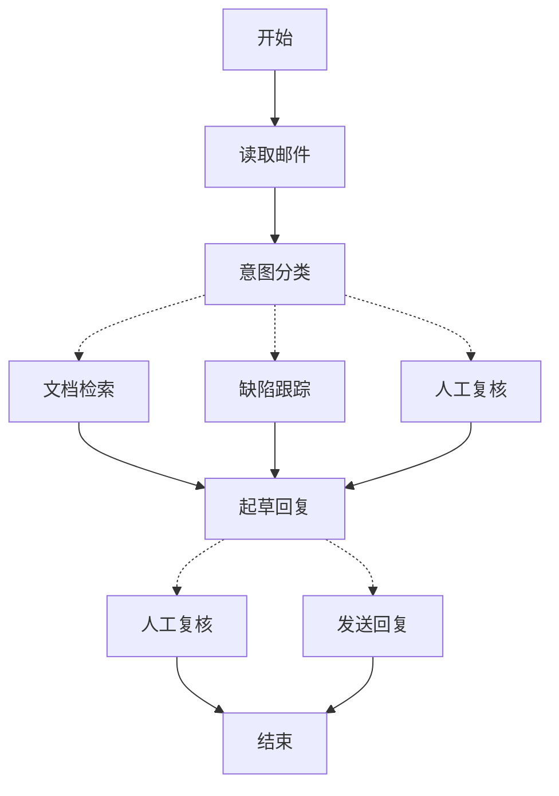

> ## 文档索引
> 获取完整文档索引：https://docs.langchain.com/llms.txt
> 在进一步探索之前，使用此文件发现所有可用页面。

# 用 LangGraph 的方式思考

> 学习如何用 LangGraph 来思考智能体的构建方式

当你使用 LangGraph 构建智能体时，你会先将其拆解为离散步骤，称为 **节点（nodes）**。然后，你需要描述从每个节点出发的不同决策与迁移。最后，你通过一个共享的 **状态（state）** 将节点连接起来，每个节点都可以从该状态读取并向其写入。

在本演练中，我们将引导你完成用 LangGraph 构建一个客户支持邮件智能体的思考过程。

## 从你想自动化的流程开始

设想你需要构建一个处理客户支持邮件的 AI 智能体。你的产品团队给出了以下需求：

```txt  theme={null}
智能体应当：

- 读取收到的客户邮件
- 按紧急程度与主题进行分类
- 搜索相关文档以回答问题
- 起草合适的回复
- 将复杂问题升级给人工客服
- 在需要时安排后续跟进

需要处理的示例场景：

1. 简单的产品问题："如何重置我的密码？"
2. Bug 报告："当我选择 PDF 格式时，导出功能会崩溃"
3. 紧急的计费问题："我的订阅被重复扣费了！"
4. 功能请求："你们能在移动端应用中加入深色模式吗？"
5. 复杂的技术问题："我们的 API 集成间歇性失败并出现 504 错误"
```

要在 LangGraph 中实现一个智能体，你通常会遵循相同的五个步骤。

## 第 1 步：将工作流映射为离散步骤

首先识别流程中的不同步骤。每一步都会成为一个 **节点**（一个只做一件特定事情的函数）。然后，草拟这些步骤彼此之间如何连接。



该图中的箭头表示可能的路径，但真正决定走哪条路径的逻辑发生在每个节点内部。

现在我们已经识别了工作流中的组件，接下来理解每个节点需要做什么：

* `Read Email`：提取并解析邮件内容
* `Classify Intent`：使用 LLM 对紧急程度与主题进行分类，然后路由到合适的动作
* `Doc Search`：查询你的知识库以获取相关信息
* `Bug Track`：在跟踪系统中创建或更新 issue
* `Draft Reply`：生成合适的回复
* `Human Review`：升级到人工客服以批准或处理
* `Send Reply`：发送邮件回复

<Tip>
  请注意，有些节点会决定下一步要去哪里（`Classify Intent`、`Draft Reply`、`Human Review`），而另一些节点总是前进到同一个下一步（`Read Email` 总是进入 `Classify Intent`，`Doc Search` 总是进入 `Draft Reply`）。
</Tip>

## 第 2 步：识别每一步需要做什么

对于图中的每个节点，确定它代表哪种类型的操作，以及它需要哪些上下文才能正确工作。

<CardGroup cols={2}>
  <Card title="LLM 步骤" icon="brain" href="#llm-steps">
    当你需要理解、分析、生成文本或做推理决策时使用
  </Card>

  <Card title="数据步骤" icon="database" href="#data-steps">
    当你需要从外部来源检索信息时使用
  </Card>

  <Card title="动作步骤" icon="bolt" href="#action-steps">
    当你需要执行外部动作时使用
  </Card>

  <Card title="用户输入步骤" icon="user" href="#user-input-steps">
    当你需要人类介入时使用
  </Card>
</CardGroup>

### LLM 步骤

当某一步需要理解、分析、生成文本或做推理决策时：

<AccordionGroup>
  <Accordion title="意图分类">
    * 静态上下文（提示词）：分类类别、紧急程度定义、响应格式
    * 动态上下文（来自状态）：邮件内容、发件人信息
    * 期望产出：用于决定路由的结构化分类结果
  </Accordion>

  <Accordion title="起草回复">
    * 静态上下文（提示词）：语气指南、公司政策、回复模板
    * 动态上下文（来自状态）：分类结果、检索结果、客户历史
    * 期望产出：可供复核的专业邮件回复
  </Accordion>
</AccordionGroup>

### 数据步骤

当某一步需要从外部来源检索信息时：

<AccordionGroup>
  <Accordion title="文档检索">
    * 参数：由意图与主题构建的查询
    * 重试策略：是，对瞬时故障使用指数退避
    * 缓存：可缓存常见查询以减少 API 调用
  </Accordion>

  <Accordion title="客户历史查询">
    * 参数：来自状态的客户邮箱或 ID
    * 重试策略：是，但如果不可用则回退为基础信息
    * 缓存：是，使用 TTL 在数据新鲜度与性能间取得平衡
  </Accordion>
</AccordionGroup>

### 动作步骤

当某一步需要执行外部动作时：

<AccordionGroup>
  <Accordion title="发送回复">
    * 何时执行节点：批准之后（人工或自动批准）
    * 重试策略：是，对网络问题使用指数退避
    * 不应缓存：每次发送都是一个唯一动作
  </Accordion>

  <Accordion title="缺陷跟踪">
    * 何时执行节点：当意图为 "bug" 时总是执行
    * 重试策略：是，确保不会丢失缺陷报告至关重要
    * 返回：用于写入回复中的工单 ID
  </Accordion>
</AccordionGroup>

### 用户输入步骤

当某一步需要人类介入时：

<AccordionGroup>
  <Accordion title="人工复核节点">
    * 决策所需上下文：原始邮件、草拟回复、紧急程度、分类结果
    * 期望输入格式：是否批准的布尔值 + 可选的编辑后回复
    * 触发时机：高紧急度、复杂问题或质量顾虑
  </Accordion>
</AccordionGroup>

## 第 3 步：设计你的状态

状态是智能体中所有节点都可访问的共享 [记忆](/oss/javascript/concepts/memory)。你可以将其视为智能体的笔记本：在流程推进时记录它所学习与所决定的一切。

### 哪些内容应该进入状态？

对每一条数据问自己以下问题：

<CardGroup cols={2}>
  <Card title="应纳入状态" icon="check">
    它是否需要跨步骤持久存在？如果是，则应放入状态。
  </Card>

  <Card title="不要存储" icon="code">
    你能否从其他数据推导出来？如果是，则在需要时计算，而不是存入状态。
  </Card>
</CardGroup>

对于我们的邮件智能体，需要跟踪：

* 原始邮件与发件人信息（之后无法重建）
* 分类结果（多个后续/下游节点都会用到）
* 检索结果与客户数据（重复获取成本高）
* 草拟回复（需要在复核期间保持不变）
* 执行元数据（用于调试与恢复）

### 保持状态为原始数据，按需格式化提示词

<Tip>
  一个关键原则：状态应存储原始数据，而不是格式化后的文本。仅在节点内部需要时再格式化提示词。
</Tip>

这种分离意味着：

* 不同节点可以按各自需要，以不同方式格式化同一份数据
* 你可以在不修改状态模式的情况下更改提示词模板
* 调试更清晰——你能准确看到每个节点收到了哪些数据
* 智能体可以演进，而不会破坏已有状态

我们来定义状态：

```typescript  theme={null}
import { StateSchema } from "@langchain/langgraph";
import * as z from "zod";

// 定义邮件分类的结构
const EmailClassificationSchema = z.object({
  intent: z.enum(["question", "bug", "billing", "feature", "complex"]),
  urgency: z.enum(["low", "medium", "high", "critical"]),
  topic: z.string(),
  summary: z.string(),
});

const EmailAgentState = new StateSchema({
  // 原始邮件数据
  emailContent: z.string(),
  senderEmail: z.string(),
  emailId: z.string(),

  // 分类结果
  classification: EmailClassificationSchema.optional(),

  // 原始检索/API 结果
  searchResults: z.array(z.string()).optional(),  // 原始文档 chunk 列表
  customerHistory: z.record(z.string(), z.any()).optional(),  // 来自 CRM 的原始客户数据

  // 生成内容
  responseText: z.string().optional(),
});

type EmailClassificationType = z.infer<typeof EmailClassificationSchema>;
```

请注意，状态只包含原始数据——没有提示词模板、没有格式化字符串、没有指令。分类输出以单个字典的形式存储，直接来自 LLM。

## 第 4 步：构建你的节点

现在我们将每一步实现为一个函数。LangGraph 中的节点就是一个 JavaScript 函数：它接收当前状态，并返回对状态的更新。

### 适当地处理错误

不同类型的错误需要不同的处理策略：

| 错误类型 | 谁来修复 | 策略 | 适用场景 |
| ------------------------------------------------------------ | ------------------ | ---------------------------------- | ------------------------------------------------ |
| 瞬时错误（网络问题、限流） | 系统（自动） | 重试策略 | 通常重试即可恢复的临时故障 |
| LLM 可恢复错误（工具失败、解析问题） | LLM | 将错误存入状态并回到循环 | LLM 能看到错误并调整策略 |
| 用户可修复错误（缺少信息、指令不清） | 人类 | 使用 `interrupt()` 暂停 | 需要用户输入才能继续 |
| 非预期错误 | 开发者 | 让错误向上冒泡 | 需要调试的未知问题 |

<Tabs>
  <Tab title="瞬时错误" icon="rotate">
    添加重试策略，以自动重试网络问题与限流：

    ```typescript  theme={null}
    import type { RetryPolicy } from "@langchain/langgraph";
    
    workflow.addNode(
      "searchDocumentation",
      searchDocumentation,
      {
        retryPolicy: { maxAttempts: 3, initialInterval: 1.0 },
      },
    );
    ```
  </Tab>

  <Tab title="LLM 可恢复" icon="brain">
    将错误存入状态并回到循环中，让 LLM 看到哪里出了问题并重试：

    ```typescript  theme={null}
    import { Command, GraphNode } from "@langchain/langgraph";
    
    const executeTool: GraphNode<typeof State> = async (state, config) => {
      try {
        const result = await runTool(state.toolCall);
        return new Command({
          update: { toolResult: result },
          goto: "agent",
        });
      } catch (error) {
        // 让 LLM 看到哪里出了问题并重试
        return new Command({
          update: { toolResult: `工具错误：${error}` },
          goto: "agent"
        });
      }
    }
    ```
  </Tab>

  <Tab title="用户可修复" icon="user">
    在需要时暂停并向用户收集信息（例如账号 ID、订单号或澄清信息）：

    ```typescript  theme={null}
    import { Command, GraphNode, interrupt } from "@langchain/langgraph";
    
    const lookupCustomerHistory: GraphNode<typeof State> = async (state, config) => {
      if (!state.customerId) {
        const userInput = interrupt({
          message: "需要客户 ID",
          request: "请提供客户的账号 ID，以便查询其订阅历史",
        });
        return new Command({
          update: { customerId: userInput.customerId },
          goto: "lookupCustomerHistory",
        });
      }
      // 现在继续查询
      const customerData = await fetchCustomerHistory(state.customerId);
      return new Command({
        update: { customerHistory: customerData },
        goto: "draftResponse",
      });
    }
    ```
  </Tab>

  <Tab title="非预期错误" icon="alert-triangle">
    让错误向上冒泡以便调试。不要捕获你无法处理的异常：

    ```typescript  theme={null}
    import { Command, GraphNode } from "@langchain/langgraph";
    
    const sendReply: GraphNode<typeof EmailAgentState> = async (state, config) => {
      try {
        await emailService.send(state.responseText);
      } catch (error) {
        throw error;  // 暴露非预期错误
      }
    }
    ```
  </Tab>
</Tabs>

### 实现我们的邮件智能体节点

我们将每个节点实现为一个简单函数。请记住：节点接收状态、执行工作、并返回更新。

<AccordionGroup>
  <Accordion title="读取与分类节点" icon="brain">
    ```typescript  theme={null}
    import { StateGraph, START, END, GraphNode, Command } from "@langchain/langgraph";
    import { HumanMessage } from "@langchain/core/messages";
    import { ChatAnthropic } from "@langchain/anthropic";

    const llm = new ChatAnthropic({ model: "claude-sonnet-4-5-20250929" });
    
    const readEmail: GraphNode<typeof EmailAgentState> = async (state, config) => {
      // 提取并解析邮件内容
      // 在生产环境中，这里会连接到你的邮件服务
      console.log(`正在处理邮件：${state.emailContent}`);
      return {};
    }
    
    const classifyIntent: GraphNode<typeof EmailAgentState> = async (state, config) => {
      // 使用 LLM 对邮件意图与紧急程度进行分类，然后据此路由
    
      // 创建结构化 LLM，使其返回 EmailClassification 对象
      const structuredLlm = llm.withStructuredOutput(EmailClassificationSchema);
    
      // 按需格式化提示词，不将其存入状态
      const classificationPrompt = `
      分析这封客户邮件并进行分类：
    
      邮件内容：${state.emailContent}
      来自：${state.senderEmail}
    
      请提供包含意图、紧急程度、主题与摘要的分类结果。
      `;
    
      // 直接以对象形式获取结构化响应
      const classification = await structuredLlm.invoke(classificationPrompt);
    
      // 根据分类决定下一个节点
      let nextNode: "searchDocumentation" | "humanReview" | "draftResponse" | "bugTracking";
    
      if (classification.intent === "billing" || classification.urgency === "critical") {
        nextNode = "humanReview";
      } else if (classification.intent === "question" || classification.intent === "feature") {
        nextNode = "searchDocumentation";
      } else if (classification.intent === "bug") {
        nextNode = "bugTracking";
      } else {
        nextNode = "draftResponse";
      }
    
      // 将分类作为单个对象存入状态
      return new Command({
        update: { classification },
        goto: nextNode,
      });
    }
    ```
  </Accordion>

  <Accordion title="检索与跟踪节点" icon="database">
    ```typescript  theme={null}
    import { Command, GraphNode } from "@langchain/langgraph";

    const searchDocumentation: GraphNode<typeof EmailAgentState> = async (state, config) => {
      // 在知识库中检索相关信息
    
      // 基于分类构建检索查询
      const classification = state.classification!;
      const query = `${classification.intent} ${classification.topic}`;
    
      let searchResults: string[];
    
      try {
        // 在此实现你的检索逻辑
        // 存储原始检索结果，而不是格式化文本
        searchResults = [
          "通过 设置 > 安全 > 更改密码 来重置密码",
          "密码长度至少需要 12 个字符",
          "需包含大写字母、小写字母、数字与符号",
        ];
      } catch (error) {
        // 对可恢复的检索错误，将错误存入状态并继续
        searchResults = [`检索暂时不可用：${error}`];
      }
    
      return new Command({
        update: { searchResults },  // 存储原始结果或错误
        goto: "draftResponse",
      });
    }
    
    const bugTracking: GraphNode<typeof EmailAgentState> = async (state, config) => {
      // 创建或更新缺陷跟踪工单
    
      // 在你的缺陷跟踪系统中创建工单
      const ticketId = "BUG-12345";  // 将通过 API 创建
    
      return new Command({
        update: { searchResults: [`已创建缺陷工单 ${ticketId}`] },
        goto: "draftResponse",
      });
    }
    ```
  </Accordion>

  <Accordion title="回复节点" icon="edit">
    ```typescript  theme={null}
    import { Command, interrupt } from "@langchain/langgraph";

    const draftResponse: GraphNode<typeof EmailAgentState> = async (state, config) => {
      // 使用上下文生成回复，并基于质量进行路由
    
      const classification = state.classification!;
    
      // 基于原始状态数据按需格式化上下文
      const contextSections: string[] = [];
    
      if (state.searchResults) {
        // 为提示词格式化检索结果
        const formattedDocs = state.searchResults.map(doc => `- ${doc}`).join("\n");
        contextSections.push(`相关文档：\n${formattedDocs}`);
      }
    
      if (state.customerHistory) {
        // 为提示词格式化客户数据
        contextSections.push(`客户等级：${state.customerHistory.tier ?? "standard"}`);
      }
    
      // 使用格式化后的上下文构建提示词
      const draftPrompt = `
      为以下客户邮件起草回复：
      ${state.emailContent}
    
      邮件意图：${classification.intent}
      紧急程度：${classification.urgency}
    
      ${contextSections.join("\n\n")}
    
      指南：
      - 专业且有帮助
      - 针对其具体问题进行回应
      - 在相关时使用提供的文档信息
      `;
    
      const response = await llm.invoke([new HumanMessage(draftPrompt)]);
    
      // 基于紧急程度与意图判断是否需要人工复核
      const needsReview = (
        classification.urgency === "high" ||
        classification.urgency === "critical" ||
        classification.intent === "complex"
      );
    
      // 路由到合适的下一个节点
      const nextNode = needsReview ? "humanReview" : "sendReply";
    
      return new Command({
        update: { responseText: response.content.toString() },  // 只存储原始回复内容
        goto: nextNode,
      });
    }
    
    const humanReview: GraphNode<typeof EmailAgentState> = async (state, config) => {
      // 使用 interrupt 暂停以进行人工复核，并基于决策进行路由
      const classification = state.classification!;
    
      // interrupt() 必须放在最前面——它之前的任何代码都会在恢复时重新运行
      const humanDecision = interrupt({
        emailId: state.emailId,
        originalEmail: state.emailContent,
        draftResponse: state.responseText,
        urgency: classification.urgency,
        intent: classification.intent,
        action: "请复核并批准/编辑这封回复",
      });
    
      // 现在处理人工决策
      if (humanDecision.approved) {
        return new Command({
          update: { responseText: humanDecision.editedResponse || state.responseText },
          goto: "sendReply",
        });
      } else {
        // 拒绝意味着人工将直接处理
        return new Command({ update: {}, goto: END });
      }
    }
    
    const sendReply: GraphNode<typeof EmailAgentState> = async (state, config) => {
      // 发送邮件回复
      // 与邮件服务集成
      console.log(`正在发送回复：${state.responseText!.substring(0, 100)}...`);
      return {};
    }
    ```
  </Accordion>
</AccordionGroup>

## 第 5 步：把它连接起来

现在我们将节点连接成一个可工作的图。由于节点会自行处理路由决策，因此我们只需要少量关键边。

要通过 `interrupt()` 启用 [人类介入（human-in-the-loop）](/oss/javascript/langgraph/interrupts)，我们需要在编译时配置一个 [checkpointer](/oss/javascript/langgraph/persistence)，以在运行之间保存状态：

<Accordion title="图编译代码" icon="sitemap" defaultOpen={true}>
  ```typescript  theme={null}
  import { MemorySaver, RetryPolicy } from "@langchain/langgraph";

  // 创建图
  const workflow = new StateGraph(EmailAgentState)
    // 添加节点，并进行合适的错误处理
    .addNode("readEmail", readEmail)
    .addNode("classifyIntent", classifyIntent)
    // 为可能发生瞬时故障的节点添加重试策略
    .addNode(
      "searchDocumentation",
      searchDocumentation,
      { retryPolicy: { maxAttempts: 3 } },
    )
    .addNode("bugTracking", bugTracking)
    .addNode("draftResponse", draftResponse)
    .addNode("humanReview", humanReview)
    .addNode("sendReply", sendReply)
    // 只添加必要的边
    .addEdge(START, "readEmail")
    .addEdge("readEmail", "classifyIntent")
    .addEdge("sendReply", END);

  // 使用 checkpointer 进行持久化编译
  const memory = new MemorySaver();
  const app = workflow.compile({ checkpointer: memory });
  ```
</Accordion>

图结构之所以极简，是因为路由通过 `Command` 对象在节点内部完成。每个节点声明它可以前往哪里，使流程显式且可追踪。

### 试运行你的智能体

我们用一个需要人工复核的紧急计费问题来运行智能体：

<Accordion title="测试智能体" icon="flask">
  ```typescript  theme={null}
  // 使用一个紧急计费问题进行测试
  const initialState: EmailAgentStateType = {
    emailContent: "我的订阅被重复扣费了！这很紧急！",
    senderEmail: "customer@example.com",
    emailId: "email_123"
  };

  // 使用 thread_id 运行以启用持久化
  const config = { configurable: { thread_id: "customer_123" } };
  const result = await app.invoke(initialState, config);
  // 图会在 human_review 处暂停
  console.log(`草稿已准备好复核：${result.responseText?.substring(0, 100)}...`);
  ```

  ```typescript  theme={null}
  import { Command } from "@langchain/langgraph";

  // 准备就绪后，提供人工输入以恢复执行
  const humanResponse = new Command({
    resume: {
      approved: true,
      editedResponse: "我们对重复扣费深表歉意。我已立即为您发起退款……",
    }
  });

  // 恢复执行
  const finalResult = await app.invoke(humanResponse, config);
  console.log("邮件已成功发送！");
  ```
</Accordion>

当图命中 `interrupt()` 时，它会暂停、将所有内容保存到 checkpointer 并等待。它可以在几天后恢复执行，并精确从中断处继续。`thread_id` 可确保该对话的所有状态被统一保存。

## 总结与后续步骤

### 关键洞见

构建这个邮件智能体展示了 LangGraph 的思考方式：

<CardGroup cols={2}>
  <Card title="拆分为离散步骤" icon="sitemap" href="#第-1-步将工作流映射为离散步骤">
    每个节点只把一件事做到最好。这种分解支持流式进度更新、可暂停并恢复的持久化执行，以及清晰的调试体验——因为你可以在步骤间检查状态。
  </Card>

  <Card title="状态即共享记忆" icon="database" href="#第-3-步设计你的状态">
    存储原始数据，而不是格式化文本。这样不同节点就能以不同方式使用同一份信息。
  </Card>

  <Card title="节点就是函数" icon="code" href="#第-4-步构建你的节点">
    节点接收状态、执行工作并返回更新。当需要做路由决策时，它们同时指定状态更新与下一步去向。
  </Card>

  <Card title="错误是流程的一部分" icon="alert-triangle" href="#适当地处理错误">
    瞬时故障会重试，LLM 可恢复错误会携带上下文回到循环，用户可修复问题会暂停等待输入，非预期错误会向上冒泡以便调试。
  </Card>

  <Card title="人工输入是一等公民" icon="user" href="/oss/javascript/langgraph/interrupts">
    `interrupt()` 会无限期暂停执行、保存所有状态，并在你提供输入后从中断点精确恢复。与节点中的其他操作组合时，它必须放在最前面。
  </Card>

  <Card title="图结构自然涌现" icon="sitemap" href="#第-5-步把它连接起来">
    你定义关键连接，节点自行处理路由逻辑。这使控制流显式且可追踪——只要查看当前节点，就能理解智能体下一步会做什么。
  </Card>
</CardGroup>

### 高级考量

<Accordion title="节点粒度的权衡" icon="adjustments">
  <Info>
    本节探讨节点粒度设计的权衡。多数应用可以跳过本节，直接使用上文所示模式。
  </Info>

  你可能会疑惑：为什么不把 `Read Email` 与 `Classify Intent` 合并成一个节点？

  或者，为什么把文档检索与起草回复分开？

  答案涉及韧性与可观测性之间的权衡。

  **关于韧性的考量：** LangGraph 的 [持久化执行](/oss/javascript/langgraph/durable-execution) 会在节点边界创建 checkpoint。当工作流在中断或失败后恢复执行时，它会从停止执行的那个节点的开头开始。更小的节点意味着更频繁的 checkpoint，从而在出现问题时需要重复的工作更少。如果你把多个操作合并成一个大节点，那么在接近尾部发生失败就意味着必须从该节点开头重做全部工作。

  我们为邮件智能体选择该拆分方式的原因：

  * **外部服务隔离：** 文档检索与缺陷跟踪是独立节点，因为它们会调用外部 API。如果检索服务很慢或失败，我们希望将其与 LLM 调用隔离开。我们可以为这些特定节点添加重试策略，而不会影响其他节点。

  * **中间可见性：** 将 `Classify Intent` 作为单独节点，允许我们在采取行动前检查 LLM 的决策。这对于调试与监控非常有价值——你可以准确看到智能体在何时、为何路由到人工复核。

  * **不同的故障模式：** LLM 调用、数据库查询与邮件发送具有不同的重试策略。拆分节点能让你分别配置这些策略。

  * **复用与测试：** 更小的节点更容易单独测试，也更容易在其他工作流中复用。

  另一种同样有效的方案：你可以把 `Read Email` 与 `Classify Intent` 合并成一个节点。你会失去在分类前检查原始邮件的能力，并且该节点内的任何失败都将导致两步操作都被重做。对多数应用而言，拆分节点带来的可观测性与调试收益通常值得这项权衡。

  应用层关注点：第 2 步中的缓存讨论（是否缓存检索结果）属于应用层决策，而不是 LangGraph 框架特性。你应在节点函数中根据自身需求实现缓存——LangGraph 并不会规定必须怎么做。

  性能考量：更多节点并不意味着更慢的执行。LangGraph 默认会在后台写入 checkpoint（参见 [异步持久化模式](/oss/javascript/langgraph/durable-execution#durability-modes)），因此你的图会继续运行，而无需等待 checkpoint 写入完成。这意味着你能以极小的性能影响获得更频繁的 checkpoint。如有需要，你也可以调整此行为——使用 `"exit"` 模式仅在完成时 checkpoint，或使用 `"sync"` 模式阻塞执行直到每次 checkpoint 写入完成。
</Accordion>

### 下一步去哪里

以上是对如何用 LangGraph 思考构建智能体的入门。你可以在此基础上继续扩展：

<CardGroup cols={2}>
  <Card title="人类介入模式" icon="user-check" href="/oss/javascript/langgraph/interrupts">
    学习如何在执行前添加工具审批、批量审批与其他模式
  </Card>

  <Card title="子图（Subgraphs）" icon="hierarchy" href="/oss/javascript/langgraph/use-subgraphs">
    为复杂的多步骤操作创建子图
  </Card>

  <Card title="流式传输" icon="broadcast" href="/oss/javascript/langgraph/streaming">
    添加流式传输，以向用户展示实时进度
  </Card>

  <Card title="可观测性" icon="chart-line" href="/oss/javascript/langgraph/observability">
    使用 LangSmith 添加可观测性，用于调试与监控
  </Card>

  <Card title="工具集成" icon="tool" href="/oss/javascript/langchain/tools">
    集成更多工具，用于 Web 搜索、数据库查询与 API 调用
  </Card>

  <Card title="重试逻辑" icon="rotate" href="/oss/javascript/langgraph/use-graph-api#add-retry-policies">
    使用指数退避为失败操作实现重试逻辑
  </Card>
</CardGroup>

***

<Callout icon="edit">
  [在 GitHub 上编辑此页面](https://github.com/langchain-ai/docs/edit/main/src/oss/langgraph/thinking-in-langgraph.mdx) 或 [提交 issue](https://github.com/langchain-ai/docs/issues/new/choose)。
</Callout>

<Callout icon="terminal-2">
  通过 MCP 将[这些文档连接](/use-these-docs)到 Claude、VSCode 等，以获得实时答案。
</Callout>
