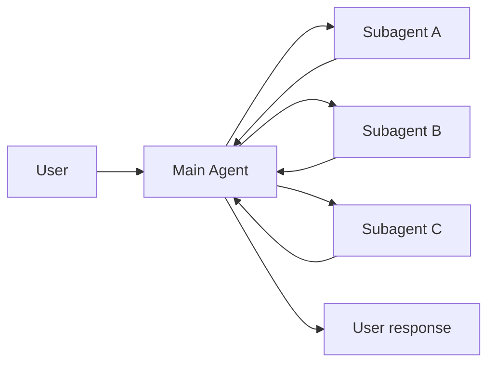
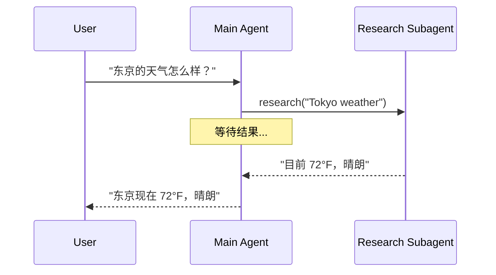
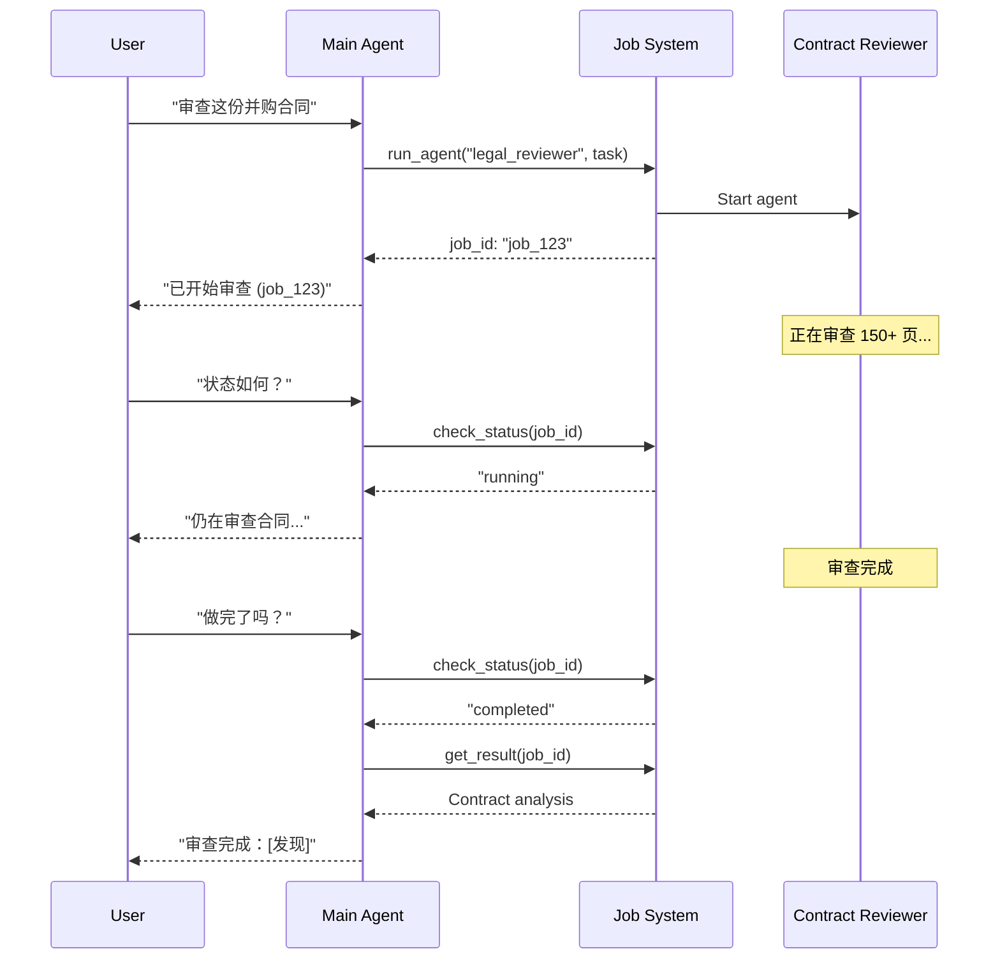
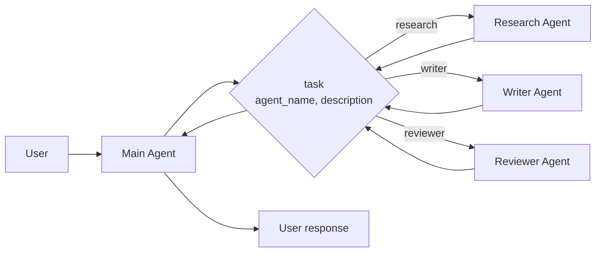

# 子智能体 (Subagents)

在 **子智能体 (Subagents)** 架构中，一个中心主智能体（通常称为 **主管 (supervisor)**）通过将子智能体作为 [工具](/oss/javascript/langchain/tools) 来调用以协调它们。主智能体决定调用哪个子智能体、提供什么输入以及如何组合结果。子智能体是无状态的——它们不记得过去的交互，所有的对话记忆都由主智能体维护。这提供了 [上下文](/oss/javascript/langchain/context-engineering) 隔离：每个子智能体调用都在一个干净的上下文窗口中工作，防止主对话中的上下文膨胀。



## 关键特征

*   集中控制：所有路由都经过主智能体
*   无直接用户交互：子智能体将结果返回给主智能体，而不是用户（尽管您可以在子智能体中使用 [中断](/oss/javascript/langgraph/human-in-the-loop#interrupt) 来允许用户交互）
*   通过工具使用子智能体：子智能体通过工具被调用
*   并行执行：主智能体可以在一轮中调用多个子智能体

<Note>
  **使用此模式时可能无法检查子图状态。** LangGraph 只能检查它能 [静态发现](/oss/javascript/langgraph/use-subgraphs#view-subgraph-state) 的子图的状态。因为子智能体是在工具函数内部调用的，它们不是静态可发现的，所以带有 `subgraphs` 的 [`get_state`](/oss/javascript/langgraph/use-subgraphs#view-subgraph-state) 将不会返回子智能体的状态。如果您需要读取嵌套图的状态（例如，在 [中断](/oss/javascript/langgraph/human-in-the-loop#interrupt) 期间），请改用自定义图中的 [节点函数](/oss/javascript/langgraph/use-subgraphs#invoke-a-graph-from-a-node) 来调用子智能体。
</Note>

<Note>
  **主管 (Supervisor) vs. 路由器 (Router)**：主管智能体（此模式）不同于 [路由器](/oss/javascript/langchain/multi-agent/router)。主管是一个完整的智能体，维护对话上下文并在多轮对话中动态决定调用哪些子智能体。路由器通常是一个单一的分类步骤，它分发给智能体而不维护持续的对话状态。
</Note>

## 何时使用

当您有多个不同的领域（例如，日历、电子邮件、CRM、数据库），子智能体不需要直接与用户交谈，或者您想要集中的工作流控制时，请使用子智能体模式。对于只有几个 [工具](/oss/javascript/langchain/tools) 的简单情况，请使用 [单个智能体](/oss/javascript/langchain/agents)。

<Tip>
  **需要在子智能体中进行用户交互？** 虽然子智能体通常将结果返回给主智能体而不是直接与用户交谈，但您可以在子智能体中使用 [中断](/oss/javascript/langgraph/human-in-the-loop#interrupt) 来暂停执行并收集用户输入。当子智能体在继续之前需要澄清或批准时，这很有用。主智能体仍然是编排者，但子智能体可以在任务中间从用户那里收集信息。
</Tip>

## 基本实现

核心机制是将子智能体包装为主智能体可以调用的工具：

```typescript
import { createAgent, tool } from "langchain";
import { z } from "zod";

// 创建一个子智能体
const subagent = createAgent({ model: "anthropic:claude-sonnet-4-20250514", tools: [...] });

// 将其包装为一个工具
const callResearchAgent = tool(
  async ({ query }) => {
    const result = await subagent.invoke({
      messages: [{ role: "user", content: query }]
    });
    return result.messages.at(-1)?.content;
  },
  {
    name: "research",
    description: "研究一个主题并返回发现",
    schema: z.object({ query: z.string() })
  }
);

// 将子智能体作为工具的主智能体
const mainAgent = createAgent({ model: "anthropic:claude-sonnet-4-20250514", tools: [callResearchAgent] });
```

<Card title="教程：构建带子智能体的个人助理" icon="sitemap" href="/oss/javascript/langchain/multi-agent/subagents-personal-assistant" arrow cta="了解更多">
  了解如何使用子智能体模式构建个人助理，其中中心主智能体（主管）协调专门的工作者智能体。
</Card>

## 设计决策

在实现子智能体模式时，您将做出几个关键的设计选择。此表总结了选项——每个选项都在下面的部分中详细介绍。

| 决策                                      | 选项                                                                                   |
| ----------------------------------------- | -------------------------------------------------------------------------------------- |
| [**同步 vs. 异步**](#sync-vs-async)       | 同步（阻塞） vs. 异步（后台）                                                          |
| [**工具模式**](#tool-patterns)            | 每个智能体一个工具 vs. 单一分发工具                                                    |
| [**子智能体规范**](#subagent-specs)       | 系统提示词 vs. 枚举约束 vs. 基于工具的发现（仅限单一分发工具）                         |
| [**子智能体输入**](#subagent-inputs)      | 仅查询 vs. 完整上下文                                                                  |
| [**子智能体输出**](#subagent-outputs)     | 子智能体结果 vs. 完整对话历史                                                          |

## 同步 vs. 异步

子智能体的执行可以是 **同步的**（阻塞）或 **异步的**（后台）。您的选择取决于主智能体是否需要结果才能继续。

| 模式     | 主智能体行为                                | 最适合                                 | 权衡                                |
| -------- | ------------------------------------------- | -------------------------------------- | ----------------------------------- |
| **同步** | 等待子智能体完成                            | 主智能体需要结果才能继续               | 简单，但会阻塞对话                  |
| **异步** | 在子智能体在后台运行时继续                  | 独立任务，用户不应等待                 | 响应迅速，但更复杂                  |

<Tip>
  不要与 Python 的 `async`/`await` 混淆。在这里，“异步”意味着主智能体启动一个后台作业（通常在单独的进程或服务中）并在不阻塞的情况下继续。
</Tip>

### 同步（默认）

默认情况下，子智能体调用是 **同步的**——主智能体等待每个子智能体完成才继续。当主智能体的下一步操作取决于子智能体的结果时，使用同步。



**何时使用同步：**

*   主智能体需要子智能体的结果来制定其响应
*   任务有顺序依赖性（例如，获取数据 → 分析 → 响应）
*   子智能体故障应阻塞主智能体的响应

**权衡：**

*   实现简单——只需调用并等待
*   在所有子智能体完成之前，用户看不到任何响应
*   长时间运行的任务会冻结对话

### 异步

当子智能体的工作是独立的——主智能体不需要结果就能继续与用户交谈时，使用 **异步执行**。主智能体启动后台作业并保持响应。



**何时使用异步：**

*   子智能体的工作独立于主对话流
*   工作进行时，用户应能继续聊天
*   您希望并行运行多个独立任务

**三工具模式：**

1.  **启动作业**：启动后台任务，返回作业 ID
2.  **检查状态**：返回当前状态（挂起、运行中、已完成、失败）
3.  **获取结果**：检索已完成的结果

**处理作业完成：** 当作业完成时，您的应用程序需要通知用户。一种方法是：显示一个通知，点击后发送一条 `HumanMessage`，如“检查 job\_123 并总结结果”。

## 工具模式

有两种主要方式将子智能体作为工具公开：

| 模式                                              | 最适合                                                        | 权衡                                              |
| ------------------------------------------------- | ------------------------------------------------------------- | ------------------------------------------------- |
| [**每个智能体一个工具**](#tool-per-agent)         | 对每个子智能体的输入/输出进行细粒度控制                       | 设置较多，但自定义程度更高                        |
| [**单一分发工具**](#single-dispatch-tool)         | 许多智能体，分布式团队，约定优于配置                          | 组合更简单，每个智能体的自定义较少                |

### 每个智能体一个工具


核心思想是将子智能体包装为主智能体可以调用的工具：

```typescript
import { createAgent, tool } from "langchain";
import * as z from "zod";

// 创建一个子智能体
const subagent = createAgent({...});

// 将其包装为一个工具
const callSubagent = tool(
  async ({ query }) => {
    const result = await subagent.invoke({
      messages: [{ role: "user", content: query }]
    });
    return result.messages.at(-1)?.text;
  },
  {
    name: "subagent_name",
    description: "subagent_description",
    schema: z.object({
      query: z.string().describe("发送给子智能体的查询")
    })
  }
);

// 将子智能体作为工具的主智能体
const mainAgent = createAgent({ model, tools: [callSubagent] });
```

当主智能体决定任务符合子智能体的描述时，它会调用子智能体工具，接收结果，并继续编排。有关细粒度控制，请参阅 [上下文工程](#context-engineering)。

### 单一分发工具

另一种方法是使用单个参数化工具来调用用于独立任务的临时子智能体。与 [每个智能体一个工具](#tool-per-agent) 方法（其中每个子智能体都被包装为单独的工具）不同，这使用基于约定的方法，只有一个 `task` 工具：任务描述作为人类消息传递给子智能体，子智能体的最终消息作为工具结果返回。

当您希望跨多个团队分发智能体开发，需要将复杂任务隔离到单独的上下文窗口中，需要一种可扩展的方式来添加新智能体而无需修改协调器，或者更喜欢约定优于自定义时，请使用此方法。这种方法以牺牲上下文工程的灵活性为代价，换取了智能体组合的简单性和强大的上下文隔离。



**关键特征：**

*   单一任务工具：一个参数化工具，可以通过名称调用任何已注册的子智能体
*   基于约定的调用：通过名称选择智能体，任务作为人类消息传递，最终消息作为工具结果返回
*   团队分发：不同的团队可以独立开发和部署智能体
*   智能体发现：可以通过系统提示词（列出可用智能体）或通过 [渐进式披露](/oss/javascript/langchain/multi-agent/skills-sql-assistant)（通过工具按需加载智能体信息）来发现子智能体

<Tip>
  这种方法的一个有趣方面是，子智能体可能具有与主智能体完全相同的能力。在这种情况下，调用子智能体 **实际上主要是为了上下文隔离**——允许复杂的、多步骤的任务在隔离的上下文窗口中运行，而不会使主智能体的对话历史膨胀。子智能体自主完成工作并仅返回简明的摘要，使主线程保持专注和高效。
</Tip>

<Accordion title="带任务分发器的智能体注册表">
  ```typescript
  import { tool, createAgent } from "langchain";
  import * as z from "zod";

  // 由不同团队开发的子智能体
  const researchAgent = createAgent({
    model: "gpt-4.1",
    prompt: "You are a research specialist...",
  });

  const writerAgent = createAgent({
    model: "gpt-4.1",
    prompt: "You are a writing specialist...",
  });

  // 可用子智能体的注册表
  const SUBAGENTS = {
    research: researchAgent,
    writer: writerAgent,
  };

  const task = tool(
    async ({ agentName, description }) => {
      const agent = SUBAGENTS[agentName];
      const result = await agent.invoke({
        messages: [
          { role: "user", content: description }
        ],
      });
      return result.messages.at(-1)?.content;
    },
    {
      name: "task",
      description: `启动一个临时子智能体。

  可用智能体：
  - research: 研究和实况调查
  - writer: 内容创作和编辑`,
      schema: z.object({
        agentName: z
          .string()
          .describe("要调用的智能体名称"),
        description: z
          .string()
          .describe("任务描述"),
      }),
    }
  );

  // 主协调智能体
  const mainAgent = createAgent({
    model: "gpt-4.1",
    tools: [task],
    prompt: (
      "You coordinate specialized sub-agents. " +
      "Available: research (fact-finding), " +
      "writer (content creation). " +
      "Use the task tool to delegate work."
    ),
  });
  ```
</Accordion>

## 上下文工程

控制上下文如何在主智能体及其子智能体之间流动：

| 类别                                      | 目的                                                     | 影响                         |
| ----------------------------------------- | -------------------------------------------------------- | ---------------------------- |
| [**子智能体规范**](#subagent-specs)       | 确保在应该调用子智能体时调用它们                         | 主智能体路由决策             |
| [**子智能体输入**](#subagent-inputs)      | 确保子智能体可以使用优化的上下文很好地执行               | 子智能体性能                 |
| [**子智能体输出**](#subagent-outputs)     | 确保主管可以根据子智能体的结果采取行动                   | 主智能体性能                 |

另请参阅我们要关于智能体 [上下文工程](/oss/javascript/langchain/context-engineering) 的综合指南。

### 子智能体规范

与子智能体关联的 **名称** 和 **描述** 是主智能体知道要调用哪些子智能体的主要方式。这些是提示词杠杆——请谨慎选择。

*   **名称**：主智能体如何引用子智能体。保持清晰且面向行动（例如，`research_agent`，`code_reviewer`）。
*   **描述**：主智能体对子智能体能力的了解。具体说明它处理什么任务以及何时使用它。

对于 [单一分发工具](#single-dispatch-tool) 设计，您必须另外向主智能体提供它可以调用的子智能体的信息。
您可以根据智能体的数量以及您的注册表是静态的还是动态的，以不同的方式提供此信息：

| 方法                          | 最适合                                   | 权衡                                                                 |
| ----------------------------- | ---------------------------------------- | -------------------------------------------------------------------- |
| **系统提示词枚举**            | 小型、静态智能体列表 (< 10 个智能体)     | 简单，但需要在智能体更改时更新提示词                                 |
| **枚举约束**                  | 小型、静态智能体列表 (< 10 个智能体)     | 类型安全且显式，但需要在智能体更改时更改代码                         |
| **基于工具的发现**            | 大型或动态智能体注册表                   | 灵活且可扩展，但增加了复杂性                                         |

#### 系统提示词枚举

直接在主智能体的系统提示词中列出可用智能体。主智能体将智能体列表及其描述视为其指令的一部分。

**何时使用：**

*   您有一组小的、固定的智能体 (< 10)
*   智能体注册表很少更改
*   您想要最简单的实现

**示例：**

```python
main_agent = create_agent(
    model="...",
    tools=[task],
    system_prompt=(
        "You coordinate specialized sub-agents. "
        "Available agents:\n"
        "- research: Research and fact-finding\n"
        "- writer: Content creation and editing\n"
        "- reviewer: Code and document review\n"
        "Use the task tool to delegate work."
    ),
)
```

#### 分发工具上的枚举约束

在您的分发工具中的 `agent_name` 参数上添加枚举约束。这提供了类型安全性，并在工具模式中使可用智能体显式化。

**何时使用：**

*   您有一组小的、固定的智能体 (< 10)
*   您想要类型安全和显式的智能体名称
*   您更喜欢基于模式的验证而不是基于提示词的指导

**示例：**

```python
from enum import Enum

class AgentName(str, Enum):
    RESEARCH = "research"
    WRITER = "writer"
    REVIEWER = "reviewer"

@tool
def task(
    agent_name: AgentName,  # Enum constraint
    description: str
) -> str:
    """Launch an ephemeral subagent for a task."""
    # ...
```

#### 基于工具的发现

提供一个单独的工具（例如，`list_agents` 或 `search_agents`），主智能体可以调用该工具来按需发现可用智能体。这启用了渐进式披露并支持动态注册表。

**何时使用：**

*   您有许多智能体 (> 10) 或不断增长的注册表
*   智能体注册表经常更改或动态
*   您希望减少提示词大小和 token 使用
*   不同的团队独立管理不同的智能体

**示例：**

```python
@tool
def list_agents(query: str = "") -> str:
    """List available subagents, optionally filtered by query."""
    agents = search_agent_registry(query)
    return format_agent_list(agents)

@tool
def task(agent_name: str, description: str) -> str:
    """Launch an ephemeral subagent for a task."""
    # ...

main_agent = create_agent(
    model="...",
    tools=[task, list_agents],
    system_prompt="Use list_agents to discover available subagents, then use task to invoke them."
)
```

### 子智能体输入

自定义子智能体接收什么上下文来执行其任务。添加在静态提示词中无法捕获的输入——完整的消息历史记录、先前的结果或任务元数据——通过从智能体的状态中提取。

```typescript
import { createAgent, tool, AgentState, ToolMessage } from "langchain";
import { Command } from "@langchain/langgraph";
import * as z from "zod";

// 通过状态将完整对话历史传递给子智能体的示例。
const callSubagent1 = tool(
  async ({query}) => {
    const state = getCurrentTaskInput<AgentState>();
    // 应用任何需要的逻辑将消息转换为合适的输入
    const subAgentInput = someLogic(query, state.messages);
    const result = await subagent1.invoke({
      messages: subAgentInput,
      // 您也可以根据需要在此处传递其他状态键。
      // 确保在主智能体和子智能体的状态模式中都定义了这些键。
      exampleStateKey: state.exampleStateKey
    });
    return result.messages.at(-1)?.content;
  },
  {
    name: "subagent1_name",
    description: "subagent1_description",
  }
);
```

### 子智能体输出

自定义主智能体接收回什么，以便它可以做出正确的决定。两种策略：

1.  **提示子智能体**：确切指定应返回的内容。常见的故障模式是子智能体执行工具调用或推理，但不在其最终消息中包含结果——提醒它主管只看到最终输出。
2.  **在代码中格式化**：在返回之前调整或丰富响应。例如，使用 [`Command`](/oss/javascript/langgraph/graph-api#command) 除了最终文本之外，还传回特定的状态键。

```typescript
import { tool, ToolMessage } from "langchain";
import { Command } from "@langchain/langgraph";
import * as z from "zod";

const callSubagent1 = tool(
  async ({ query }, config) => {
    const result = await subagent1.invoke({
      messages: [{ role: "user", content: query }]
    });

    // 返回一个 Command 以更新多个状态键
    return new Command({
      update: {
        // 从子智能体传回额外的状态
        exampleStateKey: result.exampleStateKey,
        messages: [
          new ToolMessage({
            content: result.messages.at(-1)?.text,
            tool_call_id: config.toolCall?.id!
          })
        ]
      }
    });
  },
  {
    name: "subagent1_name",
    description: "subagent1_description",
    schema: z.object({
      query: z.string().describe("发送给 subagent1 的查询")
    })
  }
);
```
