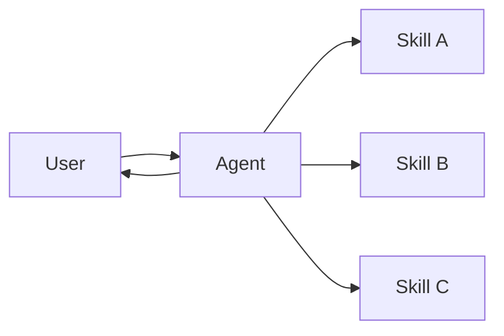

# 技能 (Skills)

在 **技能 (Skills)** 架构中，专门的能力被打包为可调用的“技能”，以增强 [智能体](/oss/javascript/langchain/agents) 的行为。技能主要是智能体可以按需调用的提示词驱动的专业化能力。
有关内置技能支持，请参阅 [Deep Agents](/oss/javascript/deepagents/skills)。

<Tip>
  此模式在概念上与 [Agent Skills](https://agentskills.io/) 和 [llms.txt](https://llmstxt.org/)（由 Jeremy Howard 引入）相同，后者使用工具调用来渐进式披露文档。技能模式将渐进式披露应用于专门的提示词和领域知识，而不仅仅是文档页面。
</Tip>



## 关键特征

*   提示词驱动的专业化：技能主要由专门的提示词定义
*   渐进式披露：技能根据上下文或用户需求变得可用
*   团队分发：不同的团队可以独立开发和维护技能
*   轻量级组合：技能比完整的子智能体更简单
*   引用感知：技能可以引用脚本、模板和其他资源

## 何时使用

当您希望单个 [智能体](/oss/javascript/langchain/agents) 具有多种可能的专业化，不需要在技能之间强制执行特定约束，或者不同的团队需要独立开发能力时，请使用技能模式。常见的例子包括编码助手（针对不同语言或任务的技能）、知识库（针对不同领域的技能）和创意助手（针对不同格式的技能）。

## 基本实现

```typescript
import { tool, createAgent } from "langchain";
import * as z from "zod";

const loadSkill = tool(
  async ({ skillName }) => {
    // 从文件/数据库加载技能内容
    return "";
  },
  {
    name: "load_skill",
    description: `加载一项专业技能。

可用技能：
- write_sql: SQL 查询编写专家
- review_legal_doc: 法律文档审查员

返回技能的提示词和上下文。`,
    schema: z.object({
      skillName: z
        .string()
        .describe("要加载的技能名称")
    })
  }
);

const agent = createAgent({
  model: "gpt-4.1",
  tools: [loadSkill],
  systemPrompt: (
    "You are a helpful assistant. " +
    "You have access to two skills: " +
    "write_sql and review_legal_doc. " +
    "Use load_skill to access them."
  ),
});
```

有关完整实现，请参阅下面的教程。

<Card title="教程：构建带按需技能的 SQL 助手" icon="wand-magic-sparkles" href="/oss/javascript/langchain/multi-agent/skills-sql-assistant" arrow cta="了解更多">
  了解如何实现具有渐进式披露的技能，其中智能体按需加载专门的提示词和模式，而不是预先加载。
</Card>

## 扩展模式

在编写自定义实现时，您可以通过多种方式扩展基本技能模式：

*   **动态工具注册**：将渐进式披露与状态管理相结合，在加载技能时注册新 [工具](/oss/javascript/langchain/tools)。例如，加载“database\_admin”技能既可以添加专门的上下文，也可以注册特定于数据库的工具（备份、恢复、迁移）。这使用与多智能体模式相同的工具和状态机制——工具更新状态以动态更改智能体功能。

*   **分层技能**：技能可以在树结构中定义其他技能，从而创建嵌套的专业化。例如，加载“data\_science”技能可能会提供“pandas\_expert”、“visualization”和“statistical\_analysis”等子技能。每个子技能都可以根据需要独立加载，从而允许对领域知识进行细粒度的渐进式披露。这种分层方法通过将能力组织成可以按需发现和加载的逻辑分组，有助于管理大型知识库。

*   **引用感知**：虽然每个技能只有一个提示词，但此提示词可以引用其他资产的位置，并提供有关智能体何时应使用这些资产的信息。
    当这些资产变得相关时，智能体将知道这些文件存在，并在需要完成任务时将其读取到内存中。
    这也遵循渐进式披露模式，并限制上下文窗口中的信息。
