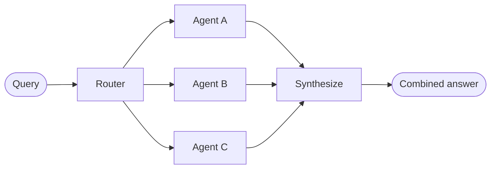

# 路由器 (Router)

在 **路由器 (router)** 架构中，路由步骤对输入进行分类并将其定向到专门的 [智能体](/oss/javascript/langchain/agents)。当您有不同的 **垂直领域**——每个领域都需要自己的智能体的独立知识领域时，这很有用。



## 关键特征

*   路由器分解查询
*   并行调用零个或多个专门的智能体
*   结果被合成为一个连贯的响应

## 何时使用

当您有不同的垂直领域（每个领域都需要自己的智能体的独立知识领域），需要并行查询多个源，并希望将结果合成为组合响应时，请使用路由器模式。

## 基本实现

路由器对查询进行分类并将其定向到适当的智能体。使用 [`Command`](/oss/javascript/langgraph/graph-api#command) 进行单智能体路由，或使用 [`Send`](/oss/javascript/langgraph/graph-api#send) 并行扇出到多个智能体。

<Tabs>
  <Tab title="单个智能体">
    使用 `Command` 路由到单个专门的智能体：

    ```typescript
    import { z } from "zod";
    import { Command } from "@langchain/langgraph";

    const ClassificationResult = z.object({
      query: z.string(),
      agent: z.string(),
    });

    function classifyQuery(query: string): z.infer<typeof ClassificationResult> {
      // 使用 LLM 对查询进行分类并确定适当的智能体
      // 分类逻辑在这里
      ...
    }

    function routeQuery(state: z.infer<typeof ClassificationResult>) {
      const classification = classifyQuery(state.query);

      // 路由到选定的智能体
      return new Command({ goto: classification.agent });
    }
    ```
  </Tab>

  <Tab title="多个智能体（并行）">
    使用 `Send` 并行扇出到多个专门的智能体：

    ```typescript
    import { z } from "zod";
    import { Command } from "@langchain/langgraph";

    const ClassificationResult = z.object({
      query: z.string(),
      agent: z.string(),
    });

    function classifyQuery(query: string): z.infer<typeof ClassificationResult>[] {
      // 使用 LLM 对查询进行分类并确定适当的智能体
      // 分类逻辑在这里
      ...
    }

    function routeQuery(state: typeof State.State) {
      const classifications = classifyQuery(state.query);

      // 并行扇出到选定的智能体
      return classifications.map(
        (c) => new Send(c.agent, { query: c.query })
      );
    }
    ```
  </Tab>
</Tabs>

有关完整实现，请参阅下面的教程。

<Card title="教程：构建带路由的多源知识库" icon="book" href="/oss/javascript/langchain/multi-agent/router-knowledge-base">
  构建一个并行查询 GitHub、Notion 和 Slack 的路由器，然后将结果合成为连贯的答案。涵盖状态定义、专门的智能体、使用 `Send` 的并行执行和结果合成。
</Card>

## 无状态 vs. 有状态

两种方法：

*   [**无状态路由器**](#stateless) 独立处理每个请求
*   [**有状态路由器**](#stateful) 跨请求维护对话历史

## 无状态

每个请求都是独立路由的——调用之间没有记忆。对于多轮对话，请参阅 [有状态路由器](#stateful)。

<Tip>
  **路由器 vs. 子智能体**：这两种模式都可以将工作分发给多个智能体，但它们在路由决策的方式上有所不同：

  *   **路由器**：一个专门的路由步骤（通常是单个 LLM 调用或基于规则的逻辑），它对输入进行分类并分发给智能体。路由器本身通常不维护对话历史或执行多轮编排——它是一个预处理步骤。
  *   **子智能体**：一个主主管智能体作为正在进行的对话的一部分，动态决定调用哪些 [子智能体](/oss/javascript/langchain/multi-agent/subagents)。主智能体维护上下文，可以跨轮次调用多个子智能体，并编排复杂的多步骤工作流。

  当您有清晰的输入类别并想要确定性或轻量级的分类时，请使用 **路由器**。当您需要灵活的、对话感知的编排，其中 LLM 根据不断变化的上下文决定下一步做什么时，请使用 **主管**。
</Tip>

## 有状态

对于多轮对话，您需要在调用之间维护上下文。

### 工具包装器

最简单的方法：将无状态路由器包装为一个对话智能体可以调用的工具。对话智能体处理记忆和上下文；路由器保持无状态。这避免了跨多个并行智能体管理对话历史的复杂性。

```typescript
const searchDocs = tool(
  async ({ query }) => {
    const result = await workflow.invoke({ query });
    return result.finalAnswer;
  },
  {
    name: "search_docs",
    description: "在多个文档源中搜索",
    schema: z.object({
      query: z.string().describe("搜索查询"),
    }),
  }
);

// 对话智能体将路由器作为工具使用
const conversationalAgent = createAgent({
  model,
  tools: [searchDocs],
  systemPrompt: "You are a helpful assistant. Use search_docs to answer questions.",
});
```

### 完全持久化

如果您需要路由器本身维护状态，请使用 [持久化](/oss/javascript/langchain/short-term-memory) 来存储消息历史。当路由到智能体时，从状态中获取先前的消息并选择性地将它们包含在智能体的上下文中——这是 [上下文工程](/oss/javascript/langchain/context-engineering) 的一个杠杆。

<Warning>
  **有状态路由器需要自定义历史管理。** 如果路由器在轮次之间切换智能体，当智能体具有不同的语气或提示词时，最终用户可能会觉得对话不流畅。对于并行调用，您需要在路由器级别维护历史（输入和合成输出），并在路由逻辑中利用此历史。请改用 [移交模式](/oss/javascript/langchain/multi-agent/handoffs) 或 [子智能体模式](/oss/javascript/langchain/multi-agent/subagents)——两者都为多轮对话提供了更清晰的语义。
</Warning>
