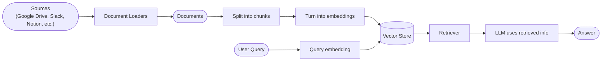
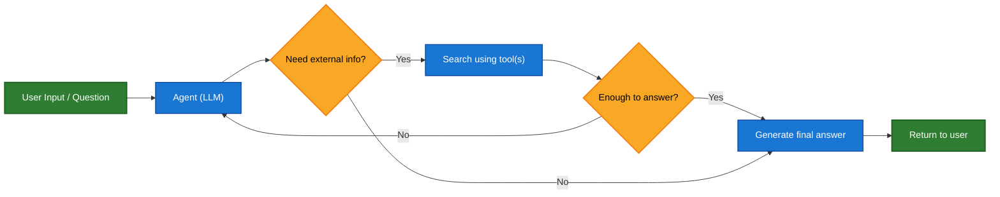
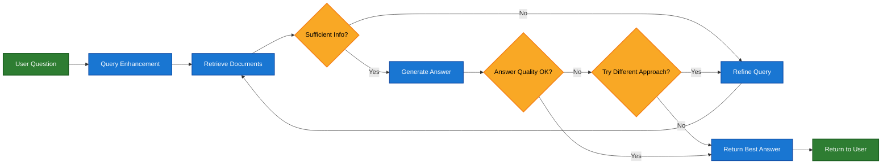

# 检索 (Retrieval)

大型语言模型 (LLM) 非常强大，但它们有两个关键限制：

*   **有限的上下文** — 它们无法一次摄取整个语料库。
*   **静态知识** — 它们的训练数据冻结在某个时间点。

检索通过在查询时获取相关的外部知识来解决这些问题。这是 **检索增强生成 (RAG)** 的基础：用特定于上下文的信息增强 LLM 的答案。

## 构建知识库

**知识库** 是检索过程中使用的文档或结构化数据的存储库。

如果您需要自定义知识库，可以使用 LangChain 的文档加载器和向量存储从您自己的数据构建一个。

<Note>
  如果您已经有知识库（例如，SQL 数据库、CRM 或内部文档系统），您 **不需要** 重建它。您可以：

  *   将其作为 Agentic RAG 中智能体的 **工具** 连接。
  *   查询它并将检索到的内容作为上下文提供给 LLM [(2-Step RAG)](#2-step-rag)。
</Note>

请参阅以下教程以构建可搜索的知识库和最小的 RAG 工作流：

<Card title="教程：语义搜索" icon="database" href="/oss/javascript/langchain/knowledge-base" arrow cta="了解更多">
  了解如何使用 LangChain 的文档加载器、嵌入和向量存储从您自己的数据创建可搜索的知识库。
  在本教程中，您将在 PDF 上构建一个搜索引擎，从而能够检索与查询相关的段落。您还将在此引擎之上实现一个最小的 RAG 工作流，以了解如何将外部知识集成到 LLM 推理中。
</Card>

### 从检索到 RAG

检索允许 LLM 在运行时访问相关上下文。但大多数实际应用程序更进一步：它们 **将检索与生成集成** 以产生基于事实的、上下文感知的答案。

这就是 **检索增强生成 (RAG)** 背后的核心思想。检索管道成为结合搜索与生成的更广泛系统的基础。

### 检索管道

典型的检索工作流如下所示：



每个组件都是模块化的：您可以交换加载器、拆分器、嵌入或向量存储，而无需重写应用程序的逻辑。

### 构建块

<Columns cols={2}>
  <Card title="文档加载器" icon="file-import" href="/oss/javascript/integrations/document_loaders" arrow cta="了解更多">
    从外部来源（Google Drive, Slack, Notion 等）摄取数据，返回标准化的 [`Document`](https://reference.langchain.com/javascript/classes/_langchain_core.documents.Document.html) 对象。
  </Card>

  <Card title="嵌入模型" icon="diagram-project" href="/oss/javascript/integrations/text_embedding" arrow cta="了解更多">
    嵌入模型将文本转换为数字向量，以便具有相似含义的文本在向量空间中彼此靠近。
  </Card>

  <Card title="向量存储" icon="database" href="/oss/javascript/integrations/vectorstores/" arrow cta="了解更多">
    用于存储和搜索嵌入的专用数据库。
  </Card>

  <Card title="检索器" icon="binoculars" href="/oss/javascript/integrations/retrievers/" arrow cta="了解更多">
    检索器是一个接口，它根据非结构化查询返回文档。
  </Card>
</Columns>

## RAG 架构

RAG 可以通过多种方式实现，具体取决于系统的需求。我们在下面的部分中概述每种类型。

| 架构            | 描述                                                                       | 控制      | 灵活性      | 延迟       | 示例用例                                          |
| --------------- | -------------------------------------------------------------------------- | --------- | ----------- | ---------- | ------------------------------------------------- |
| **2-Step RAG**  | 检索总是在生成之前发生。简单且可预测                                       | ✅ 高      | ❌ 低        | ⚡ 快       | 常见问题解答，文档机器人                          |
| **Agentic RAG** | LLM 驱动的智能体在推理过程中决定 *何时* 以及 *如何* 检索                   | ❌ 低      | ✅ 高        | ⏳ 可变     | 能够访问多种工具的研究助手                        |
| **Hybrid**      | 结合两种方法的特点并带有验证步骤                                           | ⚖️ 中等   | ⚖️ 中等     | ⏳ 可变     | 带有质量验证的特定领域问答                        |

<Info>
  **延迟**：在 **2-Step RAG** 中，延迟通常更 **可预测**，因为最大 LLM 调用次数是已知且有上限的。这种可预测性假设 LLM 推理时间是主要因素。然而，现实世界的延迟也可能受到检索步骤性能的影响——例如 API 响应时间、网络延迟或数据库查询——这些可能会因使用的工具和基础设施而异。
</Info>

### 2-step RAG

在 **2-Step RAG** 中，检索步骤总是在生成步骤之前执行。这种架构简单明了且可预测，适用于检索相关文档是生成答案的明确先决条件的许多应用程序。


<Card title="教程：检索增强生成 (RAG)" icon="robot" href="/oss/javascript/langchain/rag#rag-chains" arrow cta="了解更多">
  了解如何构建一个能够使用检索增强生成回答基于您数据的问题的问答聊天机器人。
  本教程介绍了两种方法：

  *   **RAG 智能体**，它使用灵活的工具运行搜索——非常适合通用用途。
  *   **2-step RAG** 链，每个查询只需要一次 LLM 调用——对于简单的任务快速高效。
</Card>

### Agentic RAG

**Agentic Retrieval-Augmented Generation (RAG)** 结合了检索增强生成和基于智能体推理的优势。智能体（由 LLM 驱动）不是在回答之前检索文档，而是逐步推理并决定在交互过程中 **何时** 以及 **如何** 检索信息。

<Tip>
  智能体启用 RAG 行为唯一需要的是访问一个或多个能够获取外部知识的 **工具** — 例如文档加载器、Web API 或数据库查询。
</Tip>



```typescript
import { tool, createAgent } from "langchain";

const fetchUrl = tool(
    (url: string) => {
        return `Fetched content from ${url}`;
    },
    { name: "fetch_url", description: "从 URL 获取文本内容" }
);

const agent = createAgent({
    model: "claude-sonnet-4-0",
    tools: [fetchUrl],
    systemPrompt,
});
```

<Expandable title="扩展示例：用于 LangGraph llms.txt 的 Agentic RAG">
  此示例实现了一个 **Agentic RAG 系统**，以协助用户查询 LangGraph 文档。智能体首先加载 [llms.txt](https://llmstxt.org/)，其中列出了可用的文档 URL，然后可以根据用户的问题动态使用 `fetch_documentation` 工具来检索和处理相关内容。

  ```typescript
  import { tool, createAgent, HumanMessage } from "langchain";
  import * as z from "zod";

  const ALLOWED_DOMAINS = ["https://langchain-ai.github.io/"];
  const LLMS_TXT = "https://langchain-ai.github.io/langgraph/llms.txt";

  const fetchDocumentation = tool(
    async (input) => {
      if (!ALLOWED_DOMAINS.some((domain) => input.url.startsWith(domain))) {
        return `Error: URL not allowed. Must start with one of: ${ALLOWED_DOMAINS.join(", ")}`;
      }
      const response = await fetch(input.url);
      if (!response.ok) {
        throw new Error(`HTTP error! status: ${response.status}`);
      }
      return response.text();
    },
    {
      name: "fetch_documentation",
      description: "Fetch and convert documentation from a URL",
      schema: z.object({
        url: z.string().describe("The URL of the documentation to fetch"),
      }),
    }
  );

  const llmsTxtResponse = await fetch(LLMS_TXT);
  const llmsTxtContent = await llmsTxtResponse.text();

  const systemPrompt = `
  You are an expert TypeScript developer and technical assistant.
  Your primary role is to help users with questions about LangGraph and related tools.

  Instructions:

  1. If a user asks a question you're unsure about — or one that likely involves API usage,
     behavior, or configuration — you MUST use the \`fetch_documentation\` tool to consult the relevant docs.
  2. When citing documentation, summarize clearly and include relevant context from the content.
  3. Do not use any URLs outside of the allowed domain.
  4. If a documentation fetch fails, tell the user and proceed with your best expert understanding.

  You can access official documentation from the following approved sources:

  ${llmsTxtContent}

  You MUST consult the documentation to get up to date documentation
  before answering a user's question about LangGraph.

  Your answers should be clear, concise, and technically accurate.
  `;

  const tools = [fetchDocumentation];

  const agent = createAgent({
    model: "claude-sonnet-4-0"
    tools,
    systemPrompt,
    name: "Agentic RAG",
  });

  const response = await agent.invoke({
    messages: [
      new HumanMessage(
        "Write a short example of a langgraph agent using the " +
        "prebuilt create react agent. the agent should be able " +
        "to look up stock pricing information."
      ),
    ],
  });

  console.log(response.messages.at(-1)?.content);
  ```
</Expandable>

<Card title="教程：检索增强生成 (RAG)" icon="robot" href="/oss/javascript/langchain/rag" arrow cta="了解更多">
  了解如何构建一个能够使用检索增强生成回答基于您数据的问题的问答聊天机器人。
  本教程介绍了两种方法：

  *   **RAG 智能体**，它使用灵活的工具运行搜索——非常适合通用用途。
  *   **2-step RAG** 链，每个查询只需要一次 LLM 调用——对于简单的任务快速高效。
</Card>

### Hybrid RAG

Hybrid RAG 结合了 2-Step 和 Agentic RAG 的特点。它引入了中间步骤，例如查询预处理、检索验证和生成后检查。这些系统提供了比固定管道更多的灵活性，同时保持了对执行的一定控制。

典型组件包括：

*   **查询增强**：修改输入问题以提高检索质量。这可能涉及重写不清楚的查询、生成多个变体或使用附加上下文扩展查询。
*   **检索验证**：评估检索到的文档是否相关且充足。如果不是，系统可能会优化查询并再次检索。
*   **答案验证**：检查生成的答案的准确性、完整性以及与源内容的一致性。如果需要，系统可以重新生成或修改答案。

该架构通常支持这些步骤之间的多次迭代：



此架构适用于：

*   具有歧义或未明确说明的查询的应用程序
*   需要验证或质量控制步骤的系统
*   涉及多个来源或迭代细化的工作流

<Card title="教程：带自我修正的 Agentic RAG" icon="robot" href="/oss/javascript/langgraph/agentic-rag" arrow cta="了解更多">
  **Hybrid RAG** 的一个示例，结合了智能体推理与检索和自我修正。
</Card>
