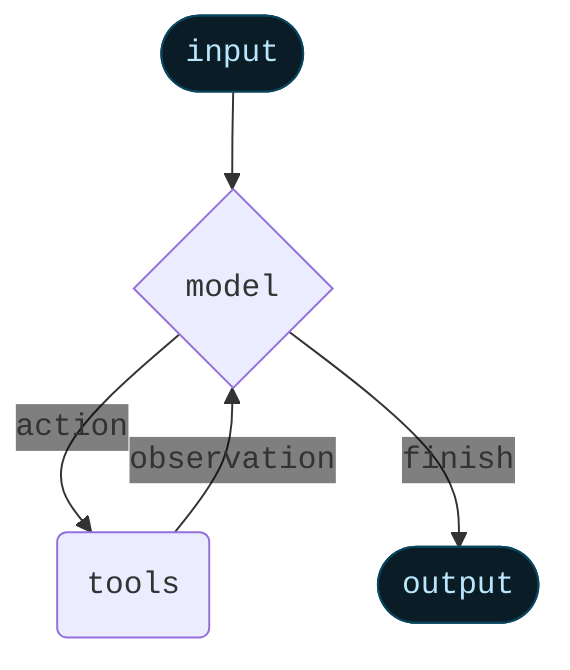

> ## 文档索引
> 获取完整文档索引请访问：https://docs.langchain.com/llms.txt
> 在深入探索之前，请使用此文件发现所有可用页面。

# Agents (智能体)

Agent（智能体）将语言模型与 [工具](/oss/javascript/langchain/tools) 结合，创建出能够对任务进行推理、决定使用哪些工具并迭代地通过解决方案工作的系统。

`createAgent()` 提供了一个生产就绪的 Agent 实现。

[LLM Agent 在循环中运行工具以实现目标](https://simonwillison.net/2025/Sep/18/agents/)。
Agent 会一直运行直到满足停止条件——即当模型输出最终结果或达到迭代限制时。



<Info>
  `createAgent()` 使用 [LangGraph](/oss/javascript/langgraph/overview) 构建基于 **图（Graph）** 的 Agent 运行时。图由节点（步骤）和边（连接）组成，定义了 Agent 如何处理信息。Agent 在此图中移动，执行如模型节点（调用模型）、工具节点（执行工具）或中间件等节点。

  了解更多关于 [Graph API](/oss/javascript/langgraph/graph-api) 的信息。
</Info>

## 核心组件

### 模型 (Model)

[模型](/oss/javascript/langchain/models) 是 Agent 的推理引擎。它可以以多种方式指定，支持静态和动态模型选择。

#### 静态模型

静态模型在创建 Agent 时配置一次，并在整个执行过程中保持不变。这是最常见和直接的方法。

要从 <Tooltip tip="遵循 `provider:model` 格式的字符串 (例如 openai:gpt-5)" cta="查看映射" href="https://reference.langchain.com/python/langchain/models/#langchain.chat_models.init_chat_model(model)">模型标识符字符串</Tooltip> 初始化静态模型：

```ts wrap theme={null}
import { createAgent } from "langchain";

const agent = createAgent({
  model: "openai:gpt-5",
  tools: []
});
```

模型标识符字符串使用 `provider:model` 格式（例如 `"openai:gpt-5"`）。您可能需要对模型配置进行更多控制，在这种情况下，可以直接使用提供者包初始化模型实例：

```ts wrap theme={null}
import { createAgent } from "langchain";
import { ChatOpenAI } from "@langchain/openai";

const model = new ChatOpenAI({
  model: "gpt-4.1",
  temperature: 0.1,
  maxTokens: 1000,
  timeout: 30
});

const agent = createAgent({
  model,
  tools: []
});
```

模型实例让您完全控制配置。当您需要设置特定参数如 `temperature`、`max_tokens`、`timeouts`，或配置 API 密钥、`base_url` 以及其他提供者特定设置时，请使用它们。参考 [API 参考](/oss/javascript/integrations/providers/) 查看模型上可用的参数和方法。

#### 动态模型

动态模型是在 <Tooltip tip="Agent 的执行环境，包含在整个 Agent 执行过程中持久存在的不可变配置和上下文数据（例如用户 ID、会话详情或应用程序特定配置）。">运行时</Tooltip> 根据当前 <Tooltip tip="流经 Agent 执行的数据，包括消息、自定义字段以及任何需要在处理过程中跟踪并可能修改的信息（例如用户偏好或工具使用统计）。">状态</Tooltip> 和上下文选择的。这使得复杂的路由逻辑和成本优化成为可能。

要使用动态模型，请使用 `wrapModelCall` 创建中间件，以修改请求中的模型：

```ts  theme={null}
import { ChatOpenAI } from "@langchain/openai";
import { createAgent, createMiddleware } from "langchain";

const basicModel = new ChatOpenAI({ model: "gpt-4.1-mini" });
const advancedModel = new ChatOpenAI({ model: "gpt-4.1" });

const dynamicModelSelection = createMiddleware({
  name: "DynamicModelSelection",
  wrapModelCall: (request, handler) => {
    // 根据对话复杂性选择模型
    const messageCount = request.messages.length;

    return handler({
        ...request,
        model: messageCount > 10 ? advancedModel : basicModel,
    });
  },
});

const agent = createAgent({
  model: "gpt-4.1-mini", // 基础模型 (当 messageCount ≤ 10 时使用)
  tools,
  middleware: [dynamicModelSelection],
});
```

有关中间件和高级模式的更多详细信息，请参阅 [中间件文档](/oss/javascript/langchain/middleware)。

<Tip>
  有关模型配置的详细信息，请参阅 [模型](/oss/javascript/langchain/models)。有关动态模型选择模式，请参阅 [中间件中的动态模型](/oss/javascript/langchain/middleware#dynamic-model)。
</Tip>

### 工具 (Tools)

工具赋予 Agent 采取行动的能力。Agent 超越了简单的模型工具绑定，通过促进以下方面实现：

* 序列中的多个工具调用（由单个提示触发）
* 适当时并行调用工具
* 基于先前结果的动态工具选择
* 工具重试逻辑和错误处理
* 跨工具调用的状态持久化

有关更多信息，请参阅 [工具](/oss/javascript/langchain/tools)。

#### 静态工具

静态工具在创建 Agent 时定义，并在整个执行过程中保持不变。这是最常见和直接的方法。

要定义具有静态工具的 Agent，请将工具列表传递给 Agent。

```ts wrap theme={null}
import * as z from "zod";
import { createAgent, tool } from "langchain";

const search = tool(
  ({ query }) => `Results for: ${query}`,
  {
    name: "search",
    description: "Search for information",
    schema: z.object({
      query: z.string().describe("The query to search for"), // 要搜索的查询
    }),
  }
);

const getWeather = tool(
  ({ location }) => `Weather in ${location}: Sunny, 72°F`,
  {
    name: "get_weather",
    description: "Get weather information for a location",
    schema: z.object({
      location: z.string().describe("The location to get weather for"), // 获取天气的地点
    }),
  }
);

const agent = createAgent({
  model: "gpt-4.1",
  tools: [search, getWeather],
});
```

如果提供空工具列表，Agent 将由没有工具调用功能的单个 LLM 节点组成。

#### 动态工具

使用动态工具，Agent 可用的工具集是在运行时修改的，而不是全部预先定义的。并非每个工具都适合每种情况。太多的工具可能会压倒模型（上下文过载）并增加错误；太少则限制了能力。动态工具选择使得能够根据身份验证状态、用户权限、功能标志或对话阶段来调整可用的工具集。

根据工具是否提前已知，有两种方法：

<Tabs>
  <Tab title="过滤预注册工具">
    当所有可能的工具在 Agent 创建时已知时，您可以预先注册它们，并根据状态、权限或上下文动态过滤哪些工具暴露给模型。

    <Tabs>
      <Tab title="State (状态)">
        仅在某些对话里程碑后启用高级工具：

        ```typescript  theme={null}
        import { createMiddleware, tool } from "langchain";
        import { createDeepAgent } from "deepagents";

        const stateBasedTools = createMiddleware({
            name: "StateBasedTools",
            wrapModelCall: (request, handler) => {
                // 从 State 读取：检查身份验证和对话长度
                const state = request.state as typeof request.state & {
                    authenticated?: boolean;
                };
                const isAuthenticated = state.authenticated ?? false;
                const messageCount = state.messages.length;

                let filteredTools = request.tools;

                // 仅在身份验证后启用敏感工具
                if (!isAuthenticated) {
                    filteredTools = request.tools.filter(
                        (t: any) => typeof t.name === "string" && t.name.startsWith("public_"),
                    );
                } else if (messageCount < 5) {
                    filteredTools = request.tools.filter(
                        (t: any) => typeof t.name === "string" && t.name !== "advanced_search",
                    );
                }

                return handler({ ...request, tools: filteredTools });
            },
        });

        const agent = await createDeepAgent({
            model: "claude-sonnet-4-20250514",
            tools: tools,
            middleware: [stateBasedTools] as any,
        });
        ```
      </Tab>

      <Tab title="Store (存储)">
        基于 Store 中的用户偏好或功能标志过滤工具：

        ```typescript  theme={null}
        import { createMiddleware } from "langchain";
        import { createDeepAgent } from "deepagents";
        import * as z from "zod";
        import {
        InMemoryStore,
        } from "@langchain/langgraph";


        const contextSchema = z.object({
        userId: z.string(),
        });

        const storeBasedTools = createMiddleware({
        name: "StoreBasedTools",
        contextSchema,
        wrapModelCall: async (request, handler) => {
            const userId =
            (request.runtime?.context as { userId?: string } | undefined)?.userId ??
            "user-123";

            // 从 Store 读取：获取用户启用的功能
            const runtimeStore = request.runtime?.store as InMemoryStore | undefined;
            const rawFlags = (await runtimeStore?.get(
            ["features"],
            userId as string
            )) as unknown;
            const featureFlags = rawFlags as FeatureFlags | undefined;

            let filteredTools = request.tools;

            if (featureFlags) {
            const enabledFeatures = featureFlags.enabledTools || [];
            filteredTools = request.tools.filter((t) =>
                enabledFeatures.includes(t.name as string)
            );
            }

            return handler({ ...request, tools: filteredTools });
        },
        });

        const agent = await createDeepAgent({
        model: "claude-sonnet-4-20250514",
        backend: backendFactory,
        store,
        checkpointer,
        tools,
        middleware: [storeBasedTools] as any,
        });
        ```
      </Tab>

      <Tab title="Runtime Context (运行时上下文)">
        基于 Runtime Context 中的用户权限过滤工具：

        ```typescript  theme={null}
        import * as z from "zod";
        import { createMiddleware } from "langchain";
        import { createDeepAgent } from "deepagents";

        const contextSchema = z.object({
        userRole: z.string(),
        });

        const contextBasedTools = createMiddleware({
        name: "ContextBasedTools",
        contextSchema,
        wrapModelCall: (request, handler) => {
            // 从 Runtime Context 读取：获取用户角色
            const userRole = request.runtime.context.userRole;

            let filteredTools = request.tools;

            if (userRole === "admin") {
            // 管理员获得所有工具
            } else if (userRole === "editor") {
            filteredTools = request.tools.filter(t => t.name !== "delete_data");
            } else {
            filteredTools = request.tools.filter(
                (t) => (t.name as string).startsWith("read_")
            );
            }

            return handler({ ...request, tools: filteredTools });
        },
        });

        const agent = await createDeepAgent({
        model: "claude-sonnet-4-20250514",
        store,
        checkpointer,
        tools,
        middleware: [contextBasedTools] as any,
        });
        ```
      </Tab>
    </Tabs>

    这种方法最适合当：

    * 所有可能的工具在编译/启动时已知
    * 您希望基于权限、功能标志或对话状态进行过滤
    * 工具是静态的，但其可用性是动态的

    参见 [动态选择工具](/oss/javascript/langchain/middleware/custom#dynamically-selecting-tools) 获取更多示例。
  </Tab>

  <Tab title="运行时工具注册">
    当工具在运行时被发现或创建（例如，从 MCP 服务器加载、基于用户数据生成或从远程注册表获取）时，您需要注册工具并动态处理它们的执行。

    这需要两个中间件钩子：

    1. `wrap_model_call` - 将动态工具添加到请求中
    2. `wrap_tool_call` - 处理动态添加工具的执行

    ```typescript  theme={null}
    import { createAgent, createMiddleware, tool } from "langchain";
    import * as z from "zod";

    // 一个将在运行时动态添加的工具
    const calculateTip = tool(
      ({ billAmount, tipPercentage = 20 }) => {
        const tip = billAmount * (tipPercentage / 100);
        return `Tip: $${tip.toFixed(2)}, Total: $${(billAmount + tip).toFixed(2)}`;
      },
      {
        name: "calculate_tip",
        description: "Calculate the tip amount for a bill",
        schema: z.object({
          billAmount: z.number().describe("The bill amount"), // 账单金额
          tipPercentage: z.number().default(20).describe("Tip percentage"), // 小费百分比
        }),
      }
    );

    const dynamicToolMiddleware = createMiddleware({
      name: "DynamicToolMiddleware",
      wrapModelCall: (request, handler) => {
        // 将动态工具添加到请求中
        // 这可以从 MCP 服务器、数据库等加载
        return handler({
          ...request,
          tools: [...request.tools, calculateTip],
        });
      },
      wrapToolCall: (request, handler) => {
        // 处理动态工具的执行
        if (request.toolCall.name === "calculate_tip") {
          return handler({ ...request, tool: calculateTip });
        }
        return handler(request);
      },
    });

    const agent = createAgent({
      model: "gpt-4o",
      tools: [getWeather], // 这里只注册静态工具
      middleware: [dynamicToolMiddleware],
    });

    // Agent 现在可以使用 getWeather 和 calculateTip
    const result = await agent.invoke({
      messages: [{ role: "user", content: "Calculate a 20% tip on $85" }],
    });
    ```

    这种方法最适合当：

    * 工具在运行时被发现（例如，从 MCP 服务器）
    * 工具基于用户数据或配置动态生成
    * 您正在集成外部工具注册表

    <Note>
      对于运行时注册的工具，`wrap_tool_call` 钩子是必需的，因为 Agent 需要知道如何执行不在原始工具列表中的工具。没有它，Agent 将不知道如何调用动态添加的工具。
    </Note>
  </Tab>
</Tabs>

<Tip>
  要了解更多关于工具的信息，请参阅 [工具](/oss/javascript/langchain/tools)。
</Tip>

#### 工具错误处理

要自定义工具错误的处理方式，请使用自定义中间件中的 `wrapToolCall` 钩子：

```ts wrap theme={null}
import { createAgent, createMiddleware, ToolMessage } from "langchain";

const handleToolErrors = createMiddleware({
  name: "HandleToolErrors",
  wrapToolCall: async (request, handler) => {
    try {
      return await handler(request);
    } catch (error) {
      // 返回自定义错误消息给模型
      return new ToolMessage({
        content: `Tool error: Please check your input and try again. (${error})`,
        tool_call_id: request.toolCall.id!,
      });
    }
  },
});

const agent = createAgent({
  model: "gpt-4.1",
  tools: [
    /* ... */
  ],
  middleware: [handleToolErrors],
});
```

当工具失败时，Agent 将返回带有自定义错误消息的 [`ToolMessage`](https://reference.langchain.com/javascript/classes/_langchain_core.messages.ToolMessage.html)。

#### ReAct 循环中的工具使用

Agent 遵循 ReAct ("Reasoning + Acting" 推理+行动) 模式，在简短的推理步骤与有针对性的工具调用之间交替，并将产生的观察结果反馈到后续决策中，直到它们能够提供最终答案。

<Accordion title="ReAct 循环示例">
  **Prompt:** Identify the current most popular wireless headphones and verify availability.
  
  **提示：** 识别当前最流行的无线耳机并验证是否有货。

  ```
  ================================ Human Message =================================

  Find the most popular wireless headphones right now and check if they're in stock
  ```

  * **推理 (Reasoning)**: "Popularity is time-sensitive, I need to use the provided search tool." (流行度是时间敏感的，我需要使用提供的搜索工具。)
  * **行动 (Acting)**: Call `search_products("wireless headphones")`

  ```
  ================================== Ai Message ==================================
  Tool Calls:
    search_products (call_abc123)
   Call ID: call_abc123
    Args:
      query: wireless headphones
  ```

  ```
  ================================= Tool Message =================================

  Found 5 products matching "wireless headphones". Top 5 results: WH-1000XM5, ...
  ```

  * **推理 (Reasoning)**: "I need to confirm availability for the top-ranked item before answering." (在回答之前，我需要确认排名第一的商品的可用性。)
  * **行动 (Acting)**: Call `check_inventory("WH-1000XM5")`

  ```
  ================================== Ai Message ==================================
  Tool Calls:
    check_inventory (call_def456)
   Call ID: call_def456
    Args:
      product_id: WH-1000XM5
  ```

  ```
  ================================= Tool Message =================================

  Product WH-1000XM5: 10 units in stock
  ```

  * **推理 (Reasoning)**: "I have the most popular model and its stock status. I can now answer the user's question." (我有最流行的型号及其库存状态。我现在可以回答用户的问题了。)
  * **行动 (Acting)**: Produce final answer (生成最终答案)

  ```
  ================================== Ai Message ==================================

  I found wireless headphones (model WH-1000XM5) with 10 units in stock...
  ```
</Accordion>

### 系统提示 (System prompt)

您可以通过提供提示来塑造 Agent 处理任务的方式。`systemPrompt` 参数可以作为字符串提供：

```ts wrap theme={null}
const agent = createAgent({
  model,
  tools,
  systemPrompt: "You are a helpful assistant. Be concise and accurate.", // 你是一个乐于助人的助手。简洁而准确。
});
```

当未提供 `systemPrompt` 时，Agent 将直接从消息中推断其任务。

`systemPrompt` 参数接受 `string` 或 `SystemMessage`。使用 `SystemMessage` 让您可以更多地控制提示结构，这对于特定于提供者的功能（如 [Anthropic 的提示缓存](/oss/javascript/integrations/chat/anthropic#prompt-caching)）非常有用：

```ts wrap theme={null}
import { createAgent } from "langchain";
import { SystemMessage, HumanMessage } from "@langchain/core/messages";

const literaryAgent = createAgent({
  model: "anthropic:claude-sonnet-4-5",
  systemPrompt: new SystemMessage({
    content: [
      {
        type: "text",
        text: "You are an AI assistant tasked with analyzing literary works.", // 你是一个负责分析文学作品的 AI 助手。
      },
      {
        type: "text",
        text: "<the entire contents of 'Pride and Prejudice'>", // <'傲慢与偏见' 的全部内容>
        cache_control: { type: "ephemeral" }
      }
    ]
  })
});

const result = await literaryAgent.invoke({
  messages: [new HumanMessage("Analyze the major themes in 'Pride and Prejudice'.")]
});
```

带有 `{ type: "ephemeral" }` 的 `cache_control` 字段告诉 Anthropic 缓存该内容块，从而减少使用相同系统提示的重复请求的延迟和成本。

#### 动态系统提示

对于更高级的用例，您需要根据运行时上下文或 Agent 状态修改系统提示，可以使用 [中间件](/oss/javascript/langchain/middleware)。

```typescript wrap theme={null}
import * as z from "zod";
import { createAgent, dynamicSystemPromptMiddleware } from "langchain";

const contextSchema = z.object({
  userRole: z.enum(["expert", "beginner"]),
});

const agent = createAgent({
  model: "gpt-4.1",
  tools: [/* ... */],
  contextSchema,
  middleware: [
    dynamicSystemPromptMiddleware<z.infer<typeof contextSchema>>((state, runtime) => {
      const userRole = runtime.context.userRole || "user";
      const basePrompt = "You are a helpful assistant."; // 你是一个乐于助人的助手。

      if (userRole === "expert") {
        return `${basePrompt} Provide detailed technical responses.`; // 提供详细的技术回复。
      } else if (userRole === "beginner") {
        return `${basePrompt} Explain concepts simply and avoid jargon.`; // 简单解释概念，避免使用行话。
      }
      return basePrompt;
    }),
  ],
});

// 系统提示将根据上下文动态设置
const result = await agent.invoke(
  { messages: [{ role: "user", content: "Explain machine learning" }] },
  { context: { userRole: "expert" } }
);
```

<Tip>
  有关消息类型和格式的更多详细信息，请参阅 [消息](/oss/javascript/langchain/messages)。有关全面的中间件文档，请参阅 [中间件](/oss/javascript/langchain/middleware)。
</Tip>

## 调用 (Invocation)

您可以通过传递对其 [`State`](/oss/javascript/langgraph/graph-api#state) 的更新来调用 Agent。所有 Agent 在其状态中都包含 [消息序列](/oss/javascript/langgraph/use-graph-api#messagesstate)；要调用 Agent，请传递一条新消息：

```typescript  theme={null}
await agent.invoke({
  messages: [{ role: "user", content: "What's the weather in San Francisco?" }],
})
```

要从 Agent 流式传输步骤和/或令牌，请参考 [流式传输](/oss/javascript/langchain/streaming) 指南。

否则，Agent 遵循 LangGraph [Graph API](/oss/javascript/langgraph/use-graph-api) 并支持所有相关方法，如 `stream` 和 `invoke`。

## 高级概念

### 结构化输出

在某些情况下，您可能希望 Agent 以特定格式返回输出。LangChain 通过 `responseFormat` 参数提供了一种简单、通用的方法来实现这一点。

```ts wrap theme={null}
import * as z from "zod";
import { createAgent } from "langchain";

const ContactInfo = z.object({
  name: z.string(),
  email: z.string(),
  phone: z.string(),
});

const agent = createAgent({
  model: "gpt-4.1",
  responseFormat: ContactInfo,
});

const result = await agent.invoke({
  messages: [
    {
      role: "user",
      content: "Extract contact info from: John Doe, john@example.com, (555) 123-4567",
    },
  ],
});

console.log(result.structuredResponse);
// {
//   name: 'John Doe',
//   email: 'john@example.com',
//   phone: '(555) 123-4567'
// }
```

<Tip>
  要了解关于结构化输出的信息，请参阅 [结构化输出](/oss/javascript/langchain/structured-output)。
</Tip>

### 记忆 (Memory)

Agent 通过消息状态自动维护对话历史记录。您还可以配置 Agent 使用自定义状态模式在对话期间记住其他信息。

存储在状态中的信息可以被视为 Agent 的 [短期记忆](/oss/javascript/langchain/short-term-memory)：

```ts wrap theme={null}
import { z } from "zod/v4";
import { StateSchema, MessagesValue } from "@langchain/langgraph";
import { createAgent } from "langchain";

const CustomAgentState = new StateSchema({
  messages: MessagesValue,
  userPreferences: z.record(z.string(), z.string()),
});

const customAgent = createAgent({
  model: "gpt-4.1",
  tools: [],
  stateSchema: CustomAgentState,
});
```

<Tip>
  要了解更多关于记忆的信息，请参阅 [记忆](/oss/javascript/concepts/memory)。有关实现跨会话持久化的长期记忆的信息，请参阅 [长期记忆](/oss/javascript/langchain/long-term-memory)。
</Tip>

### 流式传输 (Streaming)

我们已经看到可以通过 `invoke` 调用 Agent 来获取最终响应。如果 Agent 执行多个步骤，这可能需要一段时间。为了显示中间进度，我们可以流式传回消息。

```ts  theme={null}
const stream = await agent.stream(
  {
    messages: [{
      role: "user",
      content: "Search for AI news and summarize the findings"
    }],
  },
  { streamMode: "values" }
);

for await (const chunk of stream) {
  // 每个块包含该点的完整状态
  const latestMessage = chunk.messages.at(-1);
  if (latestMessage?.content) {
    console.log(`Agent: ${latestMessage.content}`);
  } else if (latestMessage?.tool_calls) {
    const toolCallNames = latestMessage.tool_calls.map((tc) => tc.name);
    console.log(`Calling tools: ${toolCallNames.join(", ")}`);
  }
}
```

<Tip>
  有关流式传输的更多详细信息，请参阅 [流式传输](/oss/javascript/langchain/streaming)。
</Tip>

### 中间件 (Middleware)

[中间件](/oss/javascript/langchain/middleware) 为在执行的不同阶段自定义 Agent 行为提供了强大的可扩展性。您可以使用中间件来：

* 在调用模型之前处理状态（例如，消息修剪、上下文注入）
* 修改或验证模型的响应（例如，护栏、内容过滤）
* 使用自定义逻辑处理工具执行错误
* 基于状态或上下文实现动态模型选择
* 添加自定义日志记录、监控或分析

中间件无缝集成到 Agent 的执行中，允许您在关键点拦截和修改数据流，而无需更改核心 Agent 逻辑。

<Tip>
  有关包括 `beforeModel`、`afterModel` 和 `wrapToolCall` 等钩子的全面中间件文档，请参阅 [中间件](/oss/javascript/langchain/middleware)。
</Tip>

***

<Callout icon="pen-to-square" iconType="regular">
  [在 GitHub 上编辑此页面](https://github.com/langchain-ai/docs/edit/main/src/oss/langchain/agents.mdx) 或 [提交 issue](https://github.com/langchain-ai/docs/issues/new/choose)。
</Callout>

<Tip icon="terminal" iconType="regular">
  [将这些文档连接](/use-these-docs) 到 Claude、VSCode 等，通过 MCP 获取实时答案。
</Tip>
